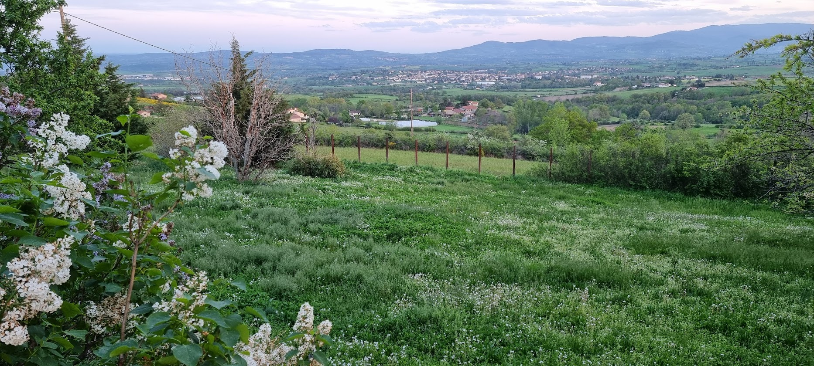

---
menu:
  hidden: true
---
# About me

This site is written and maintained by Frits Jalvingh. I am a software and infrastructure architect at a medium sized Dutch company. I am Dutch, but live most of the time in France.
I currently work mostly with Java and Kotlin, SQL databases like Oracle and PostgreSQL. I write both frontend and backend code. I specialize in more complex material like metadata based processing and compiler writing.

I am the principal author of a Java based UI framework called [DomUI](https://domui.atlassian.net/). This was open-sourced but did not become a success; to be useful you need to write documentation, lots of documentation... And currently people seem to prefer fragile solutions based on Javascript. I am writing *and maintaining* software for a living and for a long time; languages that are not strongly typed are a no-no for me, they are maintenance nightmares.

# About where I live
When in France I live in Saint Laurent d'Agny. This is a quiet rural village in the Monts Lyonnais. Our house is on top of a hill with a magnificient view:

On a good day we can even see the Mont Blanc:

I also live in the Netherlands every now and then, I have a house in Lelystad.

# Me and my electronics hobby

I have no education in electronics at all. But in my youth it was my principal hobby until the ZX81 came along.. I built the Electuur Formant synthesizer from mostly scrap parts, on perfboard, while listening to Walhalla Symfonie on the radio.

Once I discovered computers my interest in electronics waned, but it came back a few years ago when I got kind of fed up with programming. I needed to do something else in my free time so I got back to my old love.. I started with discovering Arduino's and related things, leading to a lot of fun projects like a 32x32 large LED matrix board together with my friend Marc.

After that, infected by [CuriousMarc](https://curiousmarc.com), I started to collect old vintage measurement equipment. Mostly to learn from them, and also as a means to help with repairing things. It is amazing to me that now I own a HP 16702A Logic Analyzer while when I was young I could only dream about something like that...

# My lab in France
I have a rather nice room downstairs in the house. It is about 6 x 3 m, and has a lot of nice tables:

