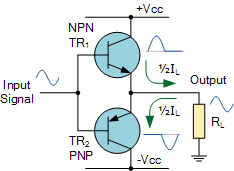
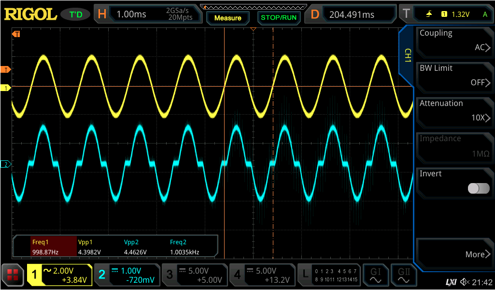
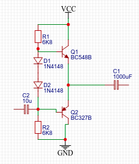
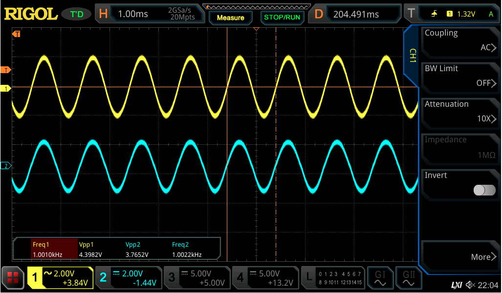
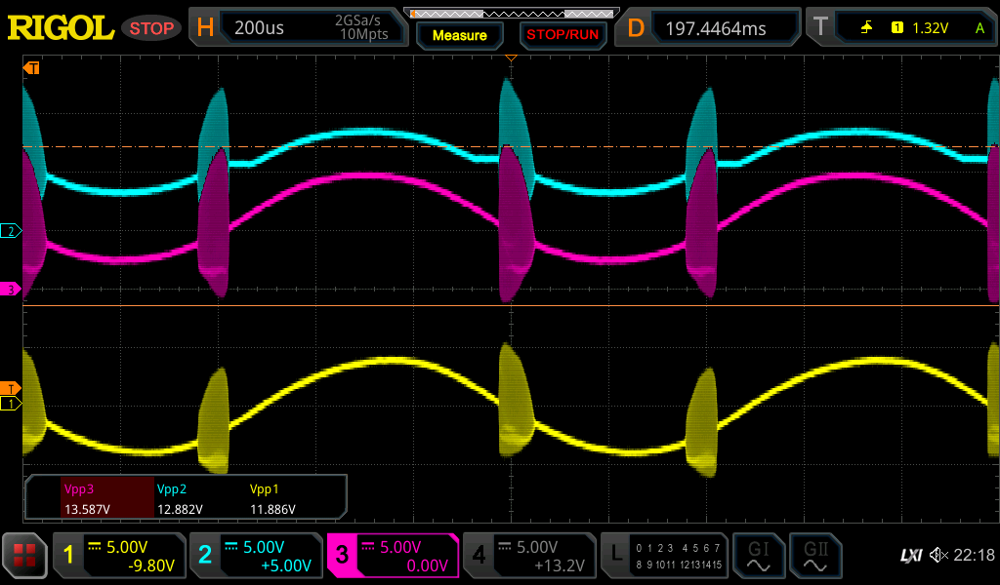
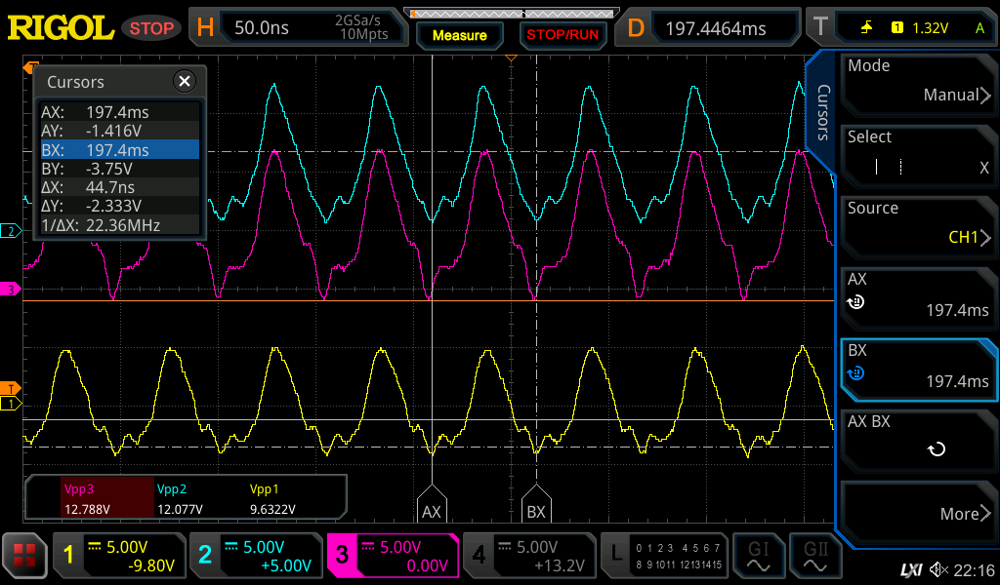

# Amplifiers

Simple class AB current amplifier with common base, common emitters

(But with 10uF capacitor @ input and 1000uF at output, Vcc is 10V.

The crossover distortion is clearly visible.

Now with two diodes to bias the transistors:

Oscillation

With tip31/tip32 the bloody thing oscillates:

Beautiful pictures :wink:

 But slightly unwanted :wink:

Zooming in:

We see a pulse of 44.7ns, equaling to a 22.4MHz oscillation.
