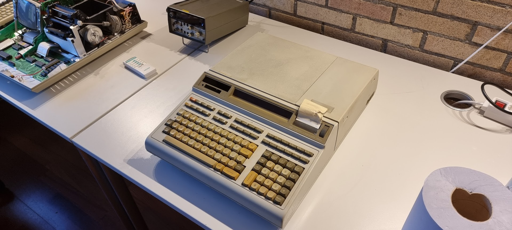
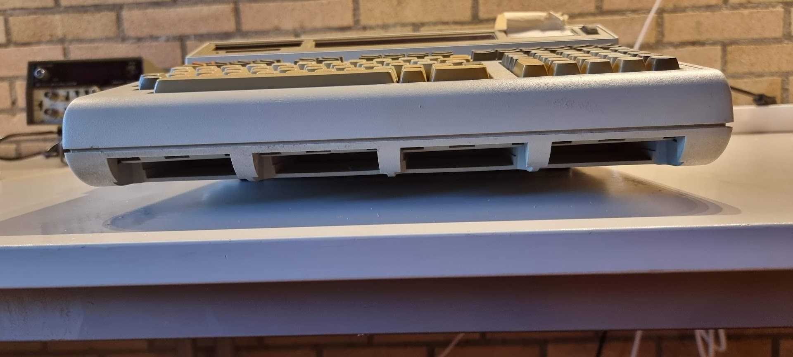
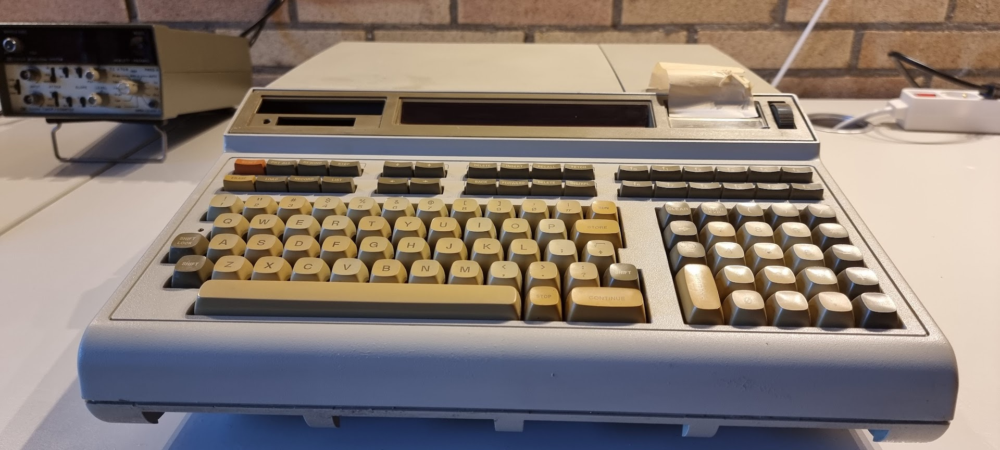
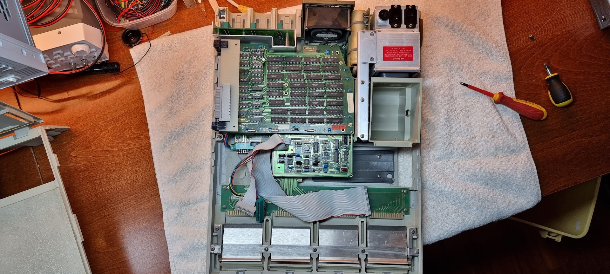
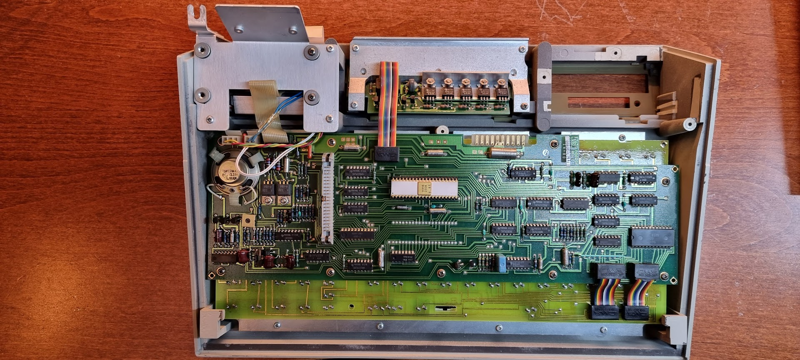
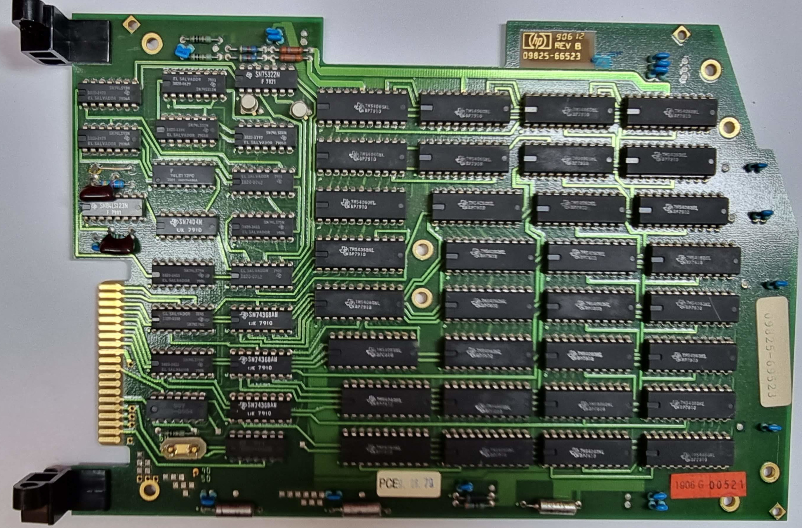
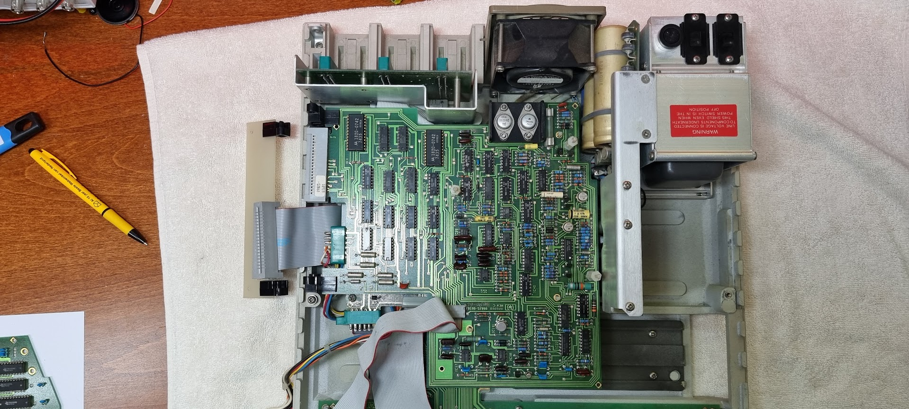
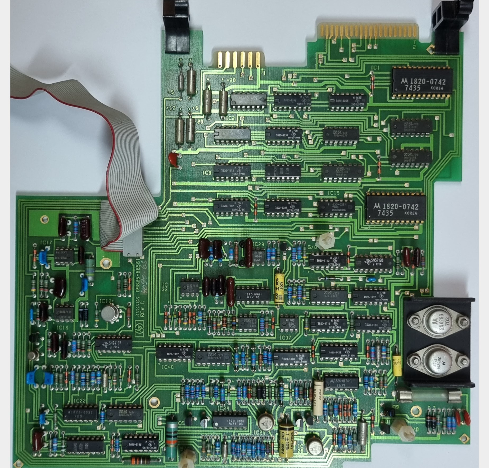

# 9825A Arrival

## Arrival

My HP 9825A arrived from France :wink:

 Whether it works or not is unknown. It arrived in good but dusty state, but the tape drive is missing sadly enough.

The markings say it is a 9825A which is most probably correct; it has the System ROM cartridge that should no longer exist on the B.

Device pictures:

Opening up showed the following:

The keyboard and printer assembly:

The device has clearly been opened before and was left in a non operable state: screws were missing, the cables to the cassette were left dangerously loose, and the keyboard assembly was not connected.

## Board overview

The topmost board is the RAM board. The slot above it is free and empty. The board has number 09825-66523 rev B, supposedly a 16KB RAM card:

After removal of the RAM board, by moving it to a 90% angle and then sliding it out of its hinges by moving it sideways, we see the cassette board:

A detailed picture of it after removal:

