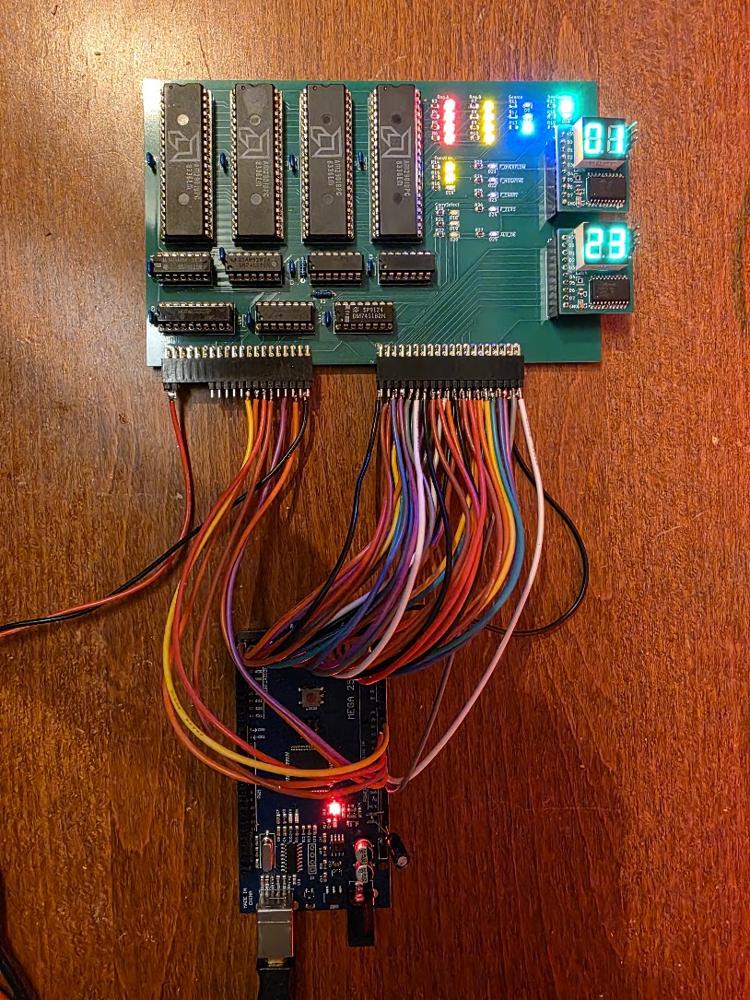
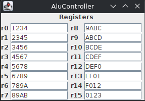

# A Java GUI controller program for the ALU Board

To test and get to actually know the 2901's I need to be able to send signals to the board. To do that I have an Arduino Meta 2560, and I connect that to the Arduino using a piece of cabling connected to pin headers:



The initial attempt was with breadboard wires but that failed terribly.

As can be seen the board has a lot of LEDs. These are in groups, and show the values for the following am2901 pins:

* The A input
* The B input
* The Function input
* The Source input
* The Dest input
* The OE(bar) input. This one however has a bug, the signal is active-low but the led is connected to +5v, so the thing is burning when OE is NOT active. Ah well.

In addition there are LEDs for the flags register's outputs, for the "carry flag" selection signals.

There are also two pin headers for the low and high part of the ALU data bus. These are for my [8 bit bus to 7 segment display boards](https://github.com/fjalvingh/8bit-busdisplay) which can also be seen on the picture.

I could now control the board by writing an Arduino program. But everything I want to test requires a new program, a compile, and an upload. That is slow. So I decided to write a GUI controller application for the PC which will communicate with the Arduino so that I can use an UI to control what I want to do to the board. The PC application is a simple Java 21 Swing application which communicates with the Arduino through the USB Serial port.

## Communication

The PC app is the master, the Arduino the slave in this solution. Data is exchanged in packets with the following structure:

```[aa][55][len][... len payload bytes][chksum hi][chksum lo]```

The first two bytes of the payload are a command code. The rest of the payload are parameters for the command.

The PC sends a command in this format which is received by the Arduino and checked. If OK the Arduino executes the command and sends a reply packet with the same structure. If the command executed successfully the reply contains the same command code in the first two bytes in the response, followed by the actual response data for the command.
If an error occurred the reply has a command code 1, and the rest of the payload is an ASCII string containing the error message.

Writing the initial code do to this took about 2 hours. The remaining 3 hours were wasted getting the xxxxing Arduino to receive data on the Serial link 8-(. I finally got it to work, mostly, as follows:

* Place a 10uF capacitor between RESET and +5V on the Arduino to disable auto-reset
* Make sure the RTS and DTR lines on the PCs output are CLEAR.

Even with this communication fails the first time after the Arduino is programmed or reset. But the PC code can easily retry, sigh.

In the current invocation the GUI does not exactly look impressive:



It shows the register values as they are set by the Arduino at startup.

## The Arduino code

The Arduino code has methods to set the different pins on the ALU board. A large amount of these are the pins that directly control the am2901's: both their data lines and the function/source/destination control inputs.

This makes it easy to set up the ALU for actions, and I'll be using these function names when describing actions done on the ALU.

The code is not written to be efficient, it is written to be easy and quick to change.


## ALU actions

### Setting a register

The following sequence sets an ALU register to some value:

```
void setAluReg(int reg, int value) {
  setAluPortB(reg);
  writeData(value);
  setAluSrc(SrcD0);                     // Read data from D bus and other part is zero
  setAluFunction(FnOr);                 // Add D plus 0
  setAluDest(DstRamF);                  // Alu result (F) to B
  pulseOperation(Op16);
  delay(200);

  setADMode(INPUT);
}

```
The basic operation is to set the DATA but to hold the value, set the register to write in portB, then do a an operation where one part is zero, and set the destination to write to "ram".
It is important that the operation chosen does not change the value. I used "add" before, but as I'm not driving the carry input to the 1st 2901 it defaults to 1, so all registers were one too large ;)

### Reading a register

To read a register I use the following:

```
  setAluFunction(FnOr);
  setAluDest(DstNop);
  setAluSrc(Src0A);               // 0, A as sources
  setOE(true);
  setAluPortA(register);
  setAluPortB(register);
  pulseOperation(Op16);
  int rv = readData();

```
It is rather similar to the write part. This operation leaves the OE signal asserted, which is why by default the ALU board shows data on its bus on the displays.

