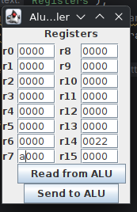

# Fixing schematic and board, and adding more commands

There were a few errors in the schematic which I fixed. The ALU latch had its OE pin connected to LE, I cut the trace on the PCB and connected OE to ground. Also, LEDs for signals that were active LOW would be lighted when the signals were negated (high). The PCB still needs to be updated though.

Added SLAVE commands to set all registers, and to execute an ALU operation, and added buttons for re-getting and setting the registers to the UI:

