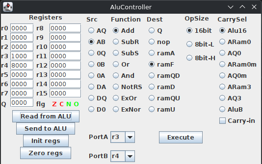
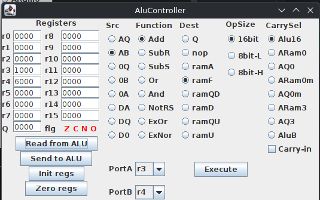
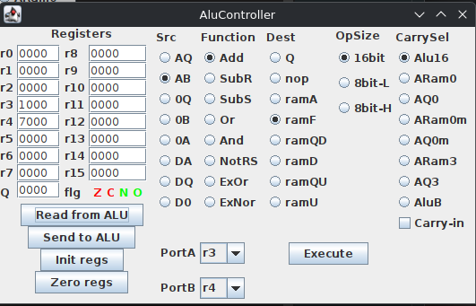
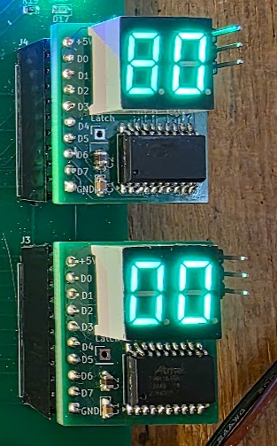

# Fun with flags ;)

The UI now shows the Q registers and the flags from the board:



and with that I can finally start to do more testing. One of the things that needs to become more clear is how the different parts of the am2901 interact with the clock signal, and I had a funny experience with that.

The am2901 datasheet states:

* The A and B latches inside the chip are passing through data when the clock is HIGH
* When clock is LOW then data gets written to the register addressed by the B input if the destination input addresses RAM.
* The Q register gets written on the up-going edge of clock.

The fun part happened when I was experimenting with the ADD operation. Adding r3 and r4, with values 1000_h_ and 5000_h_ worked fine, the result was this:



The result was 6000_h_, as expected, and all flags are off.

But when I pressed execute again, effectively adding 1000_h_ plus 6000_h_, the following showed:



The result was correct, 7000_h_, but both the N and the O flags were set?? This puzzled me for a while, but after reading the datasheet and looking at the code I saw I did this to do the operation:

```
  if(latchFlags) {
    setAluLatch(FlagLatchOpen);
  }
  
  digitalWrite(CTL_CLKAL, HIGH);                 //  Low: keep data in latches
  digitalWrite(CTL_CLKAH, HIGH);
  setAluLatch(FlagLatchHold);
```

I.e. I close the flags AFTER I reset the clock pulse to HIGH. And this caused that bug, because with the clock HIGH the register latch is open, and this means that the ALU now gets the NEW result, 7000_h_, as the B input. And 7000 + 1000 = 8000_h_, and that is indeed negative and an overflow. I could have seen that earlier if I paid attention to the debug display which actually showed that (immediately after the execute):



Moving the latch operation before upping the clock fixed the problem.
