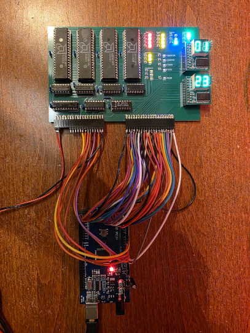
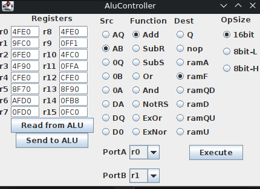

# CPU Experiments with am29xx bitslice chips

The am2900 series of chips were very popular when they came out. Many minis were created with the am2901 or am2903 as ALU/Register chips. I have a few of those in my parts bin, so I decided to do something with them. The eventual idea is to create a "simple" CPU from them, but before I can do that there is so much to learn... This page will collect the travels I am doing to do that learning.

The things I make for this project can be found [on Github](https://github.com/fjalvingh/cpuexperiment).

# Progress blog

## 2025/11/30 Adding "ALU Operation" UI

I added a new panel to the UI for executing ALU operations:

With this I can control almost all lines into the board, and execute an ALU operation. When the "execute" button is pressed the selected values are sent to the Arduino, and that sets the appropriate pins and toggles the clock signals (and latches the flags).

With this I can finally take a look at what those things all _really_ do.

## 2025/11/29 Fixing schematic and board, and adding more commands

There were a few errors in the schematic which I fixed. The ALU latch had its OE pin connected to LE, I cut the trace on the PCB and connected OE to ground. Also, LEDs for signals that were active LOW would be lighted when the signals were negated (high). The PCB still needs to be updated though.

Added SLAVE commands to set all registers, and to execute an ALU operation, and added buttons for re-getting and setting the registers to the UI:

## Older entries

* 2025/11/28 [Creating a Java program + Arduino program to remote control the ALU](20251128/index.md)
* 2025/10/18 [A 16-bit ALU board using am2901's](20251018/index.md)

