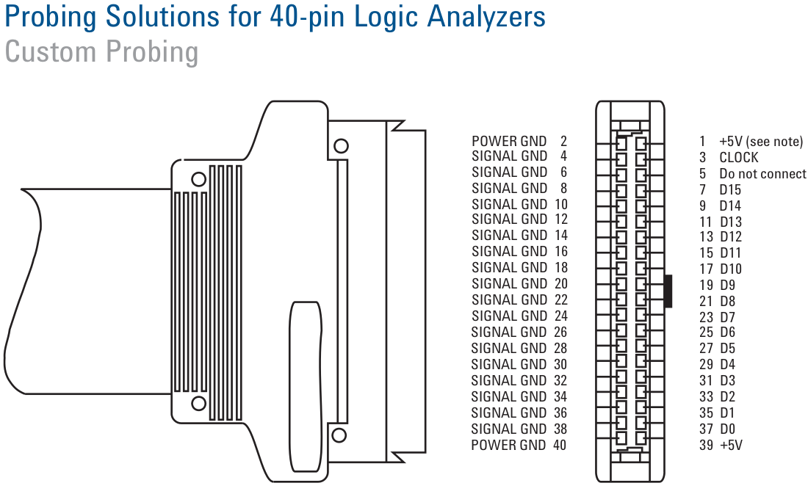
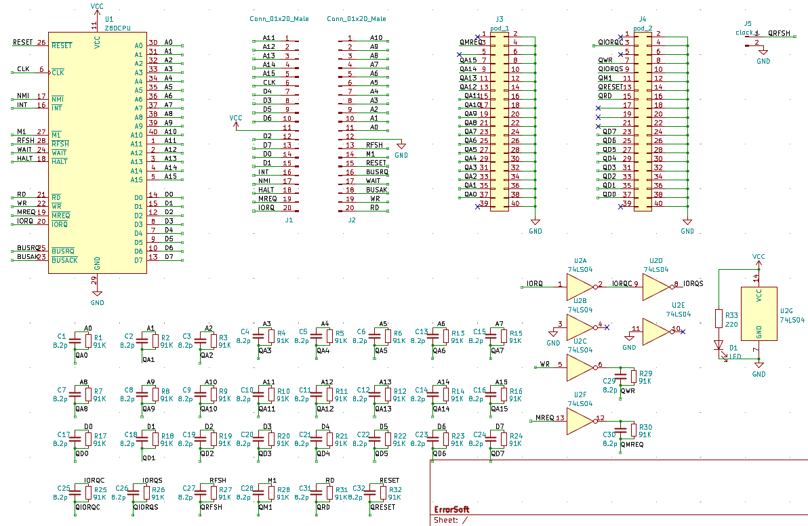
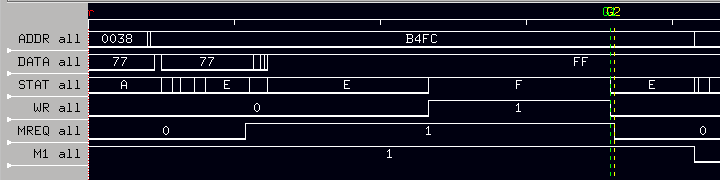

# HP 16702A Z80 pod project

Plan is to create a Z80 pod that can be inserted in a Z80 socket.

The pinout of a HP probe connector is as follows:



The configuration of the HP pod looked as follows according to this link:

```
All of the Z80 signals are buffered once through a 74LS241, with the exception of /MREQ, /IORQ, and /WR which are buffered one or more times through a 74LS240. The buffer outputs are always enabled.

Once through a 74LS241 Non-inverting Octal Buffer and Line Driver:
PIN 30 A0
PIN 31 A1
PIN 32 A2
PIN 33 A3
PIN 34 A4
PIN 35 A5
PIN 36 A6
PIN 37 A7
PIN 38 A8
PIN 39 A9
PIN 40 A10
PIN  1 A11
PIN  2 A12
PIN  3 A13
PIN  4 A14
PIN  5 A15

PIN 14 D0
PIN 15 D1
PIN 12 D2
PIN  8 D3
PIN  7 D4
PIN  9 D5
PIN 10 D6
PIN 13 D7

PIN 16 /INT     STAT BIT 7 (Not used by inverse assembler)
PIN 17 /NMI     STAT BIT 5 (Not used by inverse assembler)
PIN 18 /HALT    STAT BIT 6 (Not used by inverse assembler)
PIN 23 /BUSACK
PIN 25 /BUSREQ  STAT BIT 4 (Not used by inverse assembler)
PIN 27 /M1      STAT BIT 3
PIN 28 /RFSH    STAT BIT 2, CLOCK L

Once through a 74LS240 Inverting Octal Buffer and Line Driver:
PIN 19 /MREQ    CLOCK J

Once through a 74LS240 Inverting Octal Buffer and Line Driver:
PIN 20 /IORQ    CLOCK K

Twice through a 74LS240 Inverting Octal Buffer and Line Driver:
PIN 20 /IORQ    STAT BIT 1

Three times through a 74LS240 Inverting Octal Buffer and Line Driver:
PIN 22 /WR      STAT BIT 0

Four 74LS241 total, one 74LS240 total.
```

This is what I found out later; other posts were a bit less clear which led to:

# Problem with V1

Schematic diagram:



The 1st version of the pod has some issues. The pin assignments were not very clear, and I found out only later what the real assignments were.

Even with those remapped for v1 there is still a problem: the WR signal (which is inverted by a single buffer) never gets seen as “1” (so as a write) by the LA in STATE mode.

I tested on an Amstrad CPC646 and ran it in timing mode. We’re running this part of the ROM:

```
0860 06 F6       lab0860   ld b,#f6
0862 ED 49                 out (c),c
0864 06 F4                 ld b,#f4
0866 ED 78                 in a,(c)
0868 46                    ld b,(hl)
0869 77                    ld (hl),a
086A A0                    and b
086B 2F                    cpl
086C 12                    ld (de),a
086D 23                    inc hl
086E 13                    inc de
086F 0C                    inc c
0870 79                    ld a,c
0871 E6 0F                 and #f
0873 FE 0A                 cp #a
0875 20 E9                 jr nz,lab0860
0877 C1                    pop bc
0878 3E 82                 ld a,#82
087A ED 79                 out (c),a
087C 05                    dec b
087D ED 49                 out (c),c
087F C9                    ret
```

and we focus on this part of the trace. In this the following signals are inverted compared from what comes out of the Z80:

- WR (1 signals a write)
- MREQ (1 signals a memory access)



Let’s look at the instruction at 0869 which is “ld (hl),a” - clearly a write. We are focusing on the “write” part here and that shows the problem: WR is going down earlier than MREQ falls, so it gets sampled when it is not asserted even when there was a write. The difference in timing (g2 - g1) is about 5ns.

In the description for the original HP Z80 pod it is mentioned that WR is put through three inverting buffers. I think I now know why, sigh.

Version 2 should correct this issue, and also use better pin assignments for STAT so that it can be defined as a linear bitmask in the LA.
