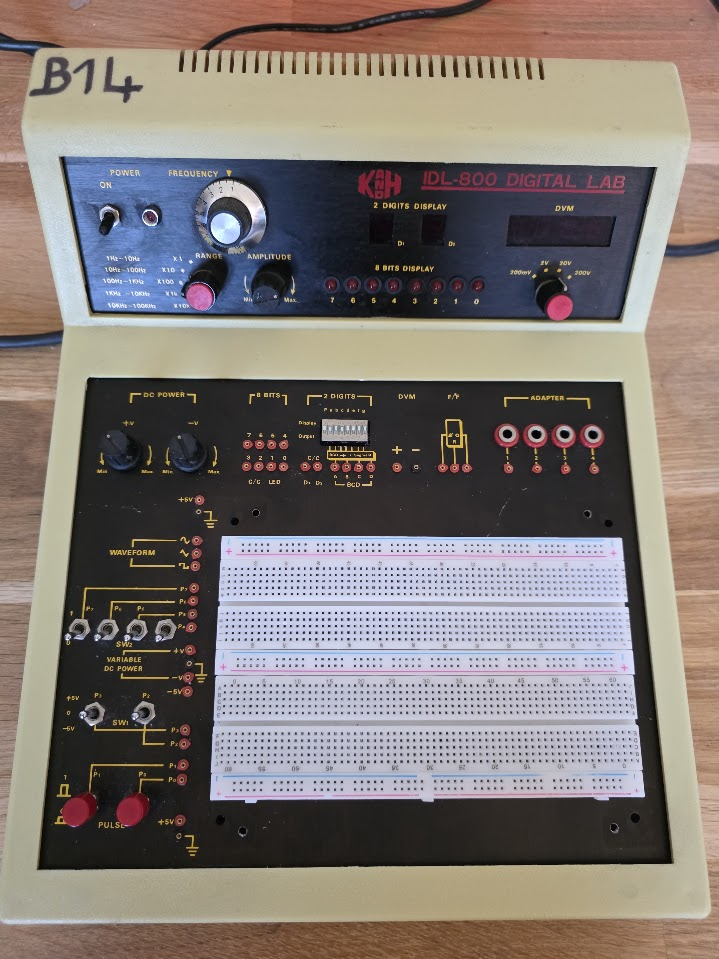

# The K and H IDL-800 Digital Lab

Found on Leboncoin, this is a rather nice experimentation tool:

It was very dirty and the breadboard area was gone. I just cleaned it up and taped on some Chinese breadboards I had lying around.

The device worked out of the box ;) It is rather nice, and has the following parts for experimentation:

* A small digital volt meter, 200mv..200V, DC only, 3 digits
* A fixed 5V and -5V power supply
* A variable positive 0..15V power supply
* A variable negative 0..15V power supply
* A variable frequency function generator with sine, square and triangle. Only the sine however can have its amplitude changed; the others have 10v P-P.
* two debounced pulse buttons (they pulse low)
* Two 3 state switches between -5v, 0v, +5v
* 4 on/off switches (to ground, not debounced)
* 8 LEDs
* 2 7-segment displays with a BCD decoder, the decoder is multiplexed so we have 4 inputs and two display select lines
* 4 banana jacks

Really nice thing to test chips with ;)
