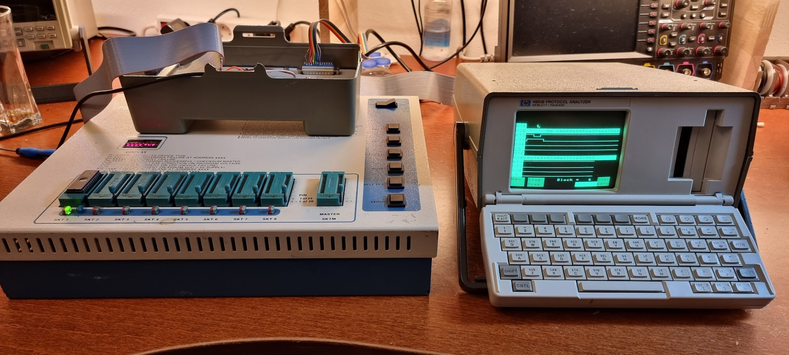
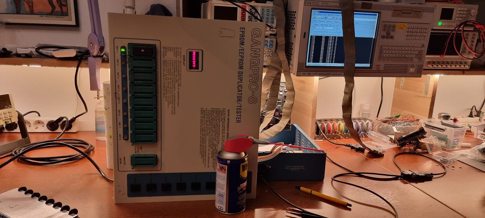
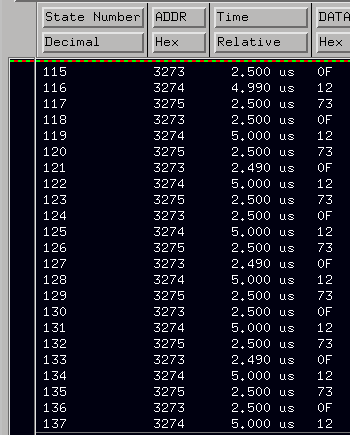
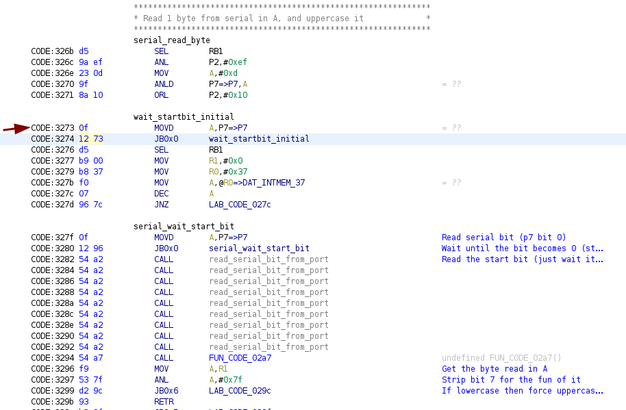
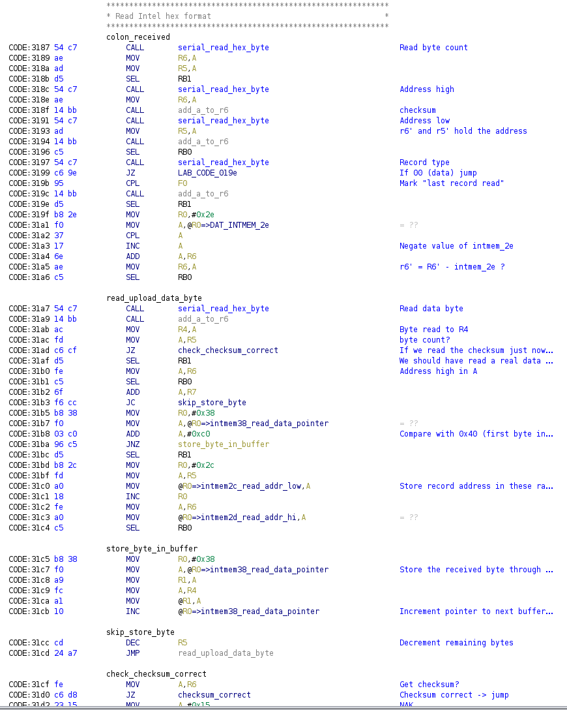
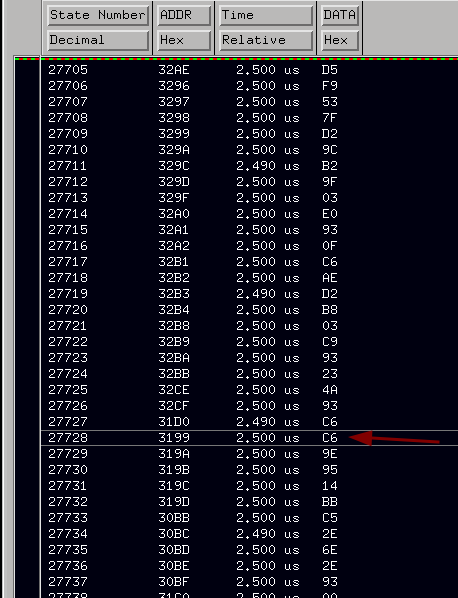
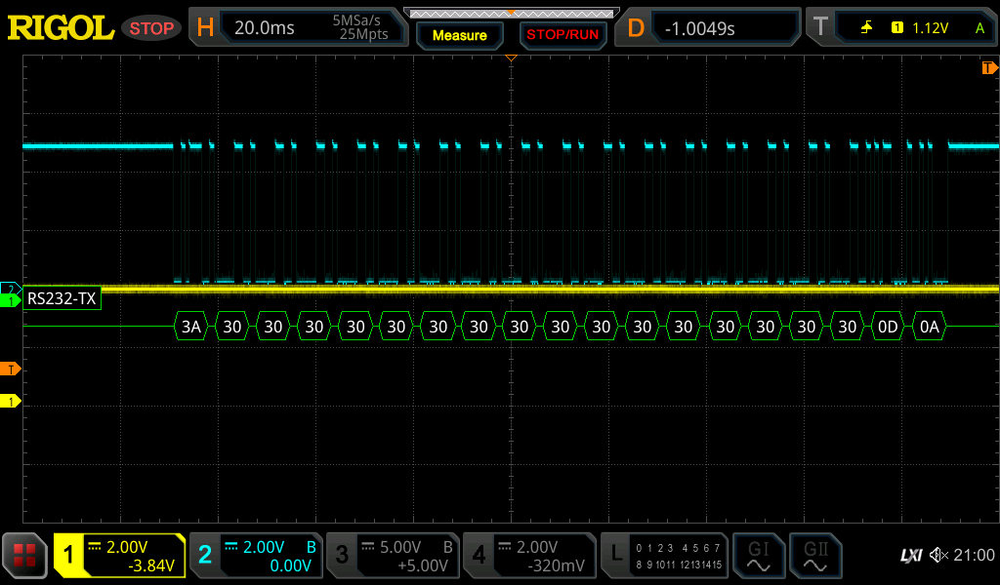

# GangPro 8 EPROM programmer

# Hardware

This is a gang programmer which uses a 8039 microcontroller with 2 P8243 “PIO” chips for I/O. It has two HPDL 1414 displays.

# Software

I wanted to create software for this programmer so that it could again be used from a PC.

I got the original documentation scanned in by the manufacturer, so that should be easy.

I wrote a simple command line tool to handle this in Java ([https://github.com/fjalvingh/gangpro-8](https://github.com/fjalvingh/gangpro-8) ). The download part worked immediately but whatever I did I could not get the upload to the programmer to work… The documentation was iffy around the upload part, and it was rather unclear what the device expected. But even messing around a bit with the format nothing worked.

The first part of the transfer works OK. I need to send a 'T' to start the process. Then I need to wait for a confirmation sent by the device. The device checks which slots contains EPROMs and checks their type which takes about 5 seconds. After that I receive either a SOH (0x01) indicating all is well, or a CAN indicating there is some error. That all works.



After that I should start sending Intel HEX records one by one; after each record I should receive either a NAK or an ACK. This part, however, never works… The device always remains with “RECEIVE” on its display and that is the end of things.

# Disassembling the ROM

So, next part was to try to find out what the device expected by disassembling its ROM. This is a 27C256 device which is very large for the CPU in question (an 8039 microcontroller). I used Ghidra to interactively handle the disassembly. This did not go too well: while Ghidra does support the processor it has large errors in understanding how the processor addresses memory (which is, indeed, a very odd scheme).

The 8039 can only address 2K of code memory directly. It addresses that memory mostly using pages of 256 instructions. The PC has more bits but most instructions refer to the 8bit page of the PC. This is not well understood by Ghidra. The result is that most of the labels that are generated by Ghidra are complete nonsense: they often refer to the first few hundred bytes of the ROM while in fact they refer to some other page completely.

This gets very problematic when adding labels manually white disassembling; this is now needed because most code above the 1st 256 byte page have no proper target labels defined at all. But adding the labels go wrong too: the new labels have “large” addresses and Ghidra does not understand that they are still reached by the jump or call instructions that reach them. Sucky.

Anyway.

Disassembling went quite well; after a short while I was able to find the code that displays strings on the display and that have away what code was responsible for what. The code I needed to understand (the stuff reading the hex stream) was around address 0x3000:

0x3000 was the code to download code TO the PC

0x3100 was the code that received the data FROM the PC (and programmed the EPROM).

The serial protocol was fully bit-banged. This was quite easy because this CPU has very simple timing; a single instruction cycle is 2.5 us, and instructions are either one or two cycles. The serial loops are unforgiving: they cannot be interrupted once they run which means for the receive part that when it hangs you have to switch off the device.

After I found the code the upload stuff was quite easy to understand. It was reading record per record, and after reading one record successfully it would immediately program the bytes into the EPROMs. Reading reach record was done in a simple way too. Sadly enough it looked like I was sending it exactly what it was expecting 8-/

So, next step: logic analyzer



# The logic analyzer

I connected my 16702A to the EPROM so that I could read what the device was doing. As an initial test I measured what the thing did when it was at RECEIVING and not doing anything else anymore. The LA display showed this:



It nicely shows the cycle type for the instructions (2.5us), and it corresponds to this part of the disassembly:



Ghidra unhelpfully truncates comments, I could not find a way to stop that idiotic behavior.

We see the code looping here waiting for a “next character”; this is more or less expected considering it stays at “receiving”.

Next step is to send actual data and try to capture the way it reads the serial data. For that I’m sending a record that looks as follows:

:1000000058e37eed7bb260c9e3f5cd0e11f1e3c993

Next step is to try to trigger at the end of a record, which is at 31cf (check\_checksum\_correct). This did not trigger. So: try try starting here at 3187:



This worked. It called serial\_read\_hex\_byte, and then called it again to read the high address, the low address, and the record type byte at 0x3197. After its return however it moved to 319b- which means it saw the record type as something else than zero. That is a good reason for a problem 8-(

So, let’s start sending a record with all zeroes:

```
:000000000000000000000000
```

No effect whatsoever. Whatever I do it always does this sadly enough:



Next try is to ensure that the data on the 8243 port 7 is correct (probe on the 8243 P7 bit 0):



That really is what I’m sending right now; zero after zero, and still the bloody thing does not see them 8-(
