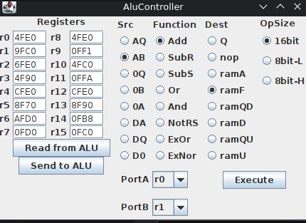

# Adding "ALU Operation" UI

I added a new panel to the UI for executing ALU operations:

With this I can control almost all lines into the board, and execute an ALU operation. When the "execute" button is pressed the selected values are sent to the Arduino, and that sets the appropriate pins and toggles the clock signals (and latches the flags).

With this I can finally take a look at what those things all _really_ do.
