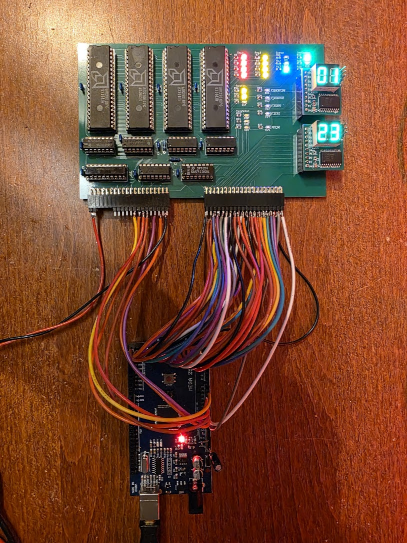

# CPU Experiments with am29xx bitslice chips

The am2900 series of chips were very popular when they came out. Many minis were created with the am2901 or am2903 as ALU/Register chips. I have a few of those in my parts bin, so I decided to do something with them. The eventual idea is to create a "simple" CPU from them, but before I can do that there is so much to learn... This page will collect the travels I am doing to do that learning.

The things I make for this project can be found [on Github](https://github.com/fjalvingh/cpuexperiment).

The [instruction set](instructionset/index.md) being designed for it is described separately.

## Progress blog

[BLOG]
