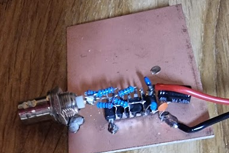
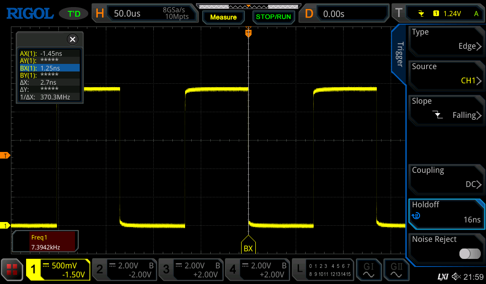
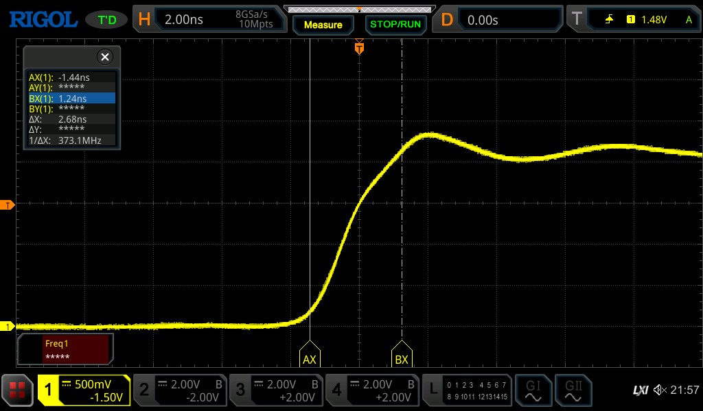

# Mini fast pulse generator

I made a small pulse generator using the 74AC14 as an oscillator:

The pulse does not disappoint. It has a 7.4KHz frequency:

and the rise time:

1.24ns rise is nice.
