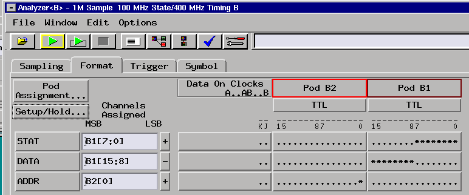
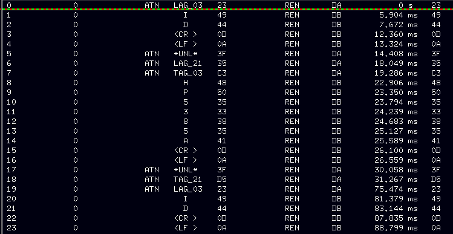
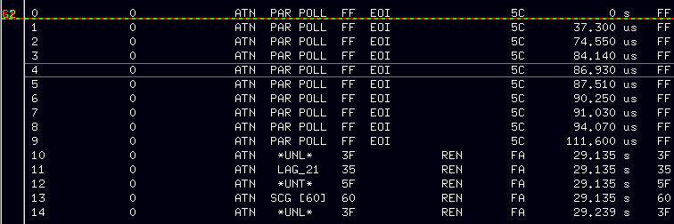
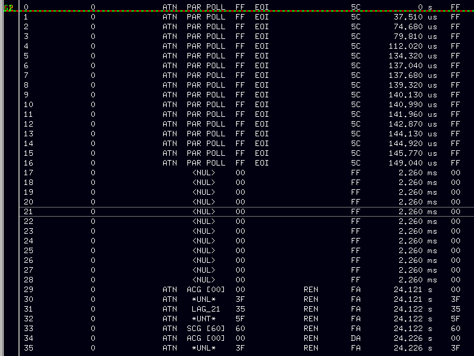

# HPIB Probe

A HPIB probe interface made as a quicky to debug HPIB trouble.

It uses the HP 01650-63203 isolation adapter which uses a 2x20 pin connector which is easier to put on a board, and it contains the termination network.

The device’s pin assignments are as follows:



The “ADDR” label is strange here, but it is required to exist for the inverse assembler to work. It just has a dummy assignment to an unused pod.

The STAT field has the following signal assignments:

| **Bit** | **Signal** |
| --- | --- |
| 0   | ATN |
| 1   | EOI |
| 2   | REN |
| 3   | IFC |
| 4   | SRQ |
| 5   | NDAC |
| 6   | DAV |
| 7   | NRFD |

The DAV signal is also used as the J clock signal on the analyzer pod.

The combination of ATN and EOI comes out on a separate pin on the device. This should be connected to the K clock of the next pod. The analyzer clocks should be J down OR K down.

# Example trace

I connected my HP 5385A frequency counter to my HP 9825A calculator and wrote a simple loop to read the ID of the counter:

```
dev "meas",703
wrt "meas","ID"
red "mes",X
dsp X
gto 1
```

A similar program for the HP 85A would be:

```
10 output 703,"ID"
20 enter 703;V
30 disp "type: ";V
40 goto 10
```

An example trace from the 1st program looks as follows:



It starts by sending a COMMAND LAG\_03. This makes device 3 the LISTENER (the 5384).

It then sends the ID<CR><LF> string as data to that device. This will make that device want to answer its type number. It now sends the COMMAND LAG\_21 making device 21 the listener (the 9825A) and device 3 the TALKER (by sending the TAG\_03) command. Device 3 now answers HP5385A<CR><LF>. The final command is UNLISTEN which cleans the listener. The set then repeats.

# Problem solving HPDISK communication

I built the HPDISK device (see [http://www.dalton.ax/hpdisk/](http://www.dalton.ax/hpdisk/)). But it would not work on neither my HP 85A nor my 9825A. It looked like something was wrong with HPIB communications.

I made a HPIB trace of the HP85A command:

```
cat ":D700"
```

which looked like this:



This repeatedly does a parallel poll. That parallel poll should have been answered by the HPDISK device by pulling bit 0 of the data lines LOW. This does not happen, and that does seem to be at least the first cause.

After the poll it UNLISTENs and UNTALKs; the other commands I do not yet know :wink:

Another try delivered this:



More info on HP-IB:

- [http://www.interfacebus.com/Design\_Connector\_GPIB.html](http://www.interfacebus.com/Design_Connector_GPIB.html)
- [https://gist.github.com/asanza/4e2719744fb0a41c8828e21dc2b7f012](https://gist.github.com/asanza/4e2719744fb0a41c8828e21dc2b7f012) (hpib commands)
