# Display and CPU board

# CPU Board

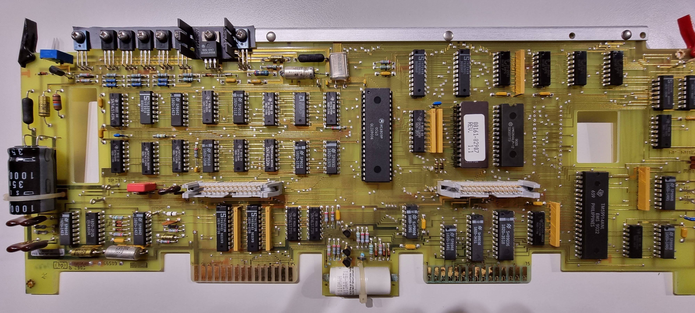

Board overview:

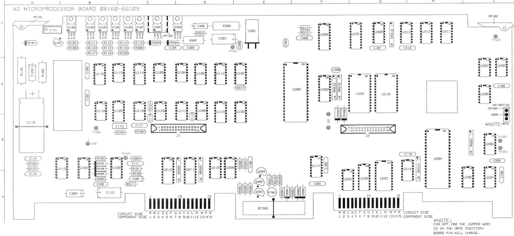

Schematics:

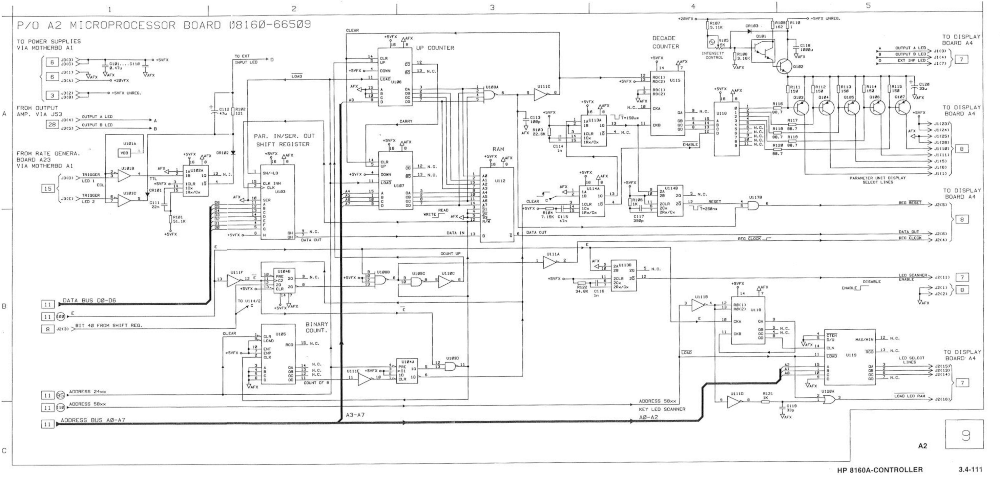

Actual CPU part

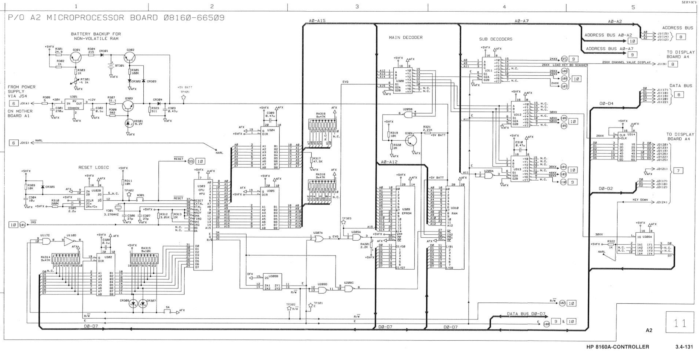

Smaller subschemas

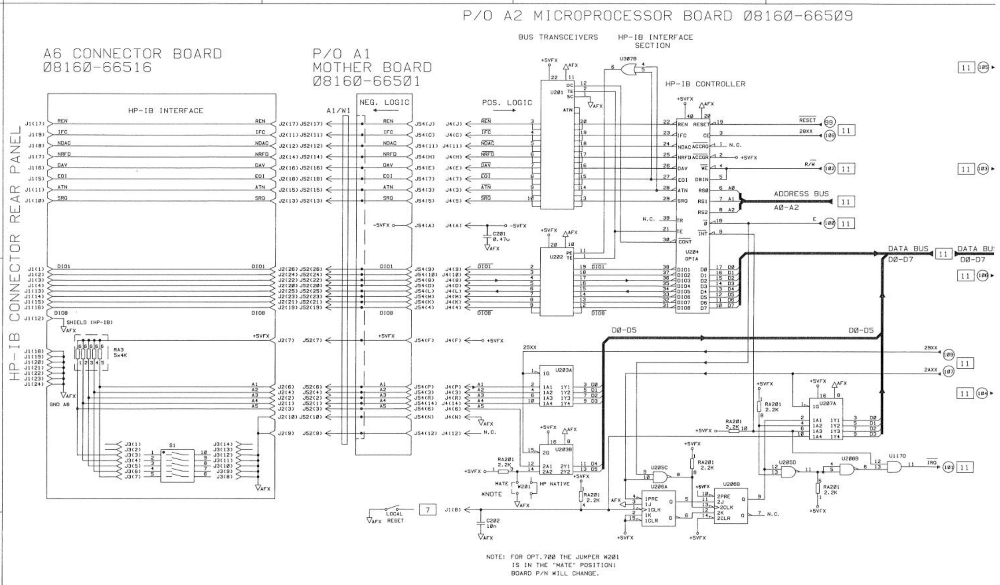

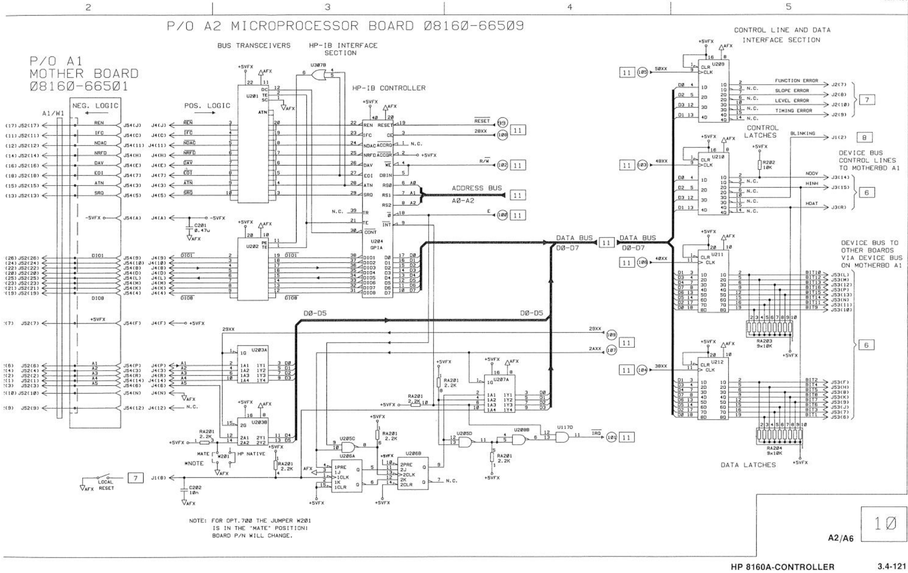

Fixes so far:

- C203 330uF replaced by 220uF (leaked)

# Display

The front panel looks as follows:

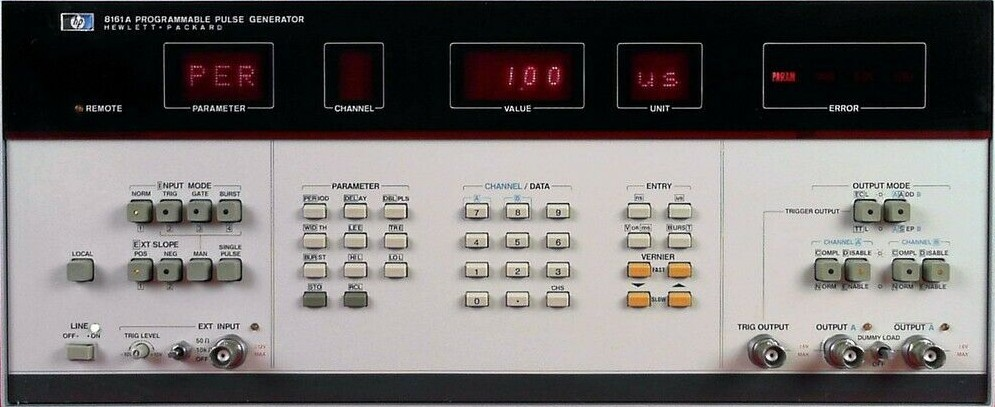

The display board layout:

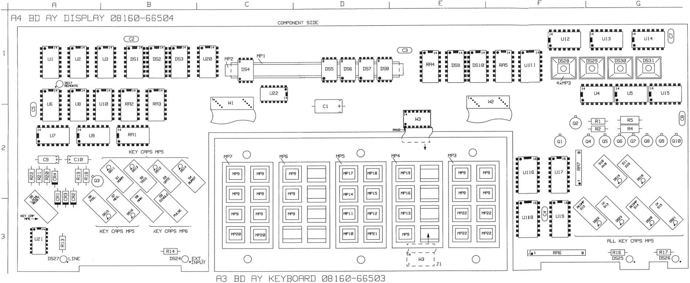

It is actual 2 boards; the middle keyboard is a separate one connected by a dip flat cable.

Its schematic diagram:

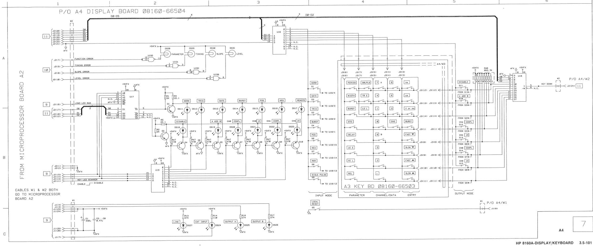

And part 2:

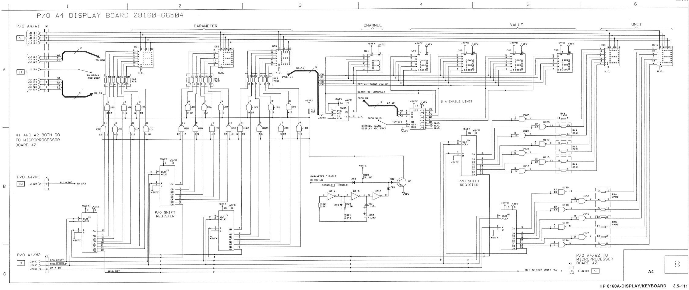

# Initial state

I removed the CPU and display boards from the case, and cleaned up the goo left by some foam between the keyboard’s keys.

Wires for providing power added:

GND black

+5v Red

+20VFX brown

+5VFX UNreg (connected to R110 1ohm then to large cap C110 +)

I connected the CPU board to a 5V power supply and checked current consumption (around 1.6A). Nothing got hot, so I checked the CPU clock (worked) and the R/W and address lines. The CPU seems to run.

After that I connected CPU board and display board together and powered them up with 5V and got display:

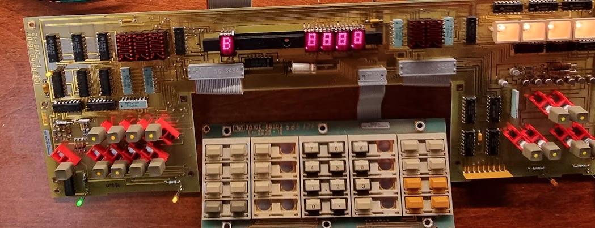

and after that lamp test like display:

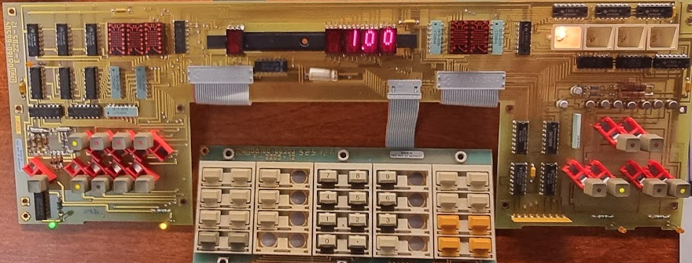

The initial display seems to be a lamp test, and from that we can see that some displays do not work: the three alphanumeric ones on the left and the two on the right. The “channel” one initially did not work either but that was just a loose connection.

Focusing on the “unit” display I checked U4, a shift register for one of the digits (74ls164). pin 8 is its clock (blue) and pin 1 is its data (yellow):

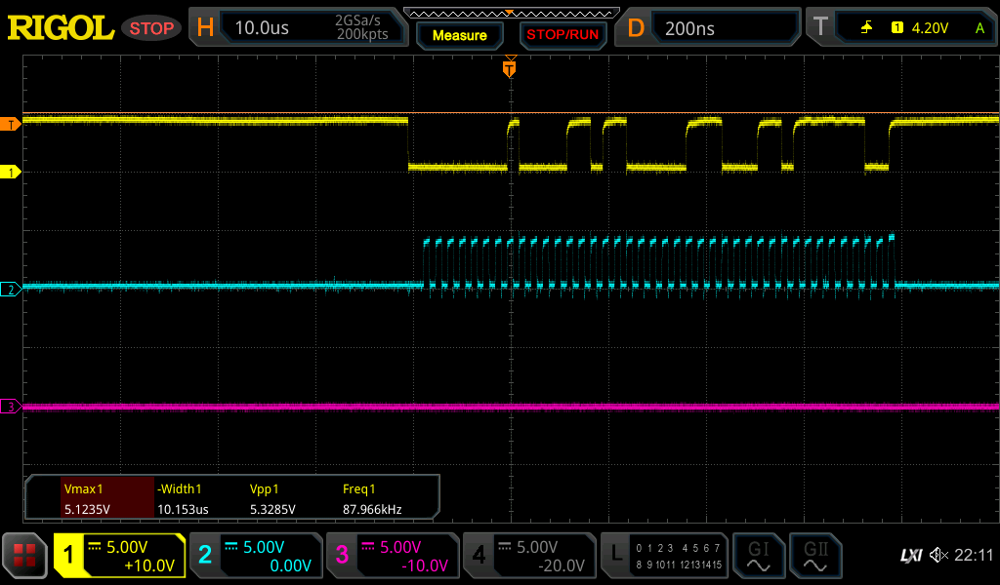

So we do seem to have data being shifted through.

Checked U103 (Parallel → serial shift register)'s SH and CLK lines (1, 2) and data out (7) and there is very little activity on it- but there is some:

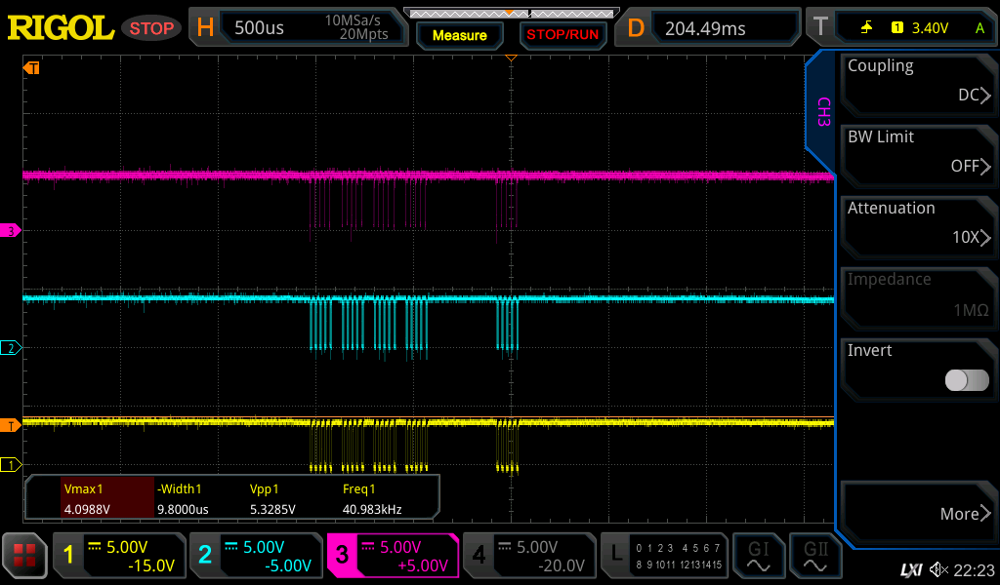

Checked U116 pin 12 (\_ENABLE\_) and it has a pulse train:

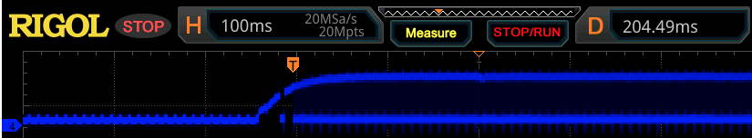

Checked Q103..Q107 (display select line drivers) and there appears to be no data on the bases of those transistors. I replaced a 74145 and after that things got to live:

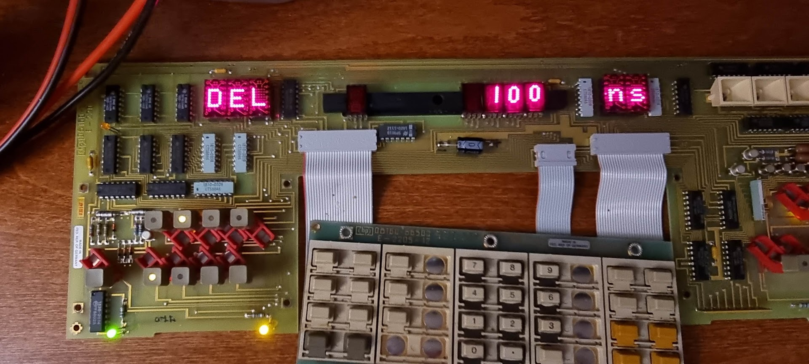

The board reacts to keypresses, and things can be configured :wink:

One done, heaps to go..
