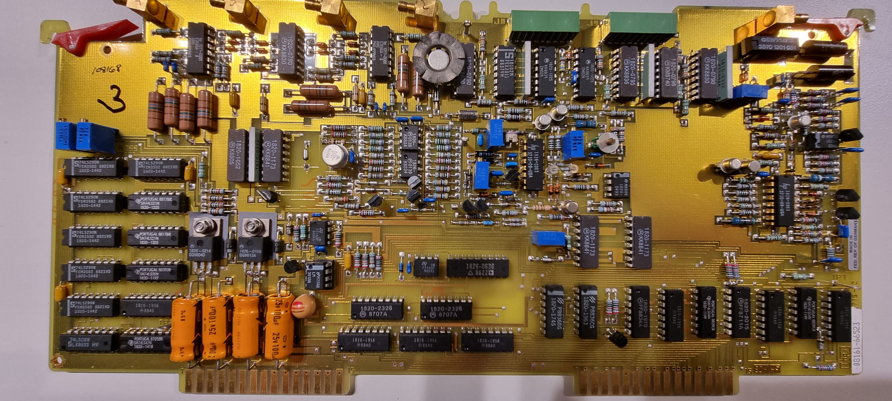
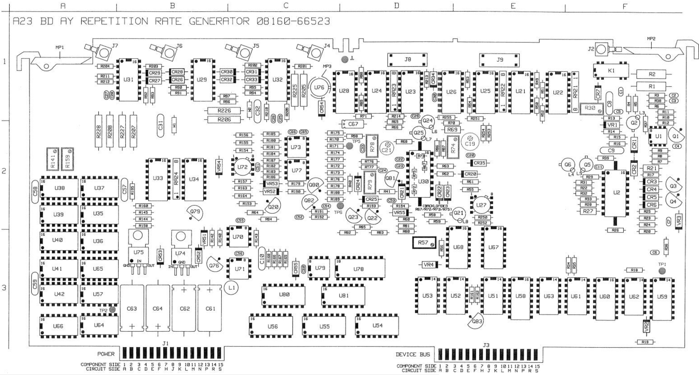
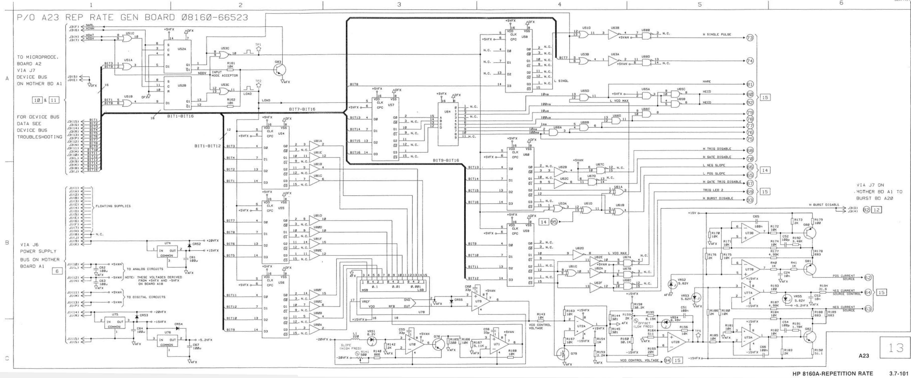
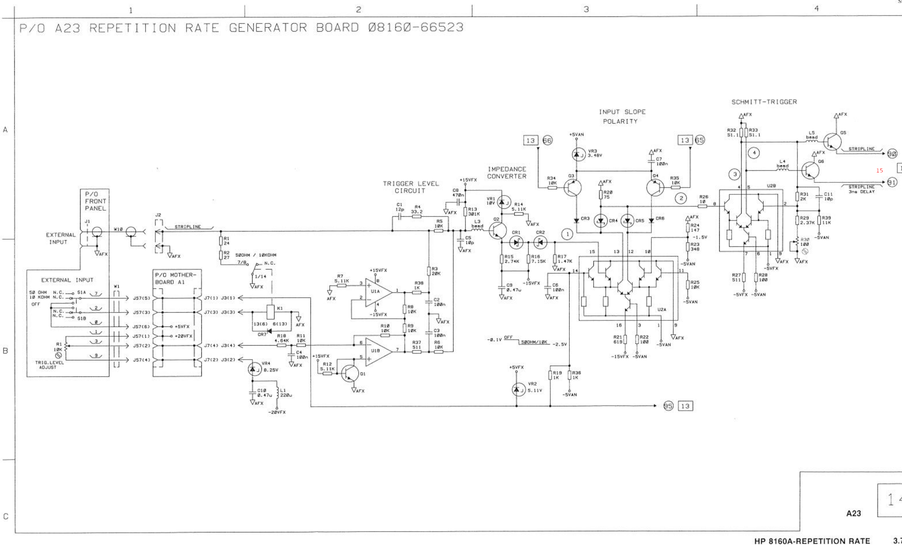
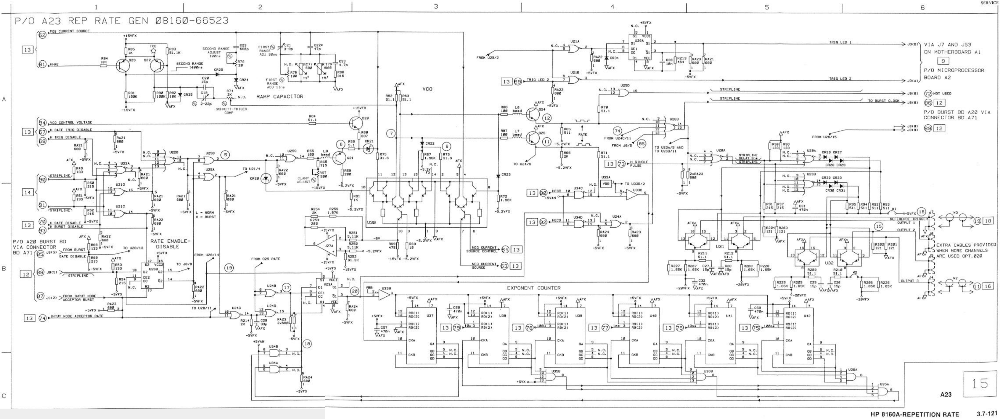
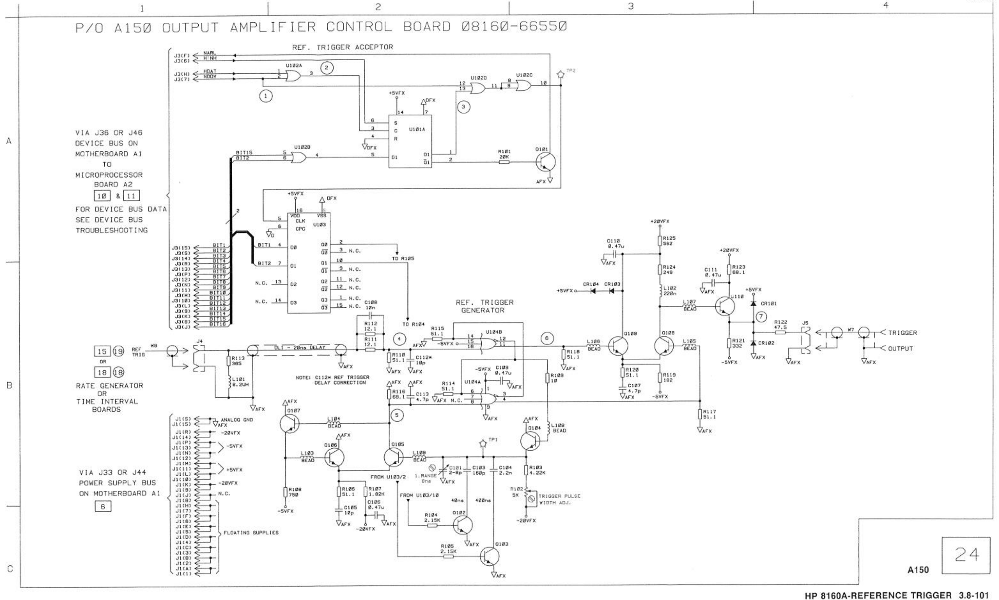
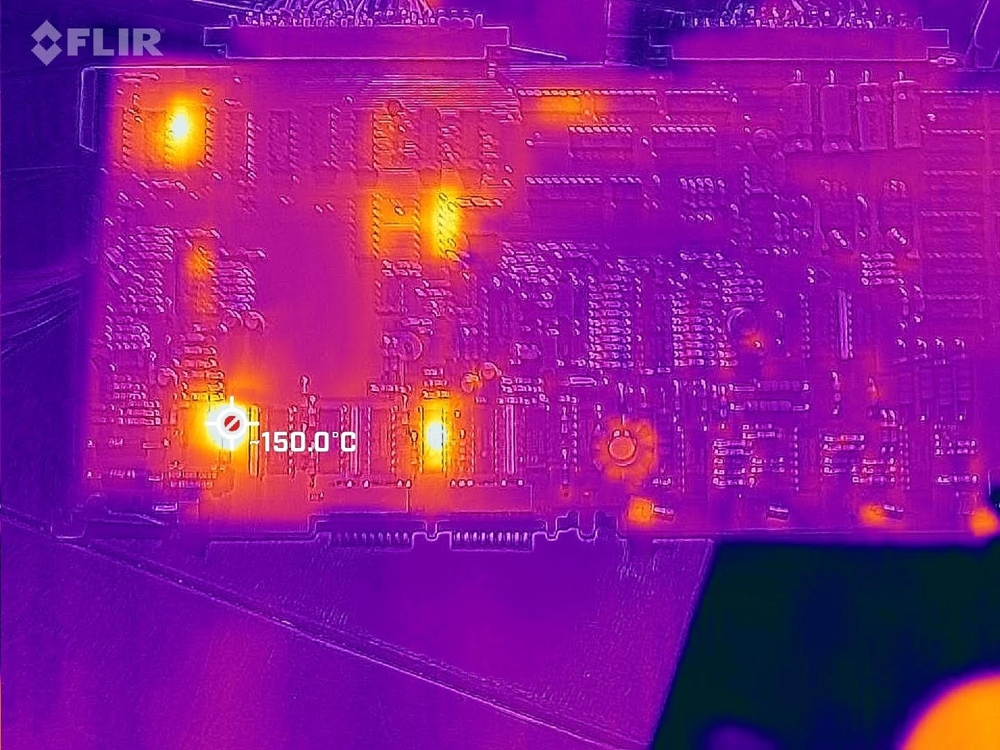

# HP 8161A - 8161-66523

Picture:

This card had the following connections:

- 2x connector board to board 2
- 1 → 5.2
- 2 → 14.1
- 3 → 21.3 (metallic cable)
- 4 → 4.1
- 5 → chassis left

Component overview:

Schematic:

2nd part:

3rd part:

Partial schematic of 66550 A150 Amplifier control board:

I placed the board in the chassis together with the CPU board and the trigger board. Switching on the replacement PSU’s showed a complete short on most supplies. The thermal camera showed some suspicious parts heating up:

This seemed to be cr7, which tested as a wire - but it was ok; it was just mounted parallel to the coil of a relay.

Another thing heating up was U68, a 1820-1173 (mc10124L), a “Quad TTL to MECL translator”.
