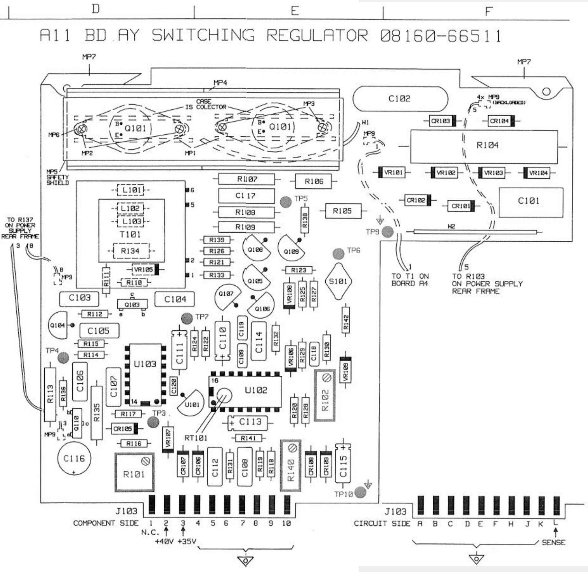
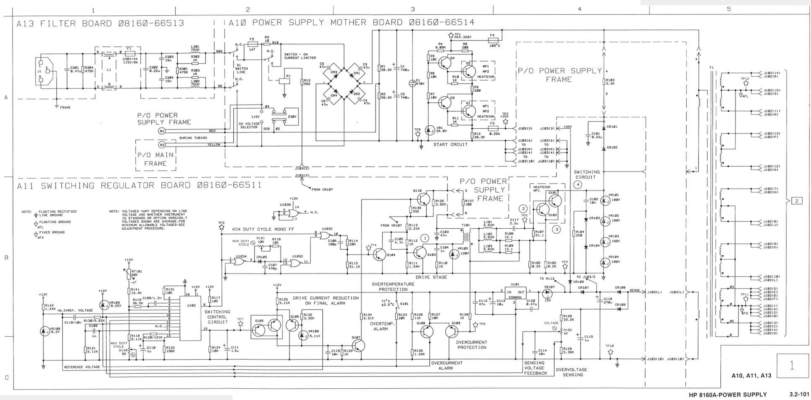

# HP 8161A PSU 8160-66511 Switching regulator

Pictures:

Heavy burn marks

Rest of PSU seems ok:

Reference manual page 137

Layout of the board:

Schematic diagram:

Problems:

- R107 vaporized completely (51.1 ohm, wattage?)
- C177 died as a victim of R107’s demise (2.2 uF bipolar 63v mkc 61)
- vr106 suspect
- r108, r109 exploded (12.1 ohm 1W)
- Q101, Q102 of course died too (BUS12 Philips, 400V 125W 8A (DC)/20A (AC), NPN)

That BUS12 will be hard to get, and replacements apparently too - there does not seem to be a lot of use of the TO-3 housing anymore 8-/

Buy from: [https://teamequip.com/hewlett-packard-08160-66511-power-supply-board-t109364/](https://teamequip.com/hewlett-packard-08160-66511-power-supply-board-t109364/)
