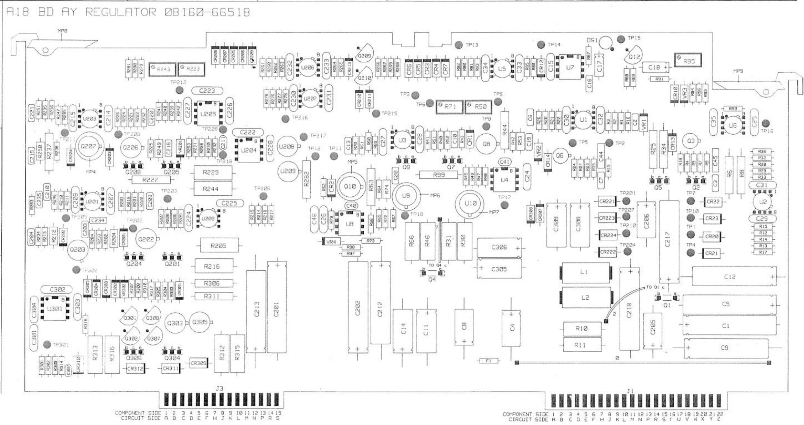
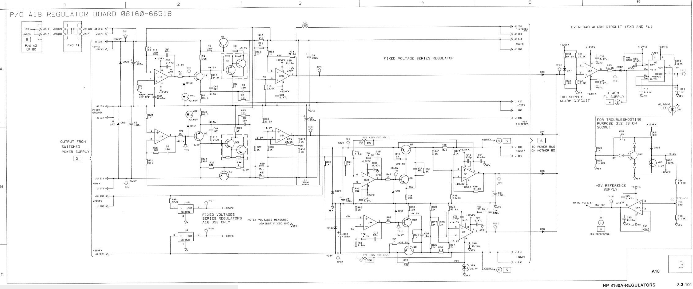
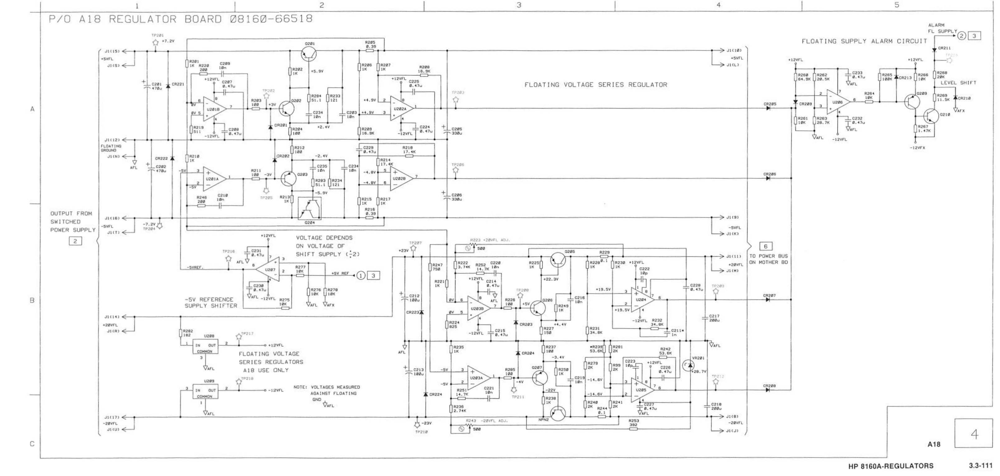

# Series Voltage Regulators (bd ay 66518)

Board overview:

Schematic diagram:

Second part:

J1 Test connector colors:

| **Pins** | **What** | **Color** |
| --- | --- | --- |
| 19+W | +20VFx in | Brown |
| 13+P+20+X | +5VFx in | Red (2x) |
| C + Z | GND | Black |
| 21+Y | \-5V | Purple |
| 22  | \-20V | Blue |

Voltage checks

U10 (+12v reg) seems to have been replaced .

Providing -22 and +22 delivers 12v on tp17 and -12v on tp18. Adding the +6.6V on red gives a 5V output on pin 4 of J1. The voltage reference also gives nice +5.0020V (R95 trimmer). I cannot check ripple on the output because I’m providing input from my lab psu.
