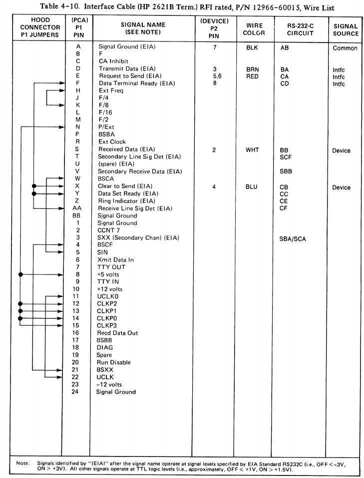
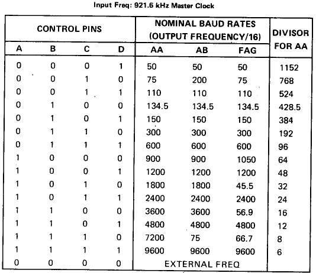

# The 12966-60002 BACI Buffered asynchronous interface

This card is needed to get a console on the HP 1000. I have no cables for it, so I'll need to make my own. Information on the cable connector [can be found here](../card-connectors/index.md), they are expensive and not common. I however had another cable, 12880-60003, for a card I do not have, and I will rewire that.

The next challenge is to find the proper pinout. The cable connector for this board is not just something to get the signals out but it also serves to "configure" the board for the specific thing it wants to connect to. To handle that the connector internally wires connector pins together to create the right config. The service manual describes how the connectors need to be wired for the different output options.

I am using a manual with the name "12966-90001_BACCI_Apr84". This seems to describe a newer version of the boards than I have, but it contains both original schematics plus "revision 2" schematics next to one another. One large difference is that the revision 2 schematics do not seem to have the crystal oscillator - which is present on my board.

For a normal serial interface I think we need the following:

## Bit (Baud) rate

Reading back from the diagram.. The UART (a COM8017) expects 16x the bit rate on its clock input. That clock input comes UCLK on sheet 1, which is connected to J1-22 (UCLK) using a XOR port. On the connector J-22 gets connected to J-11, UCLKO. This is the output of U61, a [MM5307](mm5307.pdf), the "baud rate select" part. 
This register has two connector inputs: 

- J1-H EXT FRQ <- connected to J1-K, F/8.
- J1-R(?) EXT CLK (unconnected)

F/8 is the Qc output of a 74293 counter. This counter gets fed from a crystal oscillator, with a 7.373MHz crystal. This forms the entire chain.

### Calculating the bit (baud) rates

The 7.373MHz divided by 8 (Qc) = 921.625KHz. This is the input for the [MM5307](mm5307.pdf) which uses that clock to generate the following bit rates:

### Looking at the cable diagram: external selection.

We can see the following:

- Pins J1 12..15 and N are connected to +5V. 12..15 are the inputs to the MM5307, hard tied to 1, so this hardcodes a bitrate of 9600bps. The N pin (P/EXT) connects to DOD of the baud rate select register (U62, sn74173 but marked as 8551 on the diagram) which is a 4 bit register with 3state outputs, and P/EXT connects to the two enable pins (H = disabled outputs).

