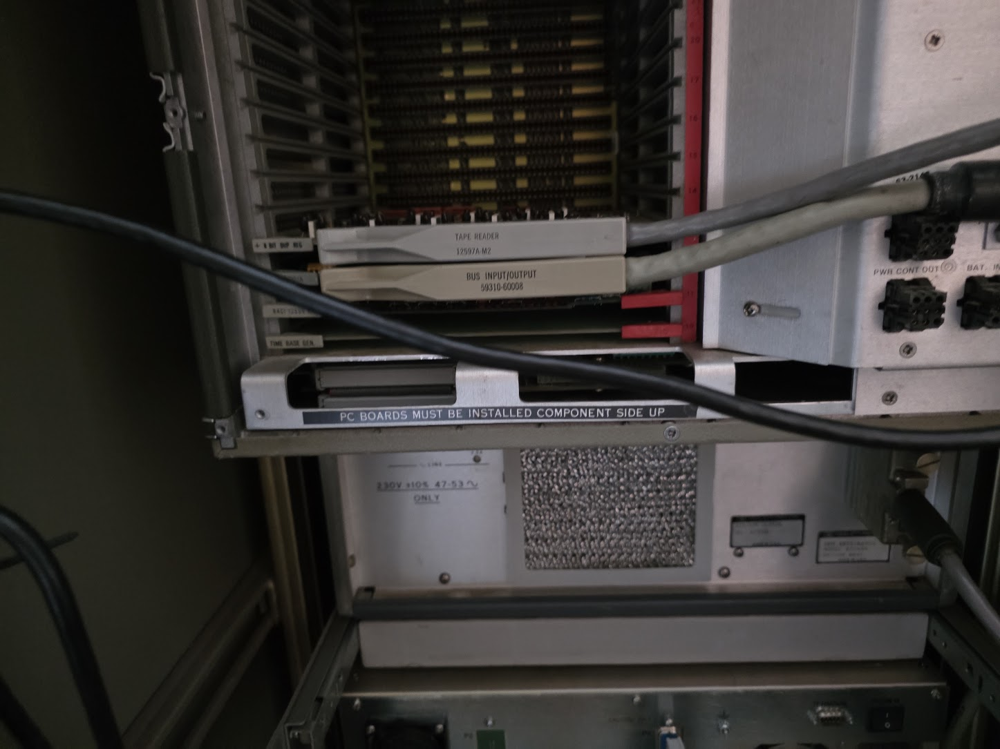
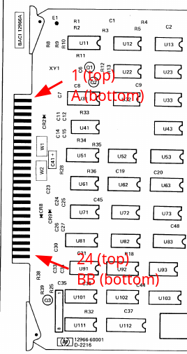

# Card connector types and pinouts

This series uses card edge connectors all over the place.

## Cable end connectors

Most extension cards that have a cable will have a 2x24 pin card edge to connect the cables to. Cable connectors on these connectors must be placed with the cable exit to the RIGHT:

The edge connector needed for this has the following specs:

* Contacts: 48 total, arranged as two rows of 24
* Pitch: 0.156 inch (3.96 mm)
* Type: dual-readout card-edge / edge-card connector, one position keyed as a polarizing slot
* Mating part: an EDAC 305-series (or Sullins equivalent) 48-position 0.156" edge connector

and can be found here: [https://eu.mouser.com/en/ProductDetail/587-305-048-500-202](https://eu.mouser.com/en/ProductDetail/587-305-048-500-202). The product spec [is here](EDAC_305_315_355_Series_Card_Edge_Connectors_English_Ordering_Guide.pdf).

The pinout for the connector, as seen from the card, is as follows:

* The component side of the board houses pin numbers 1..24
* The back side of the board houses A..BB

Looking at an example board like this:

the pinout is, from top to bottom of that image:

| Component pin | Bottom pin |
| ------ | ------ |
| 1 | A | 
| 2 | B | 
| 3 | C | 
| 4 | D | 
| 5 | E  | 
| 6 | F  | 
| 7 | H  | 
| 8 | J  | 
| 9 | K  | 
| 10 | L  | 
| 11 | M  | 
| 12 | N  | 
| 13 | P  | 
| 14 | R  | 
| 15 | S  | 
| 16 | T  | 
| 17 | U  | 
| 18 | V  | 
| 19 | W  | 
| 20 | X  | 
| 21 | Y  | 
| 22 | Z  | 
| 23 | AA | 
| 24 | BB | 

