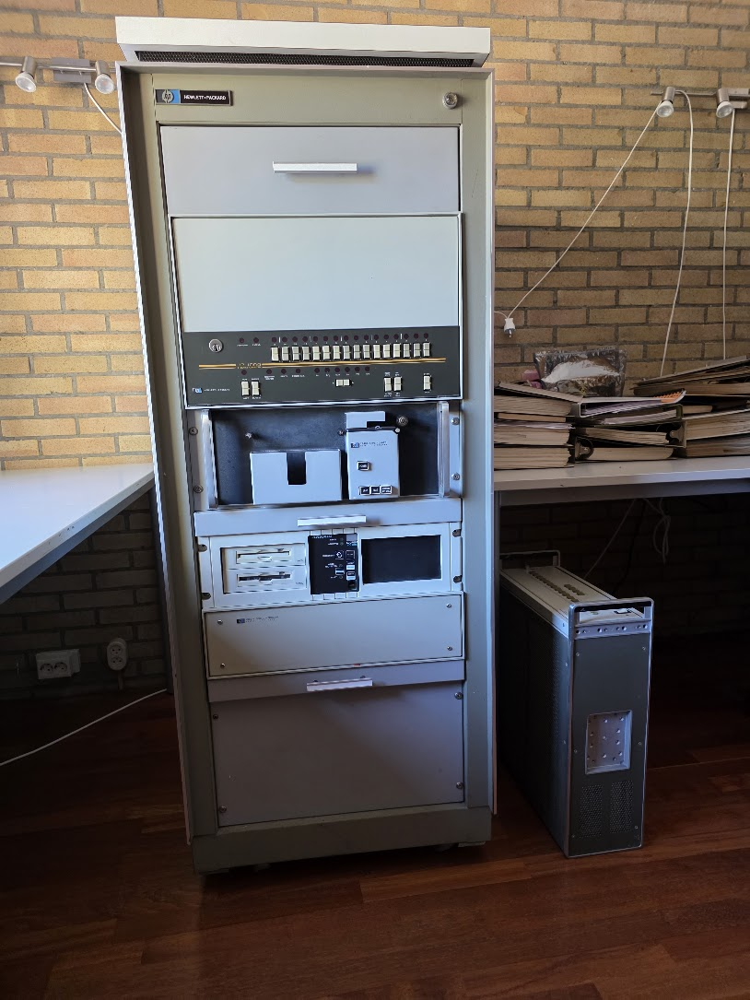
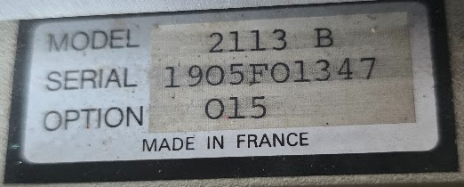
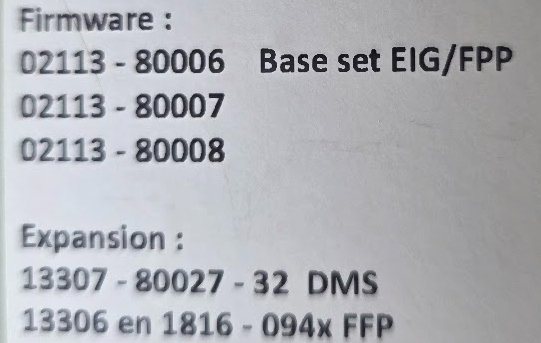
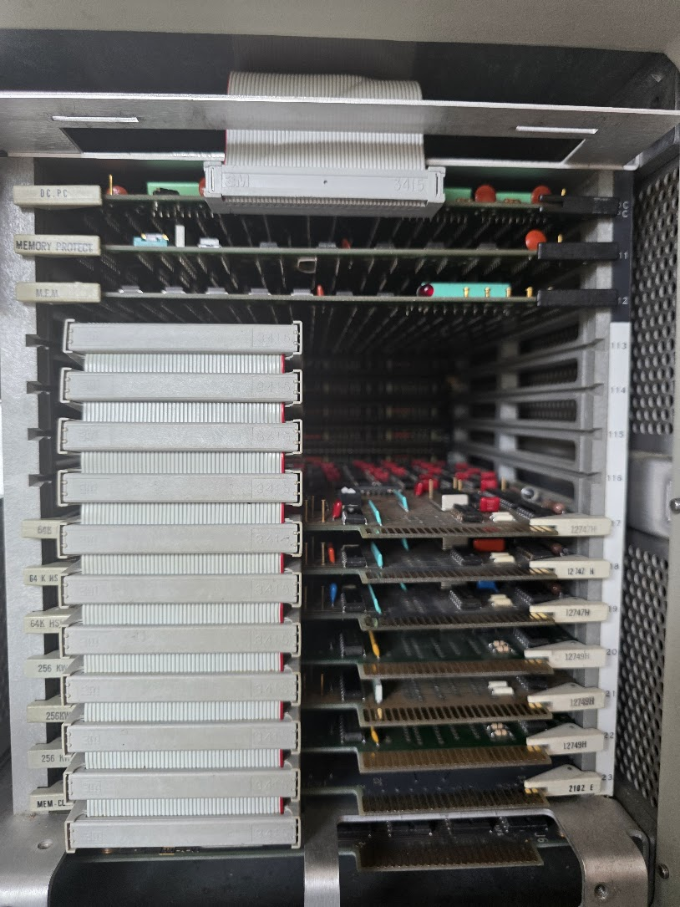

# The HP 1000 (2100 E-series 2113B)

This is a 16 mit minicomputer from around 1976. I got it complete in a rack, together with:

* An Arraid disk subsystem (probably an AEM-6C) with an HP 13037C Disc controller
* A paper tape reader (HP 2748A)
* Manuals
* Spare boards
* Paper tapes

The whole rack weights a tonne; it is all solid steel. It was a bit of work to move it, many thanks to my friend Marc for his help!

The machine's serial number is 1905F01347:

It has a few installed options:

The CPU cage holds the following:

It holds the following boards:

| Code      | Name       | Description |
| --------- | ---------- | ----------- |
| 2102E     | Mem-Cl     | High-performance memory controller |
| 12749H    | 256KW      | 256KW (512MB) memory, 3 boards |
| 12747H    | 64K HSM    | High-performance memory, 3 boards |
| ?         | DMS/MEM    | Dynamic Mapping System / memory expansion |
| 12892B?   | Memory prot| Protects the OS from being overwritten by user code |
| ?         | DCPC       | Dual channel port controller (DMA) |

This is a machine built mostly with TTL, with LSI memory. Specs:

* Max memory: 1280KB
* I/O Slots: 14

## Memory Protect option (12892B)

Memory Protect is a hardware guard that lets a resident operating system protect itself (and the system tables) from being clobbered by user programs. It's the piece that makes real multiprogramming under RTE possible. On the E-Series the board is the HP 12892B Memory Protect.

It works by trapping violations and forcing an interrupt on select code 5 (octal), with the offending instruction aborted before it can modify memory or do the illegal operation. The conditions it catches are:

- Fence violation — a write (or jump/JSB) into the protected lower region of memory. You load a fence register with the boundary address; anything below it is protected.This is how RTE keeps a user program from writing over the OS.

- Privileged I/O — any I/O instruction to a select code other than 0 and 1 (overflow/switch register). User programs therefore can't bang on the hardware directly; they have to go through the OS.

- Halt instructions — a HLT from user code traps instead of stopping the machine.

On the E/F-Series the Memory Protect logic also ties in with the Dynamic Mapping System (DMS / Memory Expansion Module) and parity, so map/parity violations likewise come through the same select-code-5 interrupt mechanism when those options are present.

### Why do we care?

- Required for RTE (and any protected, multi-user/multiprogramming operation). Without it the OS can't defend itself, so you'd be limited to standalone/single-program use.

- It's also what enables the privileged-instruction model that the OS scheduler relies on.

- If you're just bringing the machine up from the front panel and running standalone diagnostics or loaders, you don't strictly need it — but you'll want it before running RTE.

### A couple of practical notes

- It's a separate board in the backplane wired to select code 5; if a previous owner pulled it, RTE generation will still expect it and behave oddly without it.

## DMS/MEM Option

DMS = Dynamic Mapping System; MEM = Memory Expansion Module — two names for the same memory-management option. It's the HP 1000 equivalent of an MMU, and it does two big things: it lets the machine use far more memory than the CPU can directly address, and it provides per-page memory translation and protection. This actually consists of two parts:

* 12731A Memory Expansion Module (MEM) — the hardware board that holds the map registers and does the logical-to-physical translation.

* 13307B Dynamic Mapping System firmware — the microcode ROMs (for the 1000 E/F-Series) that add the ~38 DMS instructions which drive the MEM. The MEM hardware does nothing useful without this firmware.

### The problem it solves

The HP 1000 is a 16-bit machine. An address word gives you 15 bits of address (the 16th is the indirect-reference flag), so the CPU can directly address only 32K words of logical memory. That's the hard ceiling without DMS.

### What DMS adds

1. Memory expansion via mapping. DMS divides the 32K logical space into 32 pages of 1024 words each, and gives each page a map register holding a physical page number. The translation lets physical memory grow up to 1024K words (1M words) — far beyond the 32K the CPU can name at once. At any instant a program "sees" 32K, but the OS can repoint the map registers to slide that 32K window anywhere in physical memory.

2. Multiple map sets. There isn't just one map — there are four:

    - System map — for the OS/RTE.

    - User map — for the currently running user program.

    - DCPC Port A map and DCPC Port B map — so the two DMA channels translate addresses independently of the CPU.

    This is what makes real multiprogramming work: the OS and each user partition get their own logical-to-physical translation, and DMA can run into a different physical region than the program the CPU is executing.

3. Per-page protection. Each map register carries read-protect / write-protect bits. Combined with the Memory Protect board you already have, this upgrades protection from a single fence boundary to per-1K-page read/write control — so RTE can isolate partitions from each other, not just protect the resident OS below a fence.

4. A dedicated instruction set. DMS comes with firmware instructions to load/store map registers and to do cross-map block moves (move data between the system map and a user map), jump-and-restore-status for context switches, etc. RTE leans on these heavily for swapping and partition management.

### Why it is nice to have it all

Together with your Memory Protect and DCPC boards, the DMS/MEM gives the 2113B the full hardware foundation RTE needs: large physical memory, isolated mapped partitions, protected pages, and independent DMA mapping. In other words, all three options you have populated are the trio that turns the box from a 32K standalone machine into a proper protected multiprogramming system.

## The DCPC Option (Dual Channel Port Controller, DMA)

Without DMA, the CPU does programmed I/O: it executes instructions to move every single word between a device and memory. That's fine for a slow terminal but hopeless for a disk. DCPC offloads that — you set up a transfer once, and the controller runs it autonomously.

"Dual-channel" means there are two independent DMA channels (Port A / Channel 1 and Port B / Channel 2), so two block transfers can be in flight at the same time — e.g., disk and mag tape concurrently.

### How a transfer works

For each channel you load a small control block:
- Device select code — which I/O interface this channel serves.
- Starting memory address.
- Word count (and direction, in or out).

Then you start the channel and the CPU is free. DCPC moves the block by cycle stealing — it grabs memory cycles as it needs them, momentarily pausing the CPU's access to the memory bus, then hands the bus back. The CPU keeps executing the rest of the time, so the transfer overlaps computation.

### Ties to your other options

This is where a fully-populated machine matters:

- With DMS, the DCPC has its own Port A and Port B map registers (two of the four map sets). So DMA addresses are translated through dedicated maps and can target any physical page in the expanded memory, independent of whatever map the CPU is currently running under.

- That combination — DCPC + DMS + Memory Protect — is exactly what RTE relies on to do fast, protected disk I/O into mapped partitions while the CPU runs other work.

In short: DCPC is what makes a 2113B capable of real disk/tape throughput instead of crawling along with programmed I/O.

## Links

* [Board inventory](board-inventory/index.md)
* [Boot (IBL) PROMs](boot-proms/index.md)
* [Disk configuration](disk-configuration/index.md)
* [HP CE 1000 M/E/F Parts list](http://bitsavers.informatik.uni-stuttgart.de/pdf/hp/part_numbers/HP_CE_Parts_List_Jan1992.pdf)
* [HP 21xx series - I/O Interfaces](http://madrona.ca/e/HP21xx/iointerfaces.html)
* [HP 21xx processor series](http://madrona.ca/e/HP21xx/index.html)

