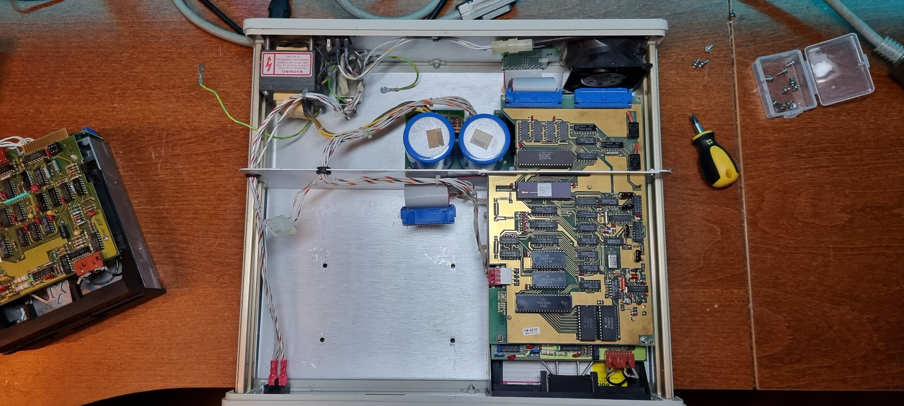

# HP82901M Disk drives

This was a gift from Rik Bos (thanks a lot, Rik!). It is a HPIB disk pair suitable for several HP machines.

I want to try to use this with my 9825A, because I have an HP/IB adapter for that, plus the SSS ROM (which I got from Adrian, thanks a lot!!).

# Getting the SSS Rom to work

The first challenge: the ROM module did not work. None of the commands that should be present with the SSS Rom connected worked, all of them reported error 3 meaning they were not recognized.

I got the schematics for the module from Paul, and the manual from the HP museum. Opening the module showed the problem: the address decoder PROM was not installed. I bought a new 82S129 on EBay and programmed it with my new Stag Quasar programmer - and that fixed that problem.

# Trying the drives

I tried to format a diskette using the init commands for both drives:

```
init 701
init 702
```

The first one, for the first drive, did do something: it played with the drive for about 3 minutes but after that it reported a D9 error which is “verification failed”.

The second one reported a D0 most of the time, but sometimes something else. Time to open up the box :wink:



The control board uses an MC6802P processor, a MB8866 floppy controller and the D8291 GP/IB Talker/Listener.

The floppy drives are HP 9130K drives.
