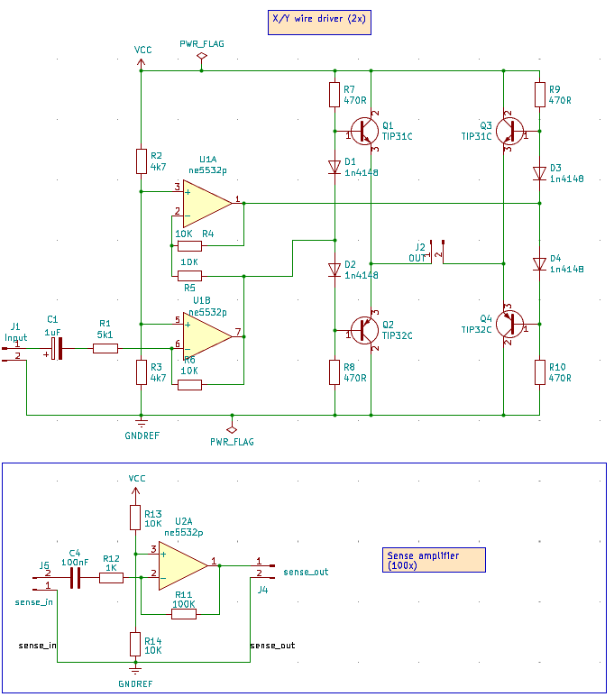
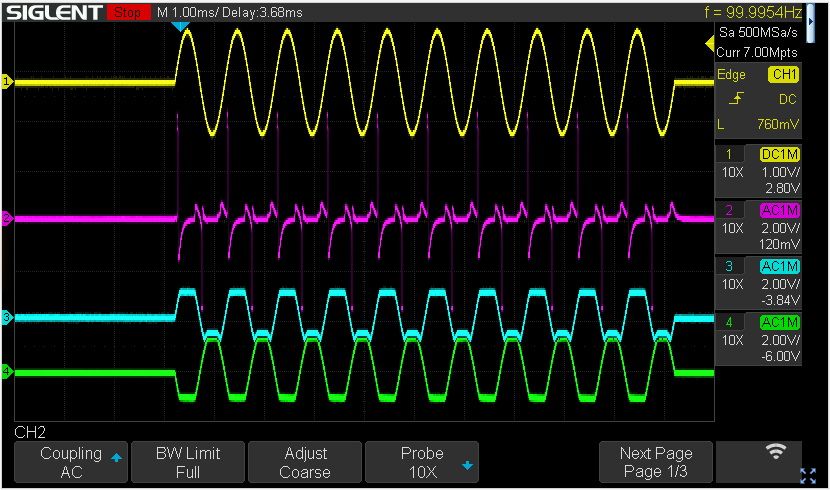

# Core memory experiments

I got a single core memory plane from EPay:

After some microscopic introspection I soldered some new wires to the panel:

| **Colors** | **Type** | **Resistance** |
| --- | --- | --- |
| Orange | Sense? Runs all cores diagonally | 17 ohm |
| Blue | Inhibit? Runs all cores diagonally | 11.51 ohm |
| Yellow | Address X | 1.98 ohm |
| Green | Address Y | 2.01 ohm |

To be able to put sufficient current in the X and Y wires I built a simple full bridge amplifier to drive one of the X/Y wires, and a small 100x amplifier to detect the pulse from the sense wire:

which will receive a signal from my signal generator so that we can see the cores flip with a bit of luck.

I sent a 1kHz sine pulse train of 10 periods separated by 100ms pause as to not overload the cores. This resulted in this:

The yellow line is the function generator input. Blue and green are the outputs of the bridge amplifier (referenced to gnd). The purple trace is the sense output, and we see the core nicely flipping :wink: