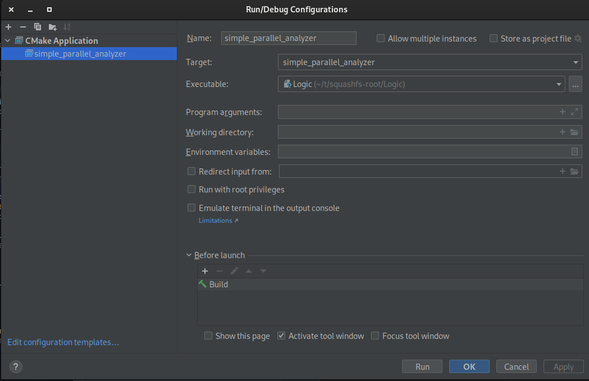

# Creating/Debugging Saleae analyzers

## Debugging

Debugging analyzers is a pain in the A because of the AppImage crap around it. The simplest way I found to debug is to print debug info. But this too is foiled: some peanut-brained person apparently decided that hiding stdout would be useful.

I ended up adding a small method to add logging output to a file, as follows:

```
extern "C" {
    void dbg(const char* format, ...)
    {
        FILE* file = fopen( "test.log", "a" );
        if( file != NULL )
        {
            va_list args;
            va_start( args, format );
            vfprintf( file, format, args );
            va_end( args );
            fclose( file );
        }
    }
}

```

To use this easily do the following in preparation:

- Extract the Logic2 appImage using --appimage-extract as a parameter
- Specify the “Logic” program as the target in CLion’s target:  


With this you should be able to load your app, and the logfile will be created in squashfs\_root of the extracted image (tail -f is your friend).