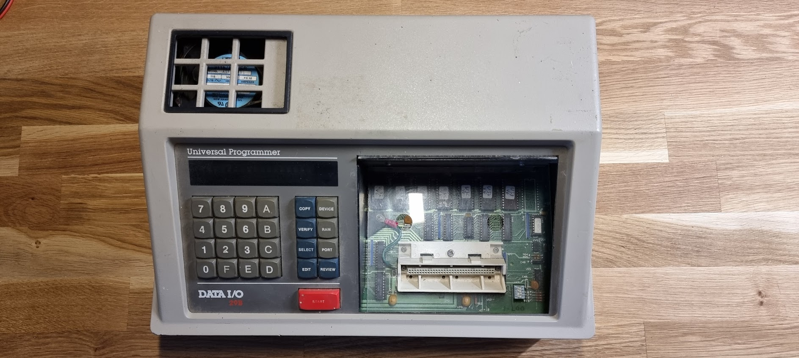
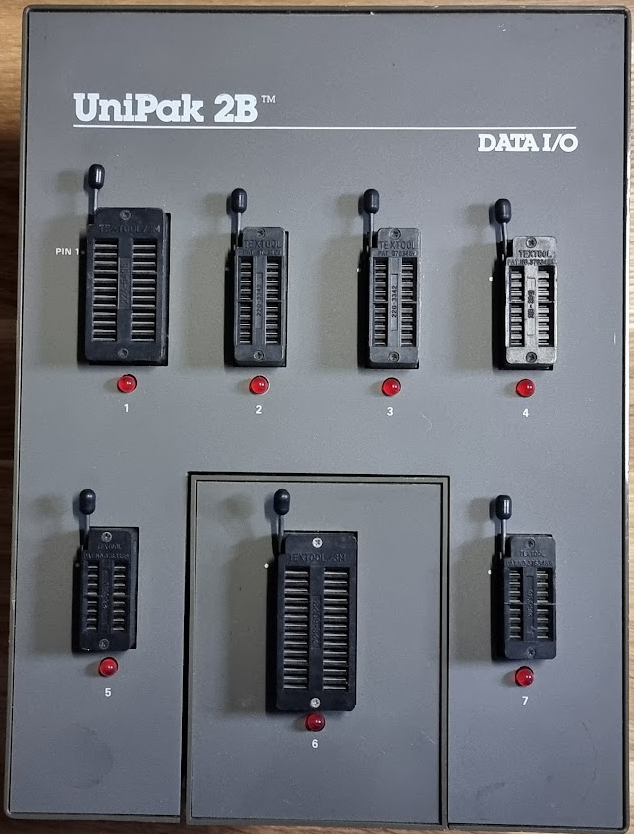
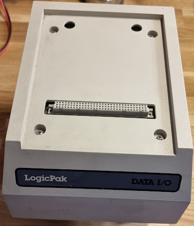
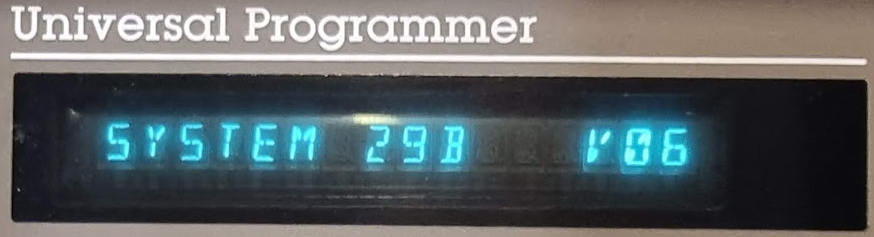

# Data I/O 29B

After years of searching I found a seller, from an inheritance. I bought the following:

- Data I/O 29B programmer
- UniPak 2B

and got a LogicPak for “free” with it, albeit without any plugin modules.

The machine as it arrived:

After connecting the UniPak and switching on I’m greeted with:

V6 is the last version of the software for the 29B. Entering SELECT B2 START I got:

So, not the 1MB version but 64K; I might want to extend that later.

The UniPak version can be found with SELECT EF START:

The max version is 27, so this is pretty good.