# Dolch Pac 64

[TOC hierarchy]

I got this machine through Marktplaats, a Dutch consumer auction and secondhand items site. Many thanks to Nico for the careful packaging and the inclusion of everything needed!

The machine is a beautiful rugged “lugtop” from around 1990.

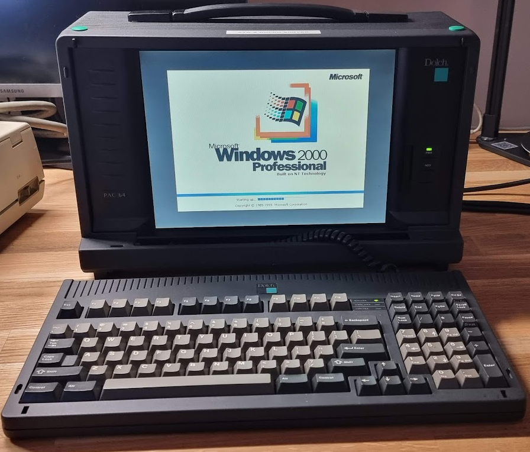

The machine was originally a Network General Sniffer. These were immensely expensive machines at the time, containing different kinds of hardware to allow “sniffing” on different communication networks. Mine came with a 3com FDDI card (3c996-SX), a 3com 1GB ethernet card (3c996-T) and a WAN card (a Network General L2000).

The machine came with two keyboards. The one attached to the machine was damaged; the left control key was missing a cap, and the switch under it was broken. The second keyboard was fine but had a connector that was too wide; it would not fit inside the Dolch. This was easily fixed by cutting it off and replacing it with a new RJ9 P4C4 connector.

The machine would not boot; its CMOS battery was dead so it could not retain any settings.

Links:

- [Complete disassembly video](https://www.youtube.com/watch?v=rCC9Z9Rdb_8)
- [CuriousMarc video series for the PAC 65](https://www.curiousmarc.com/computing/dolchpac-65-luggable-pc)

# Specs

|     |     |
| --- | --- |
| Bios | Award bios version V4.51PG |
| Processor | Pentium 1 (P54) |
| Motherboard | AI5TV |

# First round…

## Fixing the battery

This machine came with a dead battery, and it causes boot failures.

The battery is embedded in a “chip” like thing that contains a real-time clock, memory and the battery, all helpfully enclosed in an epoxy layer - so the battery cannot be replaced. The type of the thing is Odin oec12c887a. A replacement for this, the Dallas ds12C887A is still available but sourcing a new one is hard.

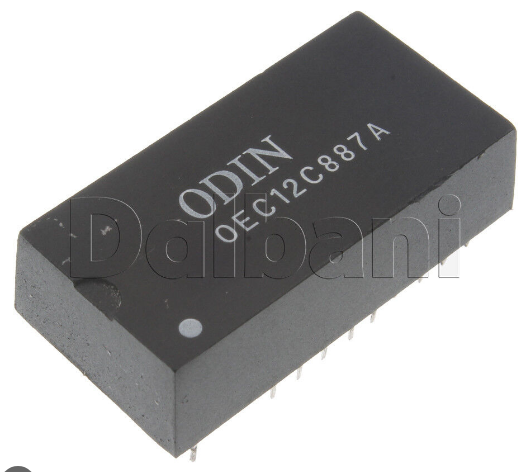

I attempted to repair the module by adding an external battery as found out by other courageous people. Links:

- [Youtube video explaining the repair](https://www.youtube.com/watch?v=xBvw1TLHyqM)
- [Repair of the Dallas chip (same for the Odin one)](https://www.classic-computers.org.nz/blog/2009-10-10-renovating-a-dallas-battery-chip.htm)

As the device is not socketed I decided to use a soldering iron to chip away the exterior to expose the pins that need to be connected to the new cr3032 cell:

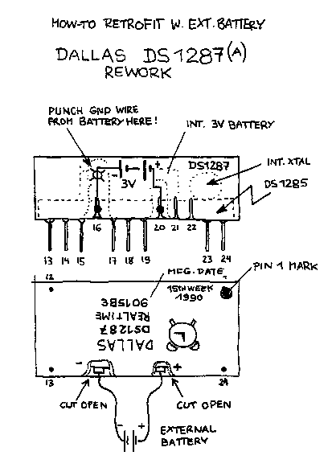

That resulted in this:

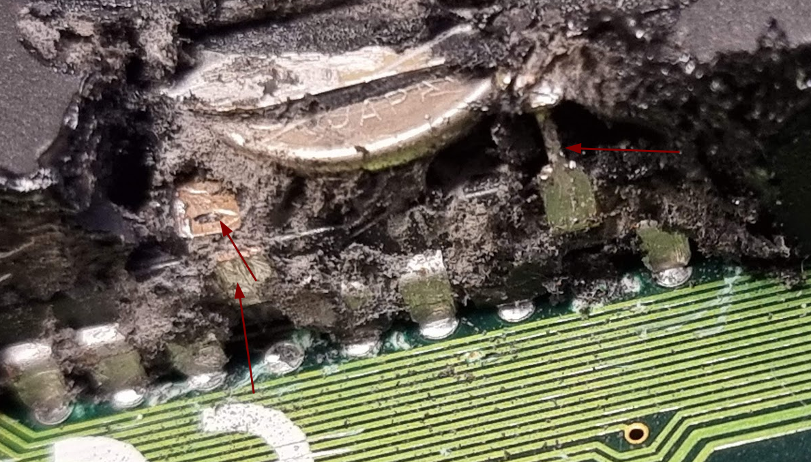

These are the connections to the expired cell. Next step is to add the new cell battery:

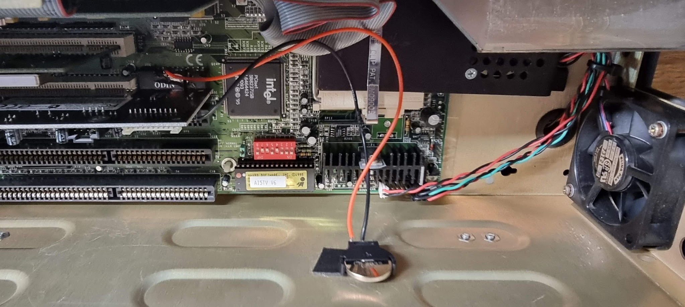

And with that the machine could remember its settings :wink:

## Storage

The machine was altered, it came with 2 harddisks and a CD reader. The extra harddisk was lodged between the CD drive and the other drive and not fixed with screws. One disk contains Windows 2000, the other Windows 98. Both disks have problems and give errors, but you can get the OSes to boot, sometimes partially. The Windows 2000 disk contains the Sniffer software.

The first drive (I assume the original) is a [Quantum Fireball 1280AT, 1281MB](https://stason.org/TULARC/pc/hard-drives-hdd/quantum/FIREBALL-1280AT-1281MB-3-5-SL-ATA2-FAST.html)

It contains windows 2000 as the base OS, with boot options present for NT and DOS.

The second one is a Quantum Fireball 2.1AT, 2.1GB, containing a Windows 98 installation.

The floppy drive is missing, sadly enough, making it impossible to install an OS as the CD/ROM cannot be booted from.

Both harddisks were unreliable: after fixing the battery the machine would randomly boot from one or the other depending on whether the disk came “alive” at powerup. The boot itself would fail often because of disk errors. Next step is to recover the disk contents, if at all possible…

## Recovering the data

These are IDE disks. To make recovery easy I got an USB3 to IDE converter. The mode, I got was this one:

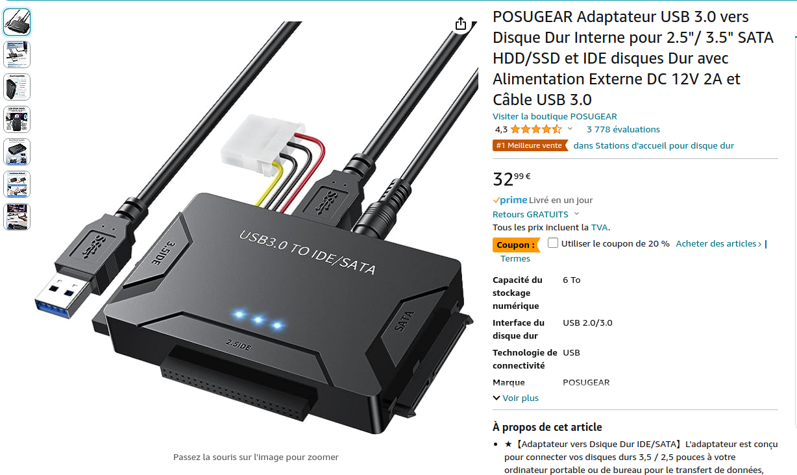

The device is very complete; it comes with USB cable and an adapter, accepts both 3.5 and 2.5 IDE connectors and SATA, and can power the disk drive by itself, making it the perfect tool.

The first step in recovery is to add the drive to the IDE converter and to switch that on. This should result in the drive being recognized by the OS. To see that you can run the following on a console:

```
dmesg -T -w
```

This will show the kernel log buffer messages as they appear during the process.

After switching on the converter the drive should start up. I needed to do that a lot, at first, as the drives really did not want to, but after some time they at least came up reliably. This shows in dmesg something like this:

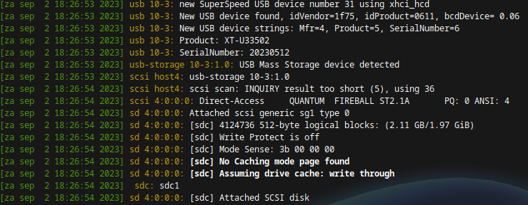

In this message you also see the drive name (sdc) which needs to be used for the recovery.

> [!WARNING]
> Do watch out here: if you restart the IDE converter this drive name can and will change!!

Once you got the disk recognized by the OS it is time to start recovery.

## Using ddrescue

The actual recovery was done using ddrescue. This tool can create an image file from a harddisk and has lots of options to retry recovery of bad blocks. While it reads the data it creates a map file (called a log file in the descriptions) which contains the exact state of recovery at any point in time. It uses that map file when the program is restarted, so that it continues where it last left off. This is important because some failures require switching off the disk drive, causing the program to exit. You can then easily restart the program and it continues where it left off.

The first start of ddrescue for the drive looks as follows:

```
sudo ddrescue -r 1 -d /dev/sdc w2000.img w2000.log
```

This limits retries to 1 (-r 1) because the drive and the OS are both already retrying, usually. The -d means “direct I/O” to the drive. The two file names are the output image file and the map file mentioned earlier.

This should start the process of recovery, and it shows info while it trundles along:

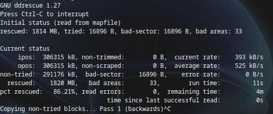

If you hit a bad spot you will hear the drive retrying. If that works things move on without errors, but if it fails you might find that the process actually hangs without doing a lot. To work around that I found that the best way is the following:

- Switch off the IDE converter (because killing the process will not work while the kernel is trying to finish that I/O, a very bad thing in Linux). This will stop the ddrescue process.
- Now start it again, but with additional options:
```
sudo ddrescue -r 1 -n -c 1 -d /dev/sdc w2000.img w2000.log
```
- This will start to read the bad part again, but now it will do a sector level read instead of reading a whole lot of sectors. This will be very much slower, but it is easier to get the sectors recovered.
- Once it passes the bad area and you see that data is being read again you can CTRL+C the program and restart it with the original options to read faster.
- Just repeat this procedure every time you see a long pause.

One extra option I found useful is -R, which starts the reading at the end of the disk. I had a lot of failures at the start and because you never know when the disk becomes completely unusable reading at the end gave me a lot of data in a short time before hitting the bad parts.

> [!WARNING]
> While it is OK to change some options in repeated invocations of the ddrescue program **never** change the names of the image file and/or the log file!

## Recovery results

The Windows 2000 drive was recovered completely in about 3 hours. It had quite some bad spots, but repeating the failed sectors in the end allowed them to be read. I upped the retry count to three (-r 3) after a while to recover the last parts, and that worked.

The W98 drive was very, very bad and had a large amount of bad sectors. I stopped switching from the slow method to the fast method after an hour or so as it always hit a bad spot after some seconds. I continued the read using per sector loads. It took about one day for the whole disk to be read, with about 130K bytes of data in bad sectors- not too bad. After the first complete pass ddrescue started additional passes to try to read the bad sectors again. I stopped that after a few hours as none of them appeared to be readable.

## Replacing the disk in the Dolch

I decided to replace the IDE disks with a single IDE to SDCARD converter. I might have been able to find another still working IDE disk, but these would all be quite old and prone to failure at this time.

I used the following converter:

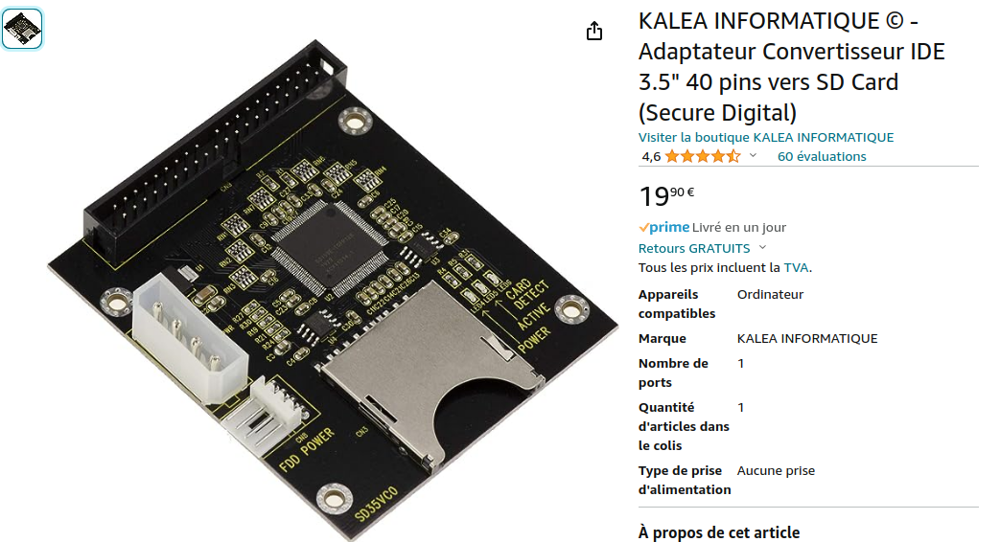

The type seems to be an “SD35VC0” (the 0 is either a zero or the letter O.

I wanted to see whether I could start the Dolch from the w2000 image I recovered. To do that we need to copy the image file to the SD card. I did this by plugging the IDE-SD converter into the IDE-to-USB3 converter and handling the copy to that using ddrescue again, as follows:

```
sudo ddrescue -f w2000.img /dev/sdb restore.log
```

> [!WARNING]
> Make sure to use a NEW logfile for this, otherwise you overwrite the original one with completely unrelated data!!

Make sure to wait for the process to finish and eject the disk from the OS before removing/switching off the converter.

Many thanks [to this article on how to use ddrescue](https://www.technibble.com/guide-using-ddrescue-recover-data/).

## Making the Dolch boot from the new device

The IDE to SDcard converter was installed as the primary IDE device. Starting the Dolch would not report errors, but the startup would hang. The reason for this is that these ancient bioses and their related OS’es are using things like cylinder number, head number and sector number as identification of where what is on a disk. This related to the Partition table but also to some of the boot files on a partition. And our new card has a geometry that differs from the original disk - a lot.

To fix this you first need to find out the geometry of the original disk. In my case the “original” primary disk was the w98 one and I’m using the w2000 one now. So I popped the old W2000 drive on the primary channel, started the Dolch and entered setup.

In the setup menu choose “IDE HDD AUTO DETECTION”.

This should ask you to confirm the things it found. Use the default answers (1st one Y, others N).

After that go to the first item and look at the disk parameters. For my drive these were:

- Size: 1282
- Cyls: 621
- Head: 64
- Precomp: 0
- Landing: 2483
- Sector: 63
- Mode: LBA

Make sure to save these, as this is the same layout that is expected by the image now on the SDcard.

Once saved replace the disk with the SDcard thing again. It should now boot.

## Keyboard repair

Next was the damaged keyboard. I ordered some replacement switches (Cherry MX Blue) and replaced the damaged switch:

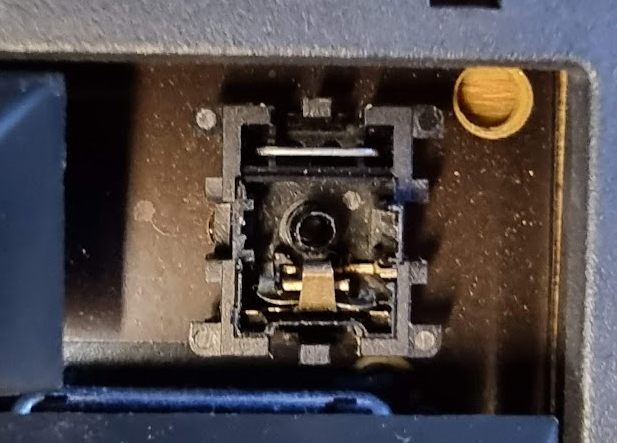

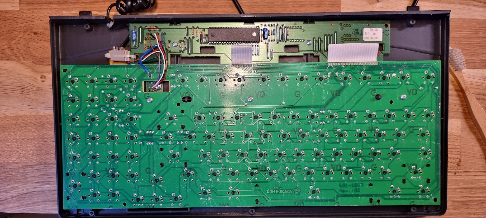

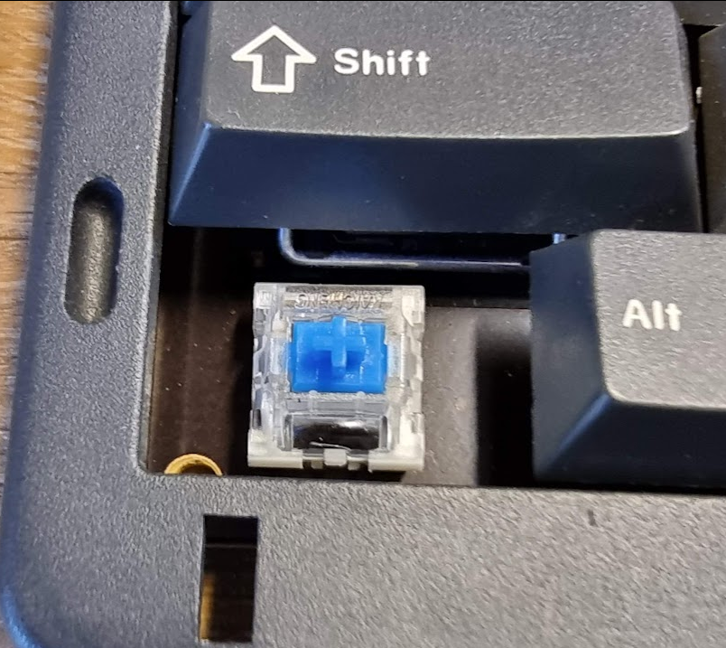

I did of course not have the original keycap so I reused one from an old set of PC keycaps.

# Round 2

When I started to put everything back into the housing after a week I found out that the machine would not boot- of course after everything got in..

The clock and CMOS was also reset. Checking the battery showed it to be completely flat. Clearly something uses a lot of power.

After replacing the battery I also found out that something is wrong with the IDE controller or the cable; it reports a disk failure 

 - more to investigate..

There are more problems than just the IDE.. The floppy interface also does not work. Which is bad because we’ll need that to install anything.

I will investigate, but I will also be on the lookout for a new motherboard.

# Motherboard replacement

The AI5TV motherboard is a “Baby AT” form factor board. Other boards that have that form factor and which might fit are:

- [https://theretroweb.com/motherboards/s/jetway-j-849bs](https://theretroweb.com/motherboards/s/jetway-j-849bs)
- [https://theretroweb.com/motherboards/s/shuttle-hot-685](https://theretroweb.com/motherboards/s/shuttle-hot-685)

In the end I opted for Soyo SY-5BT5 2.x:

- [https://theretroweb.com/motherboards/s/soyo-sy-5bt5-2.x](https://theretroweb.com/motherboards/s/soyo-sy-5bt5-2.x)

This fits rather nicely.
