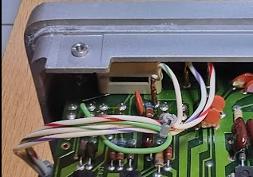

# HP 1600A Logic Analyzer

Gotten from the inheritance of Domaine l’Espitalet. This device is one of the first logical analyzers from HP and a companion of the HP 1607A I already have. The device seemed in good physical shape, just a bit dirty. But sadly enough it did not work. A quick measure of the +5V showed that no power was present there.

The insides looked quite clean too:

# Repairing the device

First step is to get access to the power supply. First remove the A1 board, taking care of the connectors at the top:

For the top right ones the PCB has markings that echo the plugs at front.

## Power supply

The schematic was stitched together from the service manual:

Disconnecting everything showed that +12, -12, +5 were all fine, until I put load on the +5V line. Even 200mA dropped it to 200mV.

Part numbers in that power supply:

|     |     |     |
| --- | --- | --- |
| Q1, Q2 | M552 4-433 | Hfe=43, Hfe=29 |
| Q3  | 2N3053 |     |
| U1 case | 1826-0147 7812 |     |
| U2 case | 1826-0221 7912 |     |
| U1, U2 brd | uA723 | Voltage regulator |

The current sensing resistors seemed fine at 0.5ohm.