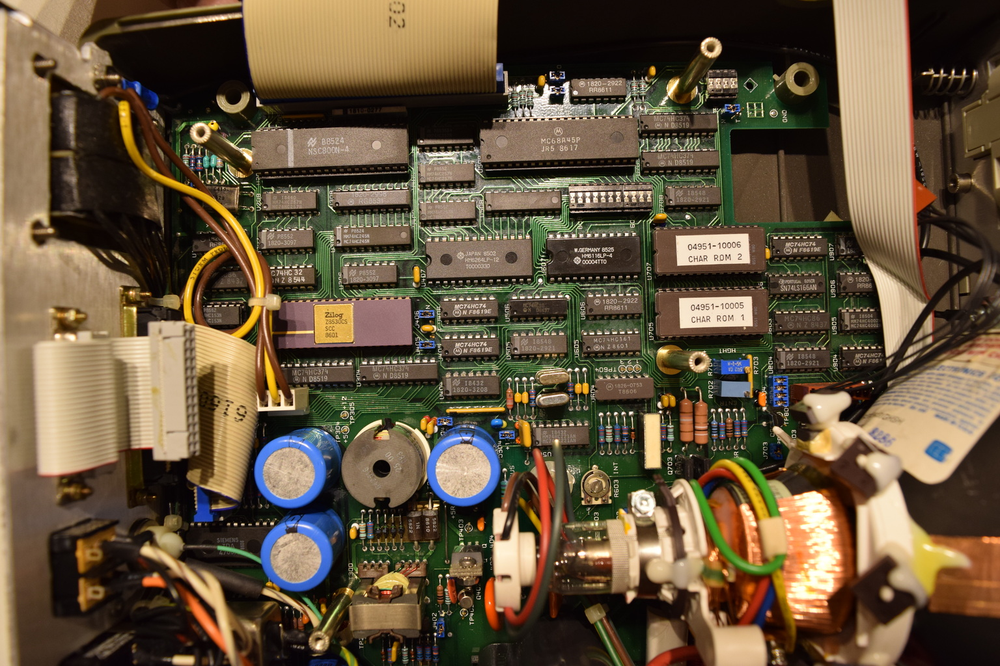

# HP 4951B Protocol Analyzer

Got it for next to nothing on ebay, but it lacked its pod cable.

Documents and links:

From [the HP Computer Museum](http://www.hpmuseum.net/display_item.php?hw=1123) website:

- The 4951A operation manual

[04951-90003_4951A_OperatingManual_129pages_Apr84.pdf](./attachments/04951-90003_4951A_OperatingManual_129pages_Apr84.pdf)

- The 4951C operation manual

[04951-90702_4951C_OperatingManual_312pages_Aug86.pdf](./attachments/04951-90702_4951C_OperatingManual_312pages_Aug86.pdf)

- The 4951A Service Manual

[04951-90002_4951A_ServiceManual_209pages_Apr84.pdf](./attachments/04951-90002_4951A_ServiceManual_209pages_Apr84.pdf)

- The 4951C Service Manual

[04951-90703_4951C_ServiceManual_393pages_Nov86.pdf](./attachments/04951-90703_4951C_ServiceManual_393pages_Nov86.pdf)

- EEVBLOG posts:
-   [https://www.eevblog.com/forum/repair/hp-4852a-protocol-analyzer-questions/msg2942174/#msg2942174](https://www.eevblog.com/forum/repair/hp-4852a-protocol-analyzer-questions/msg2942174/#msg2942174)

## Cable pinout

From the 4951C service manual (page 210), these are J2’s pin assignments on the device:

The schematic for the CPU and DLC part of the analyzer is this (figure 8-14):

The information on the 18179A RS232 POD starts around page 350 in the service manual. The interface connector there is called J1 and it has the following assignments visible:

This seems to be a straight-through cable. Sadly enough the EXT test still fails with such a cable installed 8-/

The SCC seems the most likely problem. This is a [Zilog Z8530](https://en.wikipedia.org/wiki/Zilog_SCC)CS according to the schematic diagram (page 217), A1U209.

# Pictures

# Fixing the issue

The machine seems to work fine, but the pod selftest fails.

I entered a simulate program to test the pod (the DTE test as described in the service manual for the 18179 pod around page 350). This sends data and toggles the rts and dtr lines. Running this program shows dtr nicely flashing on and off- but dtr remains space.

Following the schematic diagram for the CPU card we see that \_DTRA\_ (negated) leaves from pin 16 of the scc. The oscilloscope confirms that there is an inverse signal there.

Probing the same signal on the pod print (the small print containing the input opamps) on U600 pin 13 shows no pulse. Conclusion: the cable is bad. Checking continuity on the cable indeed showed a single pin not being connected (pin 26)..

Re-pressing the cable solved the issue, and the test now passes.

Time to put the whole thing together again…