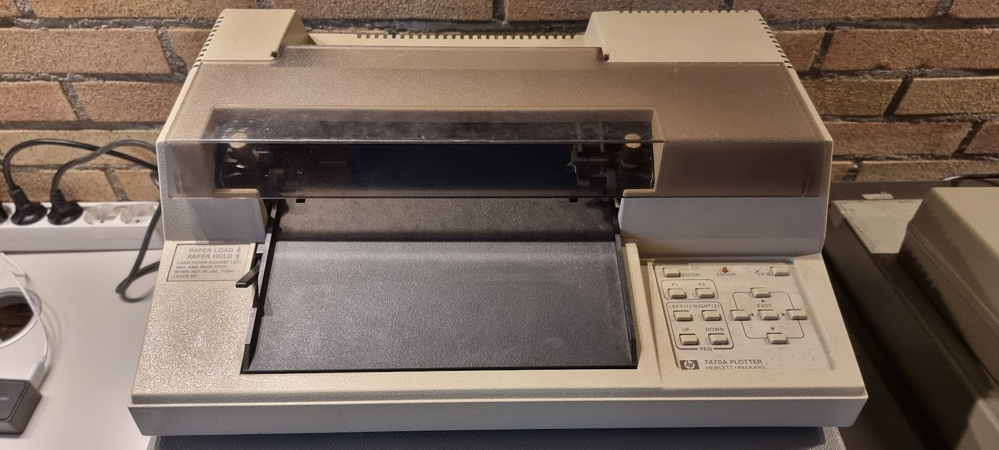

# HP 7470A Plotter

I got this as a gift from Rik Bos, thanks a lot, Rik!

The device needs a bit of cleaning, and whether it works is currently unknown.

# About

This is a 2-pen plotter that is not a bed plotter; it moves the paper for one of the axis. It supports a4 paper max.

- [HP Computer Museum](http://www.hpmuseum.net/display_item.php?hw=73)