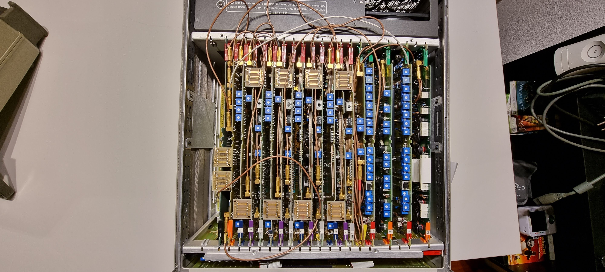
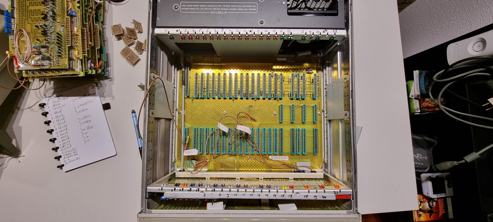

# HP 8161A Disassembly

The device looked like this initially (the top and bottom covers were missing):

The leftmost card is missing (it was already removed). The display is at the front.

From this position I am numbering the cards from left to right, starting at 1 and ending at 21. Card position 19 is empty (there is a slot on the front rails but not at the end). After removing all cards we are left with the empty chassis with number markers for all cards:

In the empty chassis picture you can see the bottom card mount being crooked; in fact its screws were missing, and it is slightly bent.

I removed all cards first, and wrote down all connections from card to card. For this I number all gold coax-like connectors on each card starting at 1 for the topmost one, and going downwards. Some cards have connectors in odd places so these are marked as such..

The device contained the following cards:

| **#** | **Code** | **Description** |
| --- | --- | --- |
| 1   | [66518](./hp-8161a-disassembly/hp-8161a-08161-66518-card-1.md) | A18 BD AY Regulator |
| 2   | [66520](./hp-8161a-disassembly/hp8161a-card-8160-66520-card-2.md) |     |
| 3   | [66523](./hp-8161a-disassembly/hp-8161a-8161-66523.md) | Rep rate gen board (VCO) |
| 4   | [66526](./hp-8161a-disassembly/hp-8161a-8160-66526-time-interval-gen-card-4.md) | Time Interval Gen 0 to 9.9ns |
| 5   | [66527](./hp-8161a-disassembly/hp-8161a-8160-66527-time-interval-gen-card-5.md) | Time Interval Gen 10 to 40ns |
| 6   | [66528](./hp-8161a-disassembly/hp-8161a-8160-66528-time-interval-gen-50ns-to-999ms-card-6.md) | Time interval gen 50ns to 999ms |
| 7   | [66526](./hp-8161a-disassembly/hp-8161a-8160-66528-time-interval-gen-099ns-card-7.md) | Time interval gen 0 to 9.9ns |
| 8   | [66527](./hp-8161a-disassembly/hp-8161a-8160-66527-time-interval-gen-10-to-40ns-card-8.md) | Time Interval Gen 10 to 40ns |
| 9   | [66528](./hp-8161a-disassembly/hp-8161a-8160-66528-time-interval-gen-50ns-to-999ms-card-9.md) | Time interval get 50ns to 999ms |
| 10  | [66526](./hp-8161a-disassembly/hp-8161a-8160-66526-time-interval-gen-0-to-99ns-card-10.md) | Time interval 0 to 9.9ns |
| 11  | [66527](./hp-8161a-disassembly/hp-8161a-8160-66527-time-interval-gen-10-to-40ns-card-11.md) | Time Interval Gen 10 to 40ns |
| 12  | [66528](./hp-8161a-disassembly/hp-8161a-8160-66528-time-interval-gen-50ns-to-999ms-card-12.md) | Time interval gen 50ns to 999ms |
| 13  | [66526](./hp-8161a-disassembly/hp-8161-8160-66526-time-interval-gen-0-to-99ns-card-13.md) | Time interval gen 0 to 9.9ns |
| 14  | [66527](./hp-8161a-disassembly/hp-8161a-8160-66527-time-interval-gen-10-to-40ns-card-14.md) | Time Interval Gen 10 to 40ns |
| 15  | [66528](./hp-8161a-disassembly/hp-8161a-8160-66528-time-interval-gen-50ns-to-999ns-card-15.md) | Time interval get 50ns to 999ms |
| 16  | [66554](./hp-8161a-disassembly/hp-8161a-8161-66554-card-16.md) |     |
| 17  | [66552](./hp-8161a-disassembly/hp-8161a-8161-66552-card-17.md) |     |
| 18  | [66555](./hp-8161a-disassembly/hp-8161a-8161-66555-card-18.md) |     |
| 19  | * * * | Empty |
| 20  | [66552](./hp-8161a-disassembly/hp-8161a-8161-66552-card-20.md) |     |
| 21  | [66553](./hp-8161a-disassembly/hp-8161a-8161-66553-card-21.md) | Damaged |

At the front (the backmost panel) is [the CPU board of type 8161-66509](./hp-8161a-disassembly/hp-8161a-8161-66509-cpu-board-front.md).

The power supply contained the following boards:

| **#** |     |     |
| --- | --- | --- |
| 1   | [8160-66511](./hp-8161a-disassembly/hp-8161a-psu-8160-66511-switching-regulator.md) | A11 BD AY Switching Regulator - Burned out |
| 2   | [8160-66512](./hp-8161a-disassembly/hp-8161a-8160-66512-psu-board.md) | A12 BD AY Rectifier - Broken cap, leaking? |