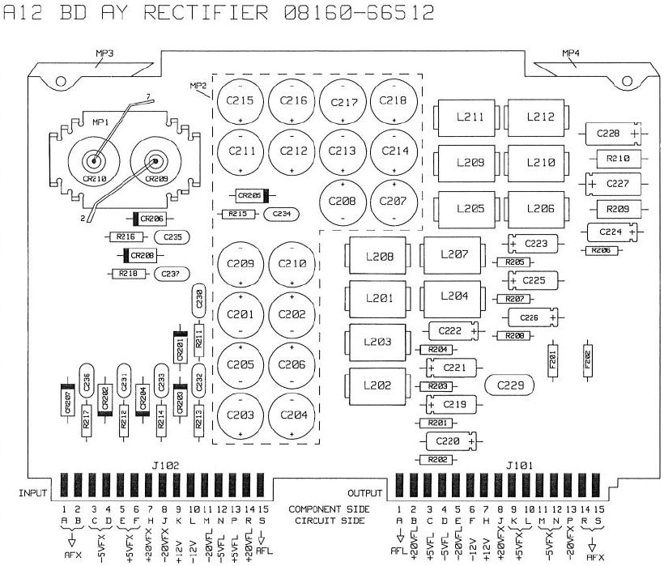
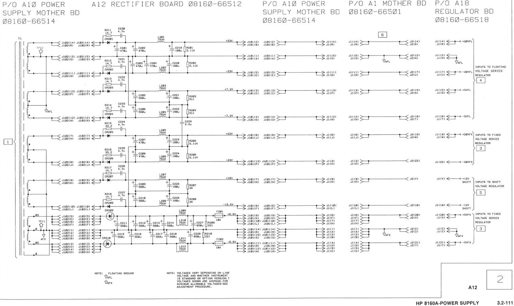

# HP 8161A 8160-66512 PSU board

Picture:

Dusty. One cap (axial, right 2nd one down) broke and leaked

C227 was broken, like C228 it was: 650 uF m20V 85 deg, 13V 125 deg

CR208 was broken (0.019 ohm both sides)

Schematic from service manual:

