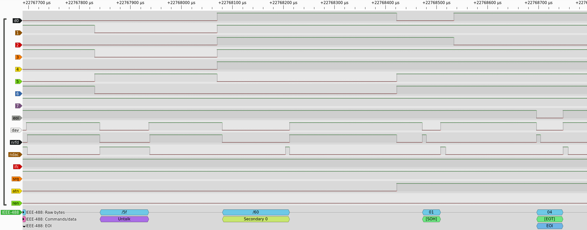

# Debugging HPDisk GP-IB

## Testing the 82937A HP-IB interface

## Traces of the HPIB Amigo protocol

Some traces of the Amigo protocol between a HP 85A and an 82901M dual floppy drive. Following the info about the Amigo protocol [from here](https://www.hp9845.net/9845/projects/hpdrive/)..

This looks like the Amigo “Identify” sequence: Untalk, Secondary 0 in which the device answers 01 04, which is the 82902M.

Links to info:

- [The HPDisk project](http://www.dalton.ax/hpdisk/)
- [Alternate project, with some gpib details](https://github.com/magore/hp85disk/blob/master/README.md)