# HP 85A Video board

The device had no video. Measuring the 800V tap showed only 85V present.

# Voltages

+6V is 6.028v, fine

+12v is 12.2v, fine

+28v is 23.4 volt

+32V is 26v

\-40v is -32v

800v is 85v

The +6v and 12v come from the PSU, these are fine. The others are generated through the T1 transformer, something is definitely off there.

# Vertical amplifier

tp2 showed:

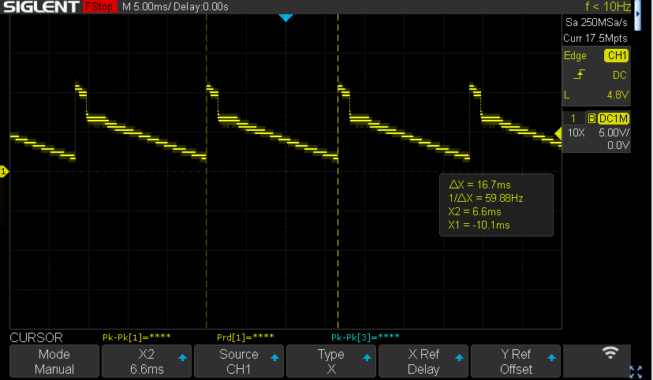

16.7ms should be 17ms, assuming it to be ok

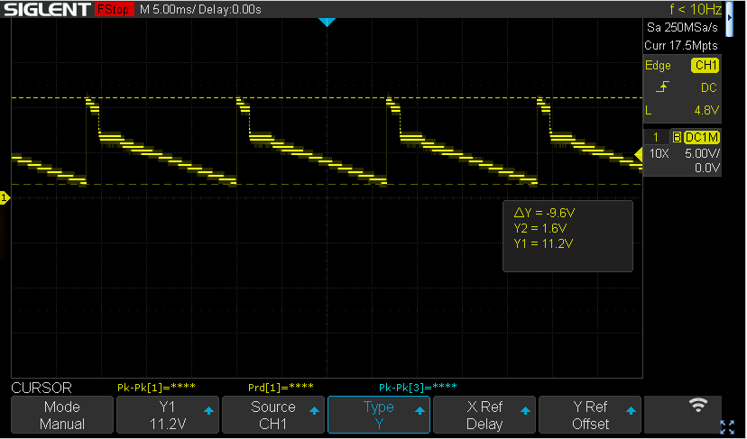

Voltages seem OK too.

TP3 (inverse of the above, more or less)

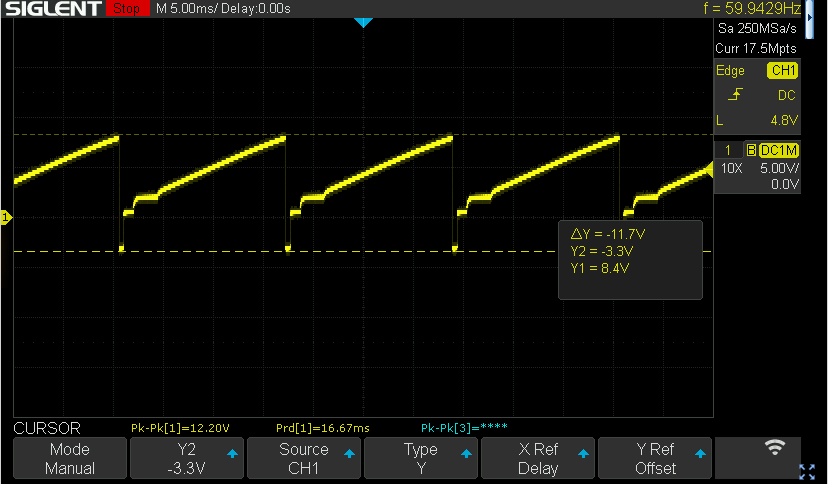

TP1 should be a clean sawtooth but looks like this:

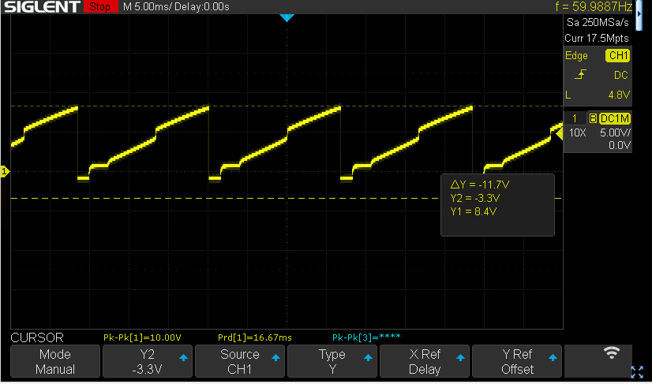

# Horizontal

tp5 (5V square 64us):

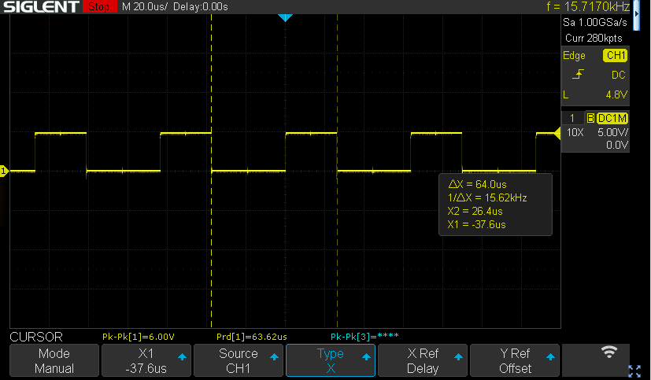

Q14 base:

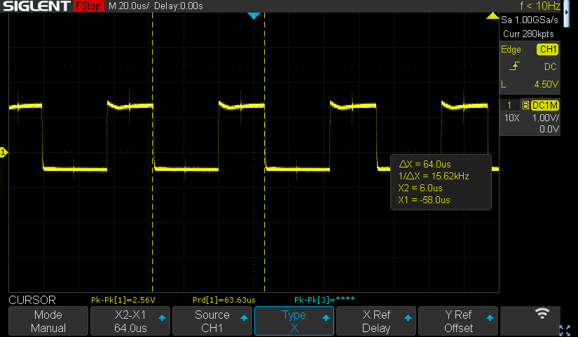

Must be between -0.5 and about 1.5V, 64us (dead on)

Q14 collector:

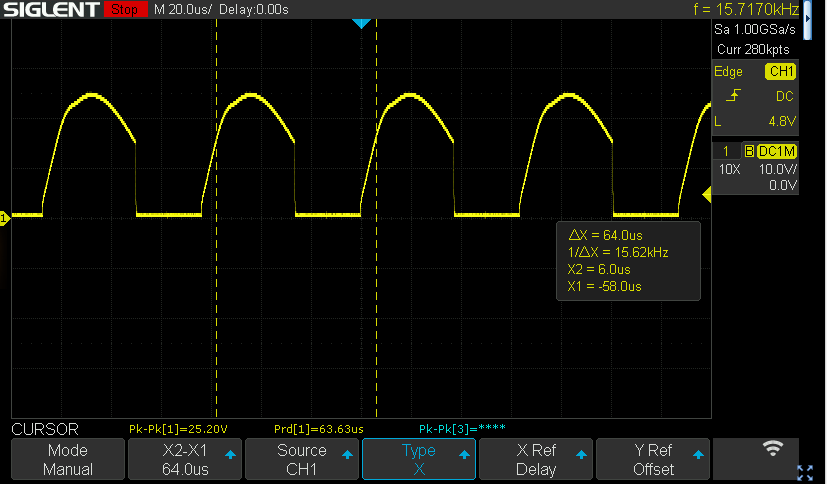

Does not look right, it should be:

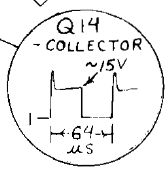

Collector T13 (driving transistor for the flyback transformer):

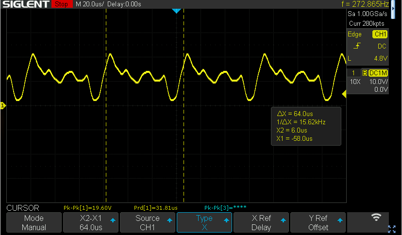

Looks very much off; should be:

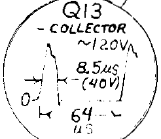

After some consultation on the [HPSeries80 newsgroup](https://groups.io/g/hpseries80) and after a long wait for a set of replacement parts from China and Mouser I could try to replace things to see what would work.

I started to check diodes and caps in the high voltage paths, mainly around the 800V output (and the things that generate that). All diodes checked fine.

After that I replaced some caps around the 800V path and the driver circuit for it. Most of them seemed fine (there were a few that were off) but just to make sure:

C52, 10uF tantalum

C46 200uF alu (replaced with 470uF)

C57 1uF 150V

C49 0.01 uF 800V

C48 .01 1KV

I then wriggled back the board in the computer in such a way that I could at least still work on it (for that I had to cut the tie wraps and move around the cables a bit), and checked if it had made a change. Sadly enough there was still no picture, and I started to smell something..

I then checked the board for possible overheating on the PCB. I could not really do that by using my fingers as that tends to be unwise when there are 800V and 8KV voltages around, so I used an IR camera and yes, something was really off:

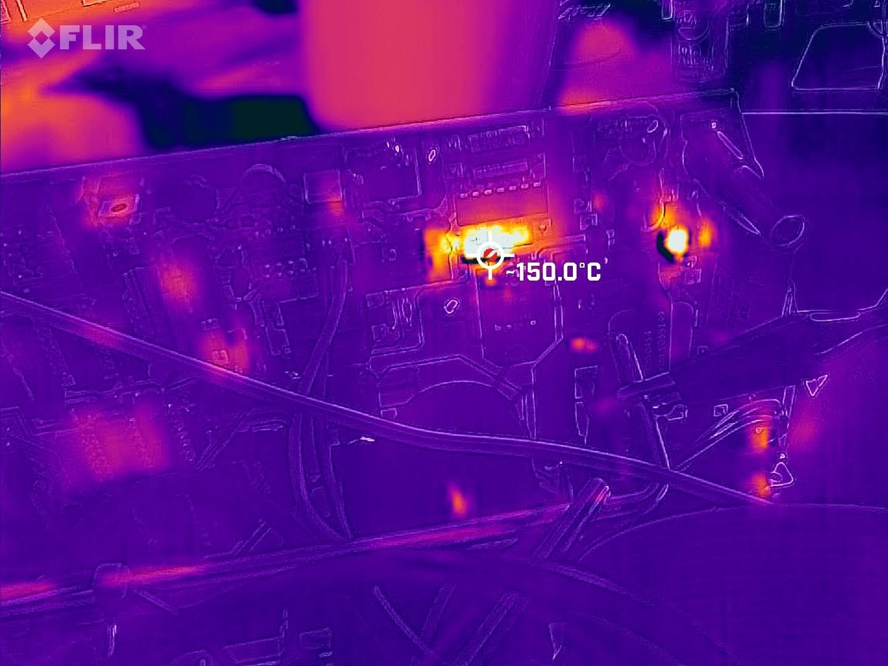

This was the R21 resistor heating up like mad. Sadly enough this was due to my own mistake: I had mistakenly taken the bar on the C52 capacitor as the minus - but the tiny little + sign had apparently rubbed off just under it, so it was voltage inverted 8-(. Replacing the cap in the right direction solved the heat issue- but still no picture, and all signals looked the same as before.

Next step was to check U13, the main driver transistor. It did check OK’ish with the little Chinese component tester:

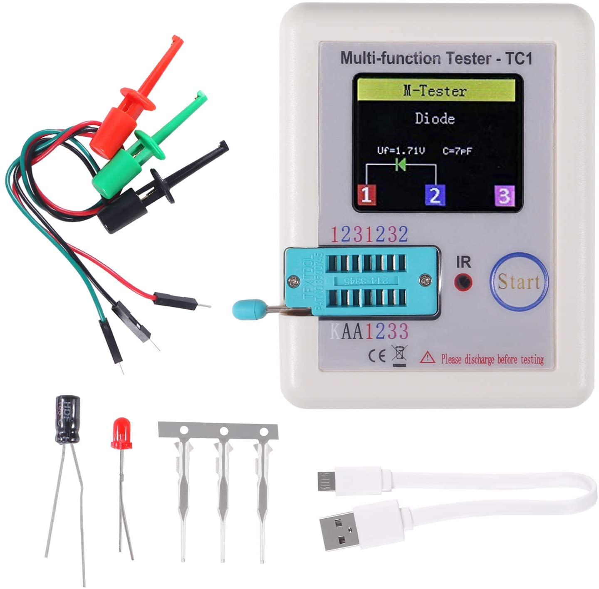

but the Hfe was only 2, and that looked wrong. I soldered in a replacement (BU406, as advised by Russel Bull on the hpseries80 list) and tested again… The signal on the emitter on Q14 now immediately looked much better (blue trace) although slightly higher than indicated on the schematic:

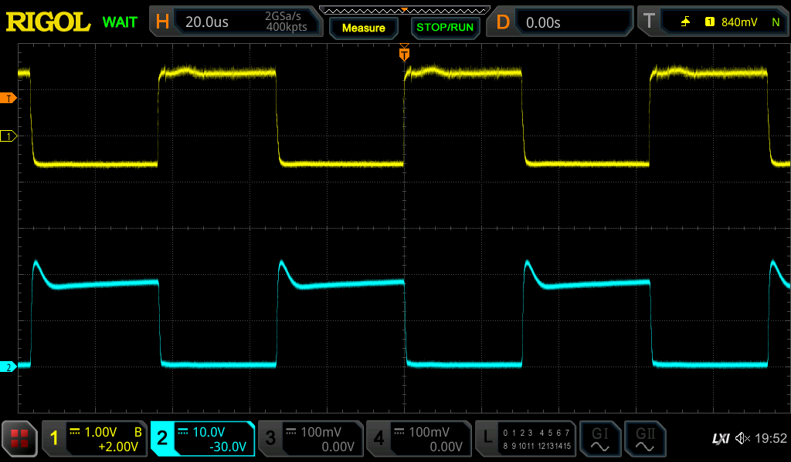

and the “-48” test point now had the correct voltage of around 40V, and yes: I now have a picture:

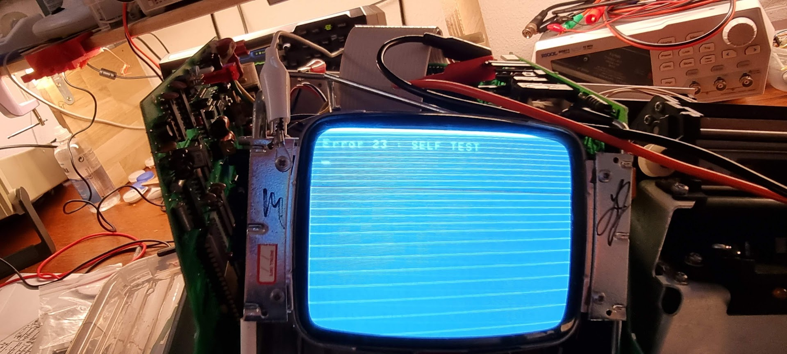

Next steps will be to clean up that picture :wink: