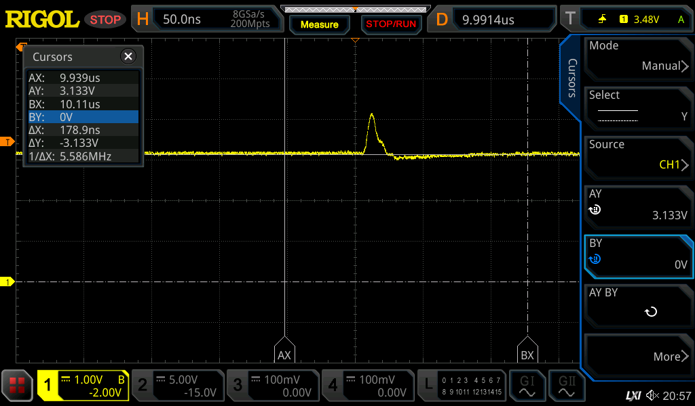

# HP 8656B Repair

This generator from 100kHz to 990MHz worked in the higher regions (> 60MHz) but below there the frequency was very far off what was set, and below about 30, 40MHz the frequency was always around 5.6MHz.

Doing “Test 6” showed that the lf loop was unlocked, the unlock led was also burning.

Following the test procedures showed the following:

Sheet 13 (pg 263):

### V1 tests

all ok

### V2 tests

4 correct  
5 -  
6 correct  
7 ok  
9: tp2 pulses voltage way too high  
11 Q1 and Q2 bases are not pulsed but remain constant

Looking at the phase comparator I see pin 11 around 3.3v, with the 100kHz pulses riding on top:

The pulse level is around 4V, this seems to be correct as per the description in the “Phase Comparator” explanation on P253 (the pin voltage is biased to just below the ECL transition level of < 3.3v).

Q1 and Q2 bases were both at a high level (4.2v for Q1 and 3.3V for Q2). As these are fed from each others opposite pulse on U1B (Q and QBAR) this looked odd. Desoldering Q1 and Q2 found that Q1 is defective; Q2 seems to be OK. The type for both is 3-405, which translates to 1853-0405 which is a 2n4209 PNP transistor.

Trying to replace both with 2n3906.. Not ideal (they have slower rise/fall times) but:

**It worked**

After changing both the lock LED switches off, and changing frequencies in the low range now produces the correct frequencies.

Yay :wink: