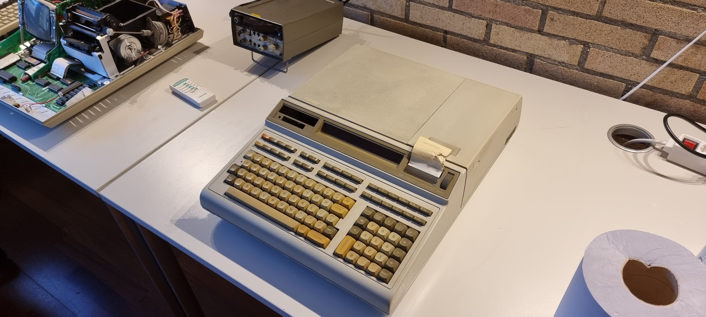

# HP 9825A

This beautiful device is a 16 bit calculator from 1976. Its CPU is a work of art, as are the internals of the machine.

# Parts:

- [Arrival from France and pictures](./hp-9825a/9825a-arrival.md)
- [Initial checks of the machine](./hp-9825a/9825a-initial-checks.md)

# Repairs

- [Tape card repair](./hp-9825a/9825a-tape-board-repair.md)
- [Converting to 9825T](./hp-9825a/conversion-to-9825t.md)
- [Converting the tape unit for DC2000](./hp-9825a/tape-unit-conversion-to-dc2000.md)

# Extension cards

- The 98034B HPIB adapter
- The 98032A GPIO (16 bit Parallel input/output card)

# Information

- [Error message list](./hp-9825a/9825a-error-codes.md) (copied from the badly readable error message booklet)