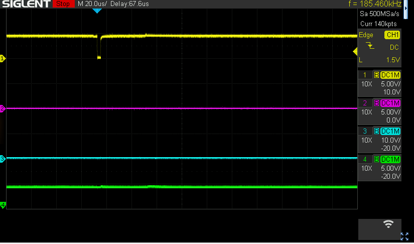
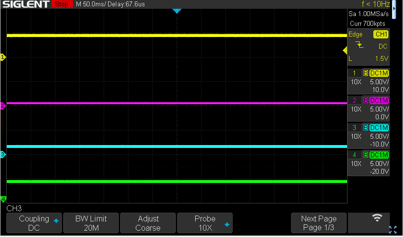
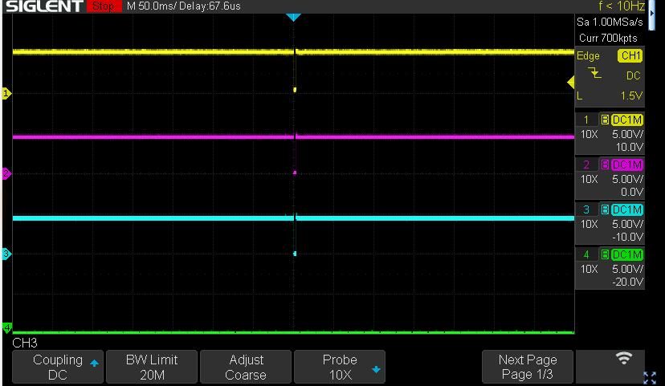

# 9825A Tape board repair

After adding the tape drive I got from Rik Bos I tried to send the rew command to it- but that hangs the computer. So something seems wrong.

First step is to see whether we have communications working with the tape board. I measured U4 pin 12 (INT\_, yellow) and U4 pin 8 (purple). U4 is a 74LS20, dual 4 in NAND gate of which pin 8 is an output and pin 12 is one of the inputs. When I start the machine (and when I send the REW command) I see this:

U4 pins measured:

| **Pin** | **Signal** | **Color** | **Value** |
| --- | --- | --- | --- |
| p9  | PA3\_ | blue | 0   |
| p10 | PA2\_ | green | 1   |
| p12 | INT\_ | yellow | 1 pulsed down |
| p13 | PA1\_ & ! PA0 | purple | 0   |

The P8 output of U4 will be low ONLY when PA\_0..3 is 1110 & INT\_ is 1, i.e. address 0x1 and no int poll.

In our case PA3\_ being 0 and p13 also being 0 seems to be an issue.

Next measure: PA1\_ (U5P1, purple) and PA0\_ (U10P11, blue):

PA1 is zero’ish, but PA0 (blue) is hovering in the middle.

Next measurement: on CPU board, measure U1P4 (PA0 cpu, yellow), U1P6 (PA0 buffered out, purple) and Tape board U10P11 (PA0 directly from CPU U1P6 (resistance 1.6 ohm):

All nice voltages and all nicely 1, oddly enough, so the earlier measurement must have been in error 8-(

Sending a “REW” with the same assignments does drop PA0 and this percolates proper:

Remember logic is inversed, so addr 0x1 would indeed need to drop PA0\_- as it seems to do.

And of course- when I do the “rew” now it reports “Error 41” - No cartridge in tape unit, sigh.

Cause: bad contact on the flat cable connectors, most likely.