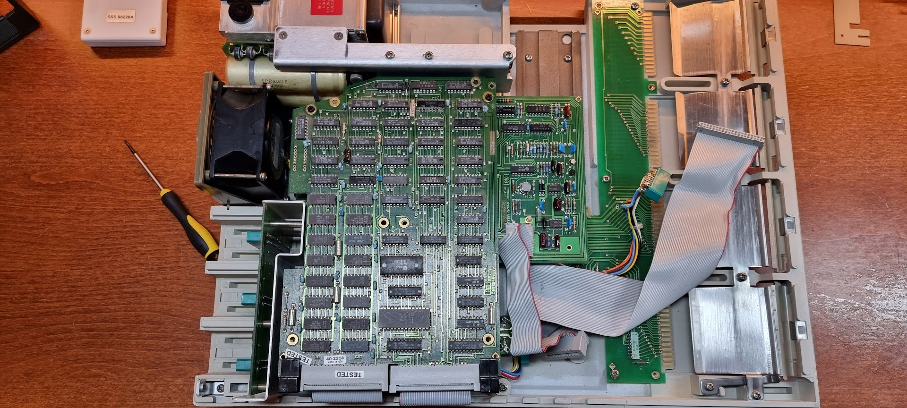

# Conversion to 9825T

I got two board from Paul Berger on the vinthp mailing list which would convert the 9825A to an 9825T:

- The A24 (09825-66524) Ebenezer board containing RAM and a ROM set
- The A25 (09825-66525) SKOAL board

To update the machine first remove the System ROM pack from the 9825A, then cut a few traces on the CPU board:

Installation pictures from CuriousMarc’s video

Ebenezer board (1st above the tape drive board)

followed by the Skoal board. I lacked the nice HP spacers for that so I used some nylon spacers and screwed them in:

