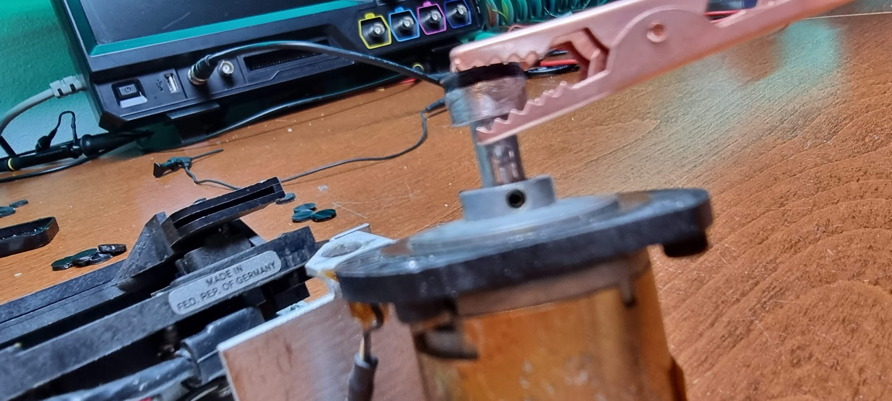
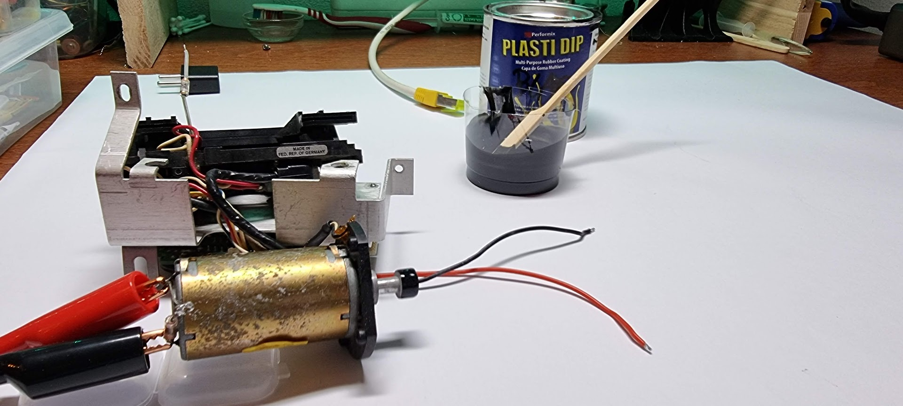
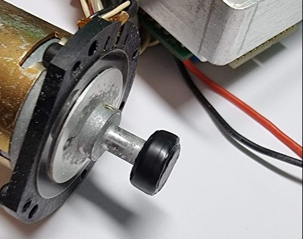
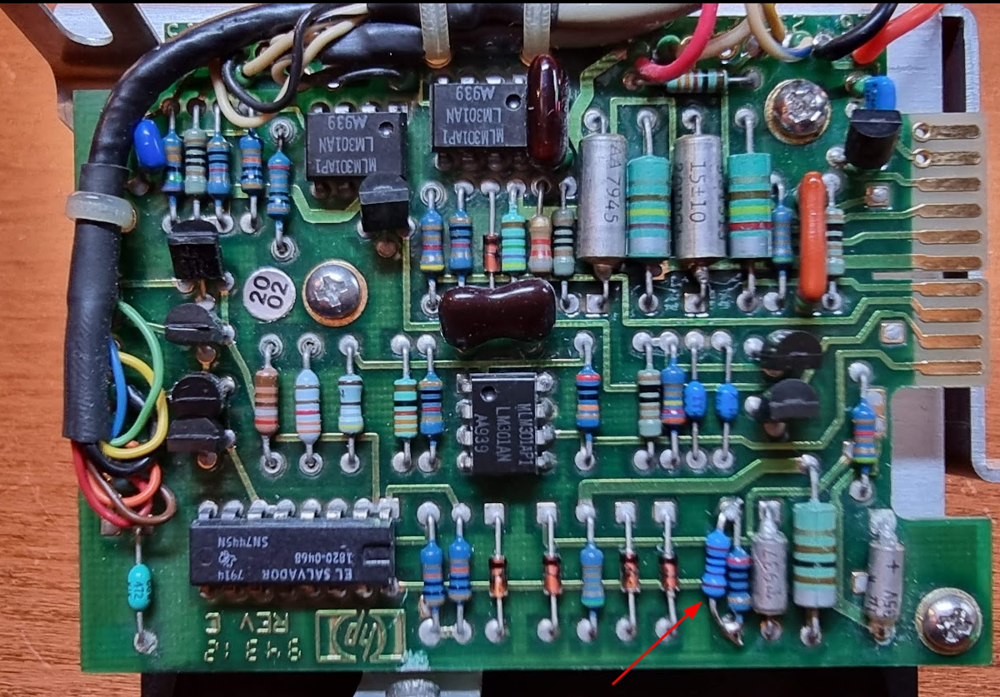
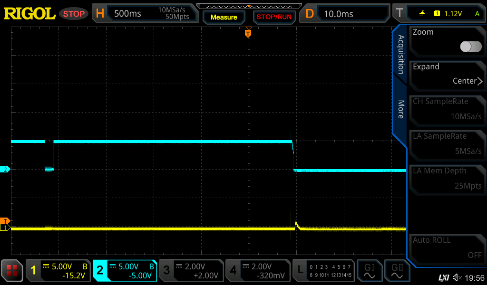
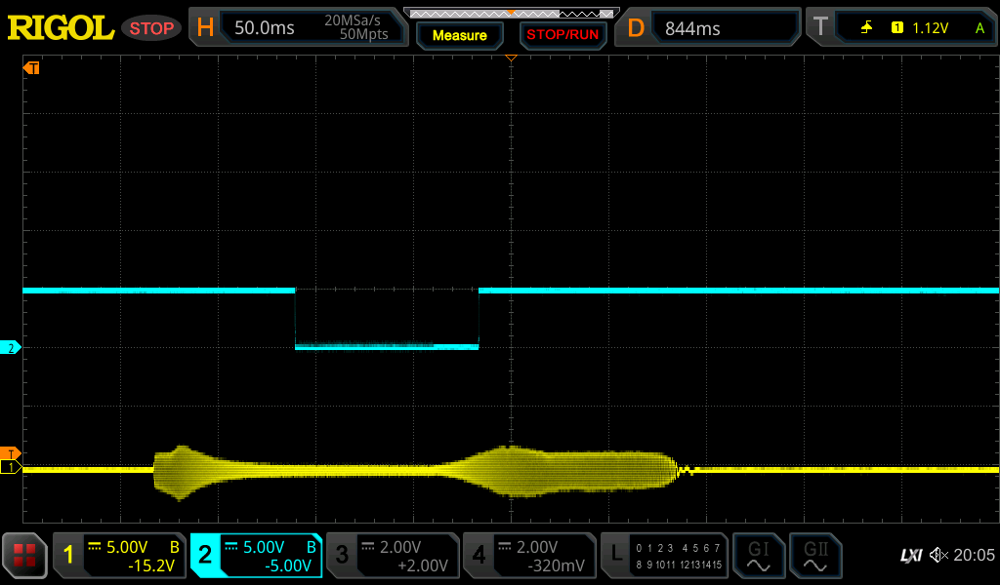
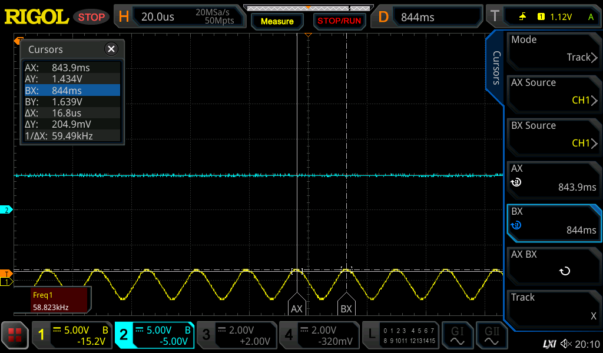
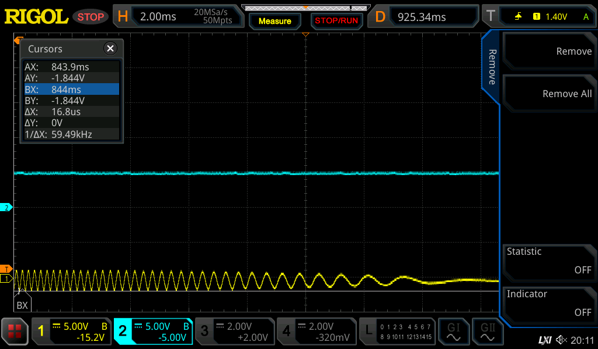
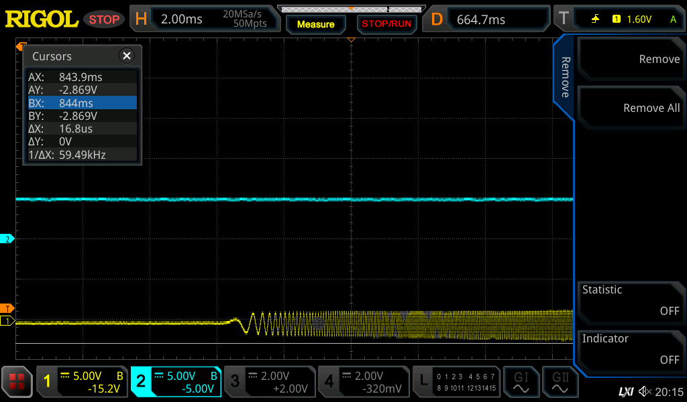
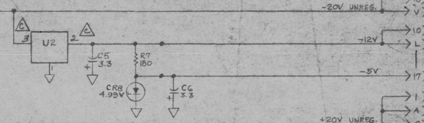

# Tape unit conversion to DC2000

To convert the tape unit to use DC2000 we need to do a few things. Look at CuriousMarc’s video’s and the remarks on the vinthpcom groups.

First step is to clean the capstan goo, and to extend it by 2mm. Cleaning the goo is simple with a hobby knife.

Extending the capstan was done with the help of a lathe in the video’s I watched. But I have no such thing (and that seems wise, those things are dangerous :wink:

 ). So I’m trying another way..

I just made a 3d model of a cylinder and 3d-printed a set of these, all with slightly different sizes, and printed these on a resin printer with hard resin. I then selected the ones that at the end had the best size required, and glued it to the capstan wheel using epoxy glue.

The day after I connected the motor to a power supply, made it rotate at speed and used a file to remove the extra resin and glue. This should have resulted in a reasonably round extension.

Next step is the plasti-dip treatment: make the motor turn slowly, and apply coats of plasti-dip every 5 minutes with a flat hobby knife until we reach the required size (around 10.5 mm diameter):

Adding a coating every 5 minutes gets us this:

Next step is to put a 1K resistor in parallel with the 200ohm resistor to increase the write current:

After reinstalling the tape drive the capstan moves the tape, but sadly enough doing an fdf 0 will report an error 43. I also tried rew, but that was a bad plan: the drive did not see BOT and wound the tape off the wheel. Rik had warned me for that and of course he was right :wink:

The unit makes a terrible sound while moving the tape, so clearly something is still amiss…

Time to get the oscilloscope. I put the yellow probe on U27 pin 3 which should be a tacho signal. The blue probe goes on U21 pin1+2 which is the SFD signal (Servo Fail Detect). Switching on then shows the following (the tape is accessed at startup and does its scream):

That does look like there is no tacho at all. Next step is to check tacho in at U26 which is an 1820-1048, translating to the N8T20N, a monostable multivibrator. Pin 6 (not marked on the schematic but that is the - input) should contain the ATC Analog Tach signal; let’s put that on yellow now:

That at least shows as something :wink:

 Enlarging that signal shows:

58kHz!? It does seem a real signal from the wheel because when the motor seems to stop we see it slowing down:

And it does the same at the start:

Some further investigation showed that the -5V power was lost… And the 8T20 needs it so we need to fix this 1st.

I did check the PSU’s voltages when I got the machine, but clearly something has happened. Checking the PSU diagram it showed that the -5V is made in a very simple way:

It’s simply a zener diode with a resistor on the -12V rail (which is present). Measuring the power over the zener with all power connections removed shows 0.2V over it, indicating a defective zener or capacitor. It turned out to be the zener. Replacing it with a 5.1V 3W version fixed the -5V rail.

And lo and behold, the tape unit now reacts more normal and starts to spool properly! Next step: trying to stop it from rewinding the tape off its wheel, sigh.