# HP1640A Serial Data Analyzer

Gotten from Domaine d’Espitalet inheritance.

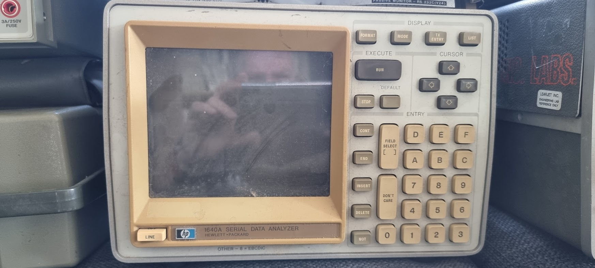

The machine was dirty but quite complete.

# Internals

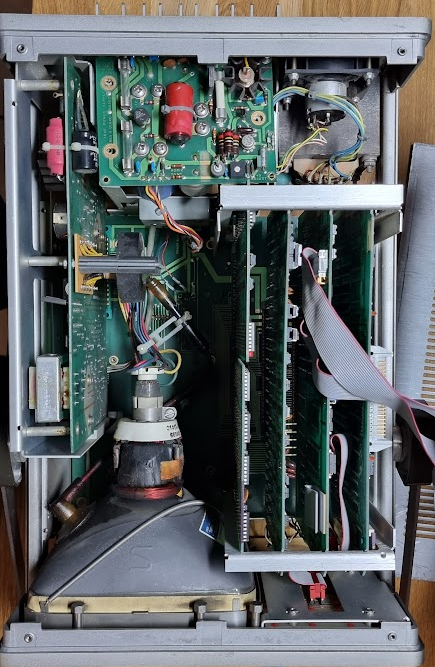

The power supply is a linear one and has some nice large elco’s:

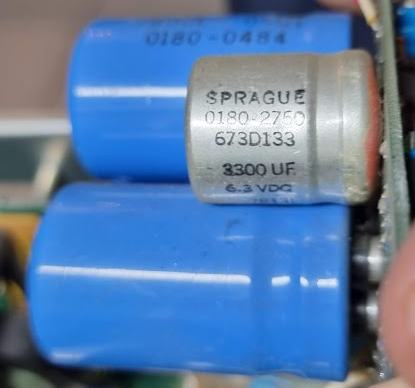

These were removed and tested, and all of them tested fine. I removed them and reformed them for 8 hours so that they get used to being under power again.

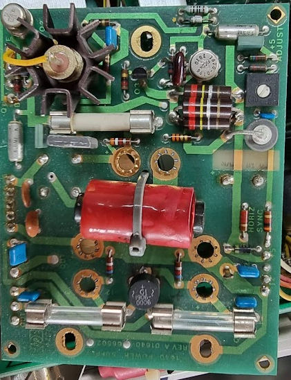

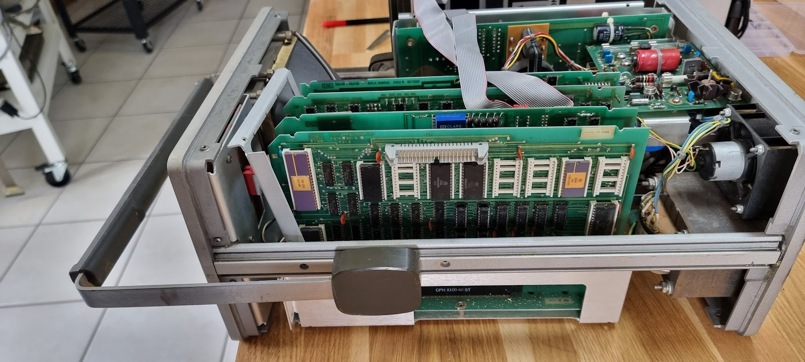

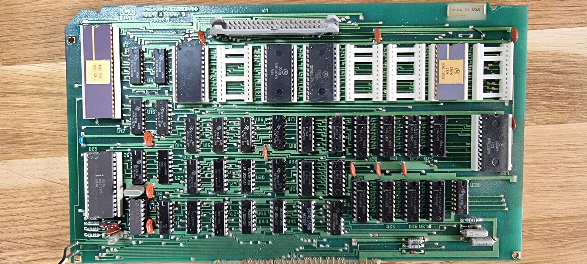

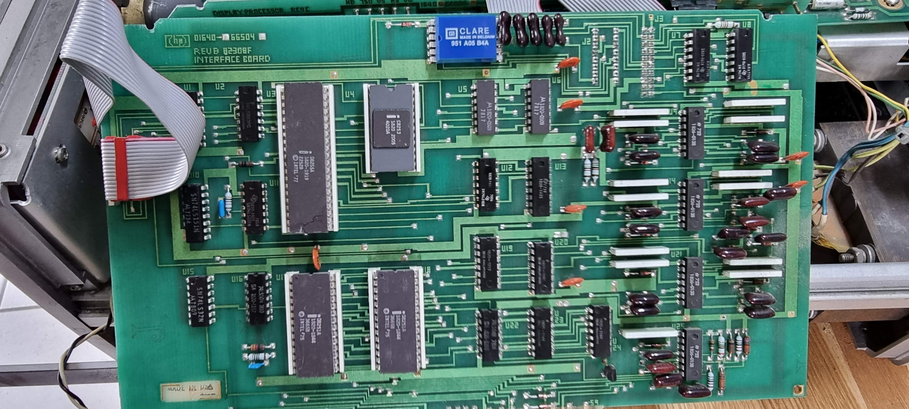

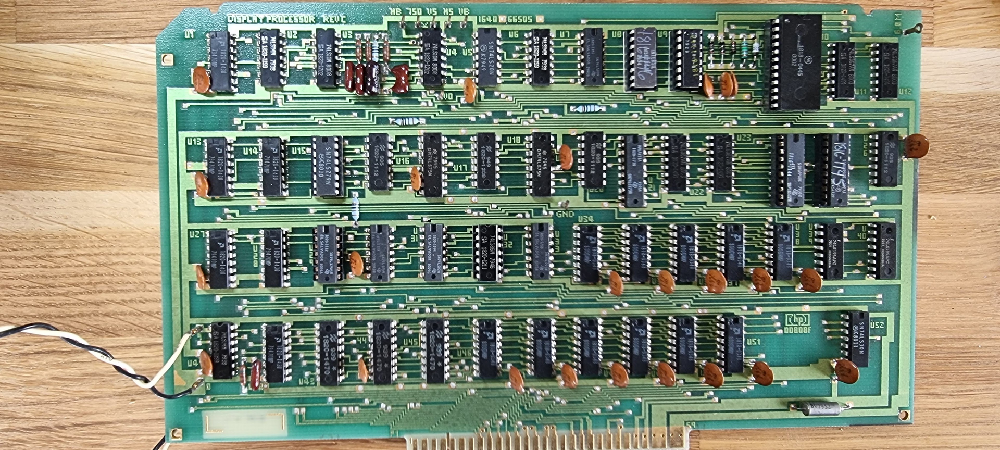

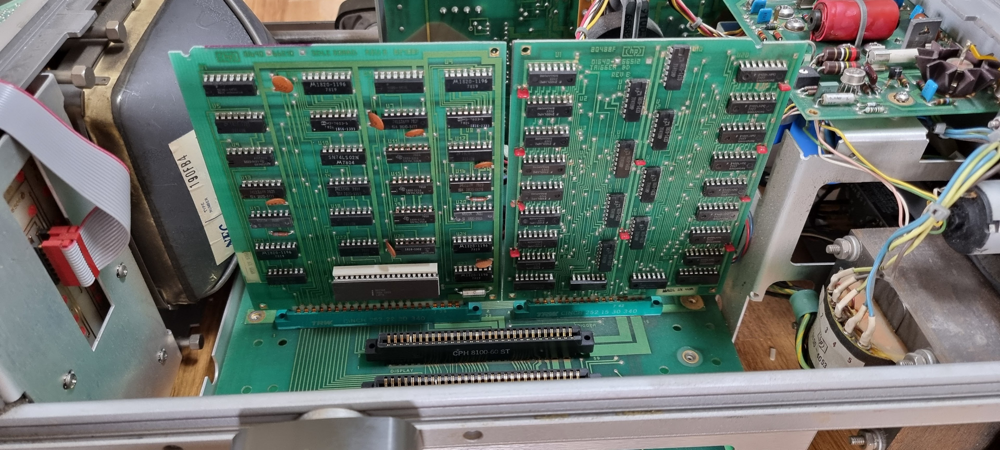

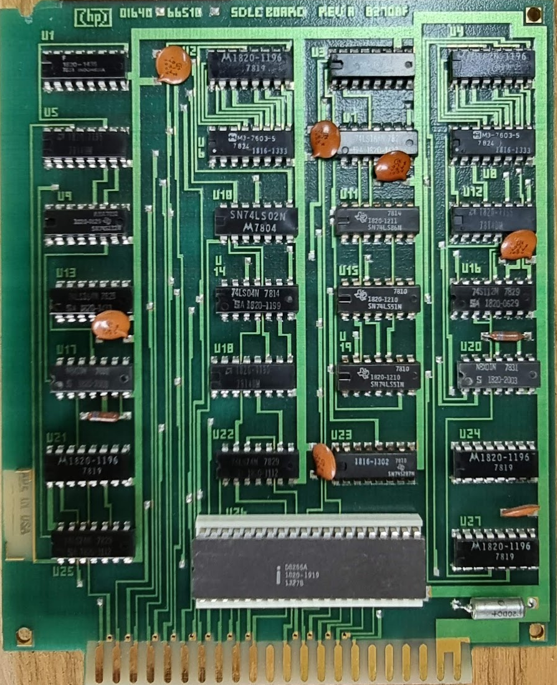

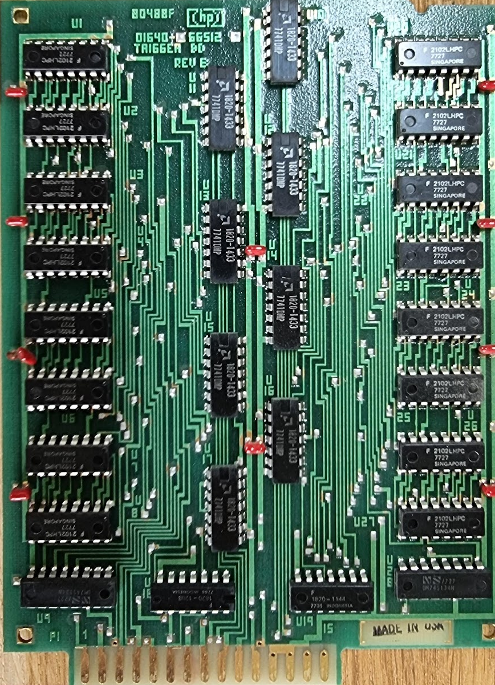

The main CPU is an AM9080, a 8080 clone (1820-2006).

# Initial startup

After cleaning the machine started but with an error message:

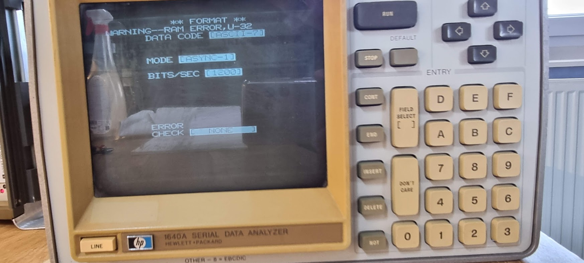

U32 was a socketed chip with the HP number 1818-0348 which should be an AM9102DPC, a 1024x1 bit static RAM. Swapping the chip on other places where it is used follows the chip around so it is the chip..