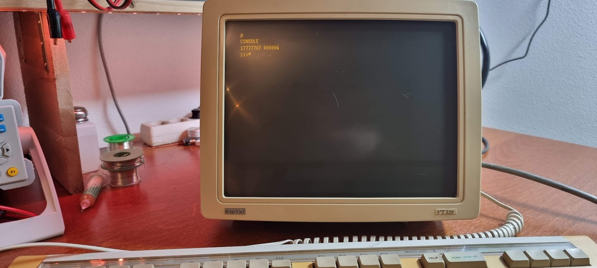

# PDP-11/44

I got this beauty from Geert Rolf, thanks Geert!!

This is now a dump of things I learn and need to keep; it should be organized later.

- [Inventory](./pdp-1144/pdp-11-inventory.md)
- [Boards list / boards to look for](./pdp-1144/unibus-board-list.md)
- [Unibus, Uniprobe, Unibone](./pdp-1144/unibus-uniprobe-and-unibone-tales.md)…
-   [The Unibone I2C panel](./pdp-1144/unibone-i2c-panel.md)
- [List of Unibus machines and their details](./pdp-1144/pdp-11-unibus-processors.md)

## Related devices

- [The Cipher F880](pdp-1144/cipherf880.md)
- [Board extenders](pdp-1144/douglas-extenders.md)
- [The TU58 tape drive](./pdp-1144/the-tu58-tape-unit.md)
- [The RX02 floppy drive](./pdp-1144/the-rx02-floppy-drive-and-the-m8256-rv211-controller.md)
- [The DELUA ethernet controller (M7521)](./pdp-1144/the-delua-ethernet-controller-m7521.md)
- [Unibus backplanes](./pdp-1144/the-dd11-dk-backplane.md)

## Unibone tutorials and details

- [Using the Unibone on a standalone backplane (without a PDP-11)](./pdp-1144/using-the-unibone-as-a-stand-alone-machine.md)
- [Cross-compiling the Unibone code on Ubuntu](./pdp-1144/unibone-crosscompile.md)
- [Extending the Unibone CPU emulation](./pdp-1144/extending-the-unibone-cpu-emulation.md)
- [Unibone disk image descriptions](./pdp-1144/unibone-disk-image-details.md) and details

## Problems and fixes

- [zmspc0 test failure](./pdp-1144/zmspc0-test-failure.md)

## Operating systems

- [rsx-11](./pdp-1144/rsx-11.md)

## Running diagnostics

- [Creating a tu58 (or console) serial cable](./pdp-1144/pdp11-m7090-console-cable-tu58-cable.md)
- [Using tu58 emulation to run the xxdp tests from tape images](./pdp-1144/running-the-xxdp-tests-using-tu58.md)
- [The XXDP Diagnostics](./pdp-1144/xxdp-diagnostics-information.md)
- [Investigating and testing the H7140 PSU](./pdp-1144/investigating-and-testing-the-psu-h7140.md)

First powerup with only 5 cards (M7094..M7098):

Useful tools:

- xxdpdir.pl: read DEC disk image files
-   [xxdpdir.pl](http://xxdpdir.pl) --image=xxdp25.rl02 --directory to get a directory from that file
- [Convert BIC files to straight binary](./pdp-1144/convert-bic-files-to-straight-binary-files.md)

## DEC related mailing lists and groups

- [The Unibone mailing list](https://groups.google.com/g/unibone)
- [The Vintage Computer Federation forii](https://forum.vcfed.org/index.php?forums/dec/)

## Useful links

- [DEC related 3D models](https://so-much-stuff.com/pdp8/cad/3d.php)
- Instruction set details
-   [Stackosaurus](http://stackosaurus.com/pdp11.html)
- [Vt320 Power supply repair](https://forum.vcfed.org/index.php?threads/vt320-modern-replacement-power-supply.1238917/#post-1260807)
- [https://www.pdp-11.de/index.php/2018/06/09/dec-pdp-11-34-m9312-with-new-bootproms/](https://www.pdp-11.de/index.php/2018/06/09/dec-pdp-11-34-m9312-with-new-bootproms/)
- [https://ak6dn.github.io/PDP-11/M9312/](https://ak6dn.github.io/PDP-11/M9312/) Boot PROM files (also for the M7098 Unibus Interface)
- [http://www.bluefeathertech.com/technoid/promfiles.html](http://www.bluefeathertech.com/technoid/promfiles.html) But with the PROM types noted too
