# The Cipher F890 tape drive

I was very happy to get a 10.5 inch 9 track tape drive!!
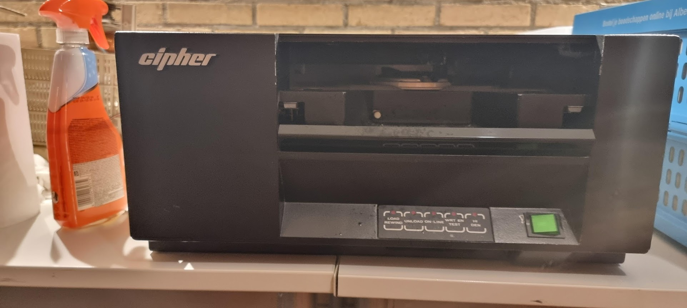
This tape unit support up to 1600BPI tapes, and has a PERTEC interface.

## Initial status
The unit needed a bit of cleaning but seemed in good state overall. It switched on without apparent problems. One thing that needed to be fixed were the rubber like pads on the main drive wheel:
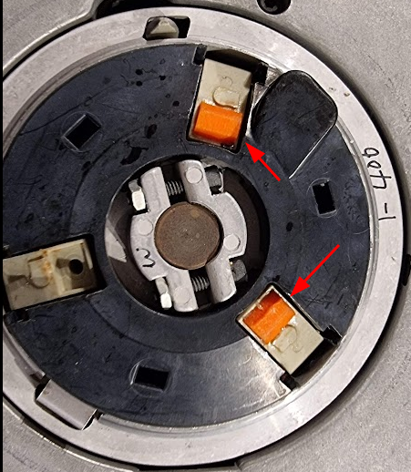
These had already been replaced with newer versions but these were a little too small.

I made a new model in [Onshape](https://cad.onshape.com/documents/5250b162d057a5e5121f53b6/w/216b7eb7df0f59c64dfa8067/e/a828b49ce936e442852a7f1d) which I printed in NinjaFlex TPU and glued back on the grabbers:
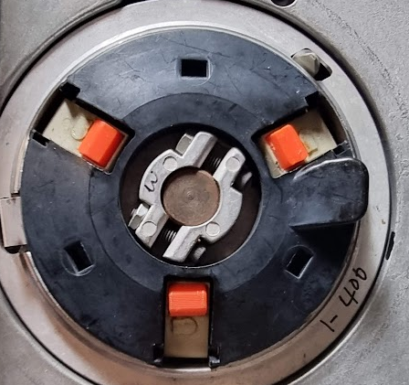

After replacement I tried to load the tape but was greeted by an error 17, a problem with the tensioning arm. The tape did properly wind itself however:
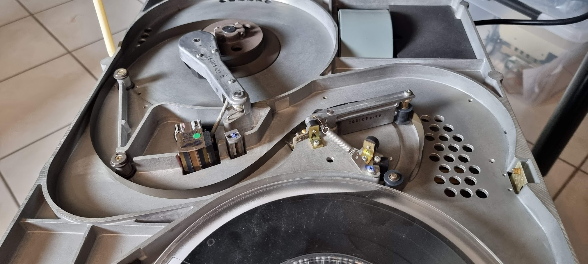

## Debugging the drive
The drive has extensive help for servicing. The details can be found in the service manual (section 3). The drive as a set of numbered "Service Aids". You enable/start a service aid as follows:

* Switch on the drive
* Press TEST, then HI-DEN
* Type in the number of the service aid, using the buttons as numbers from 1..4
* Press 5 (HI-DEN) to enable the SA.
Make sure to press the buttons within 3 seconds.

Important service aids:

* 33: This disables the "door open" checks and allows you to see what happens during tape load. WATCH OUT FOR YOUR HANDS!!

## Fixing error 17
I removed the tape from the machine as the first tests need to run without one.

The error message tells us to runSA24. This test shows the voltage from the thing that measures the angle of the tension arm. The measurements here are:

| Position | Binary value | Voltage | Comment |
| - | - | - | - |
| Rest     | 10010        | 2.817V  | Seems high, manual says 1.56 V |
| Extended | 01001        | -0.313V | Manual says -1.565V |
| Delta    | 00110        | 3.75V   | Slightly high, 3.13V |

Running SA11 after that sees both tape wheels move together, switching direction. Does not seem to be wrong..

Adding a tape and doing a load sequence again fails with error 17. But now I can try again with SA33, so that I can see what happens.
The first such attempt showed error 4, which is a "hard" error saying "Arm out of limits during autoload". A more detailed table in the service guide states:
"Compliance arm circuit voltage level is out of tolerance during the autoload sequence", and tells us to use SA24 to check _if_ the tape has been properly captured (which was the case).
This seems another indication that the voltages from the tensioning arm are incorrect, as already seen by SA24.

### What senses that angle?
Looking at the drawings for the tensioning arm it looks like the angle is measured by an "air capacitor":
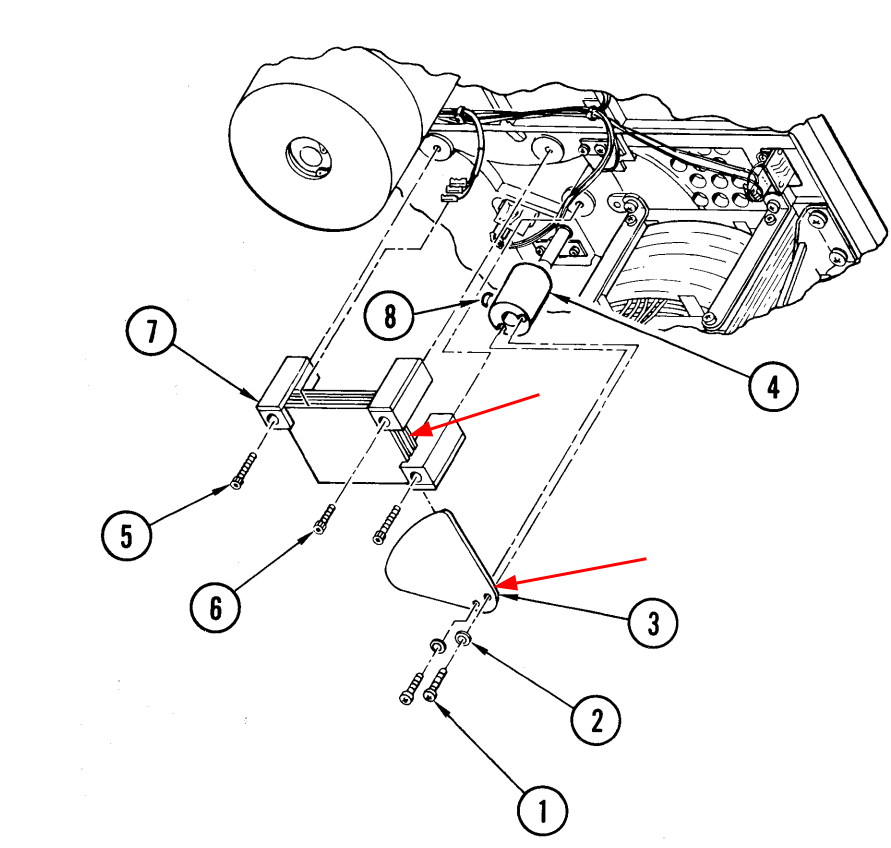
The relevant part of the schematic seems to be this:
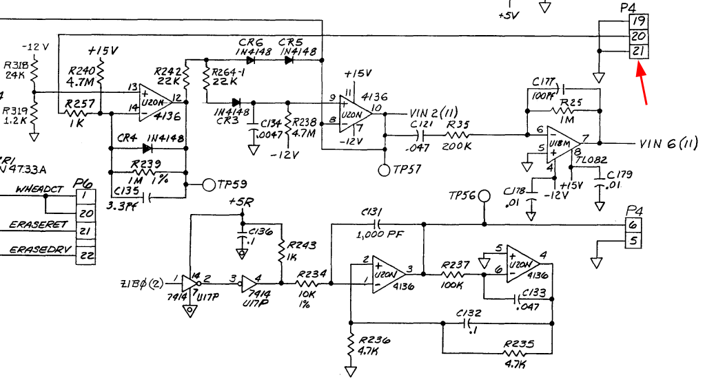
I'm not exactly certain because there seem to be errors in the annotations in the wire loom. But that P4 matches in part, and it has the expected 3 wires. The circuit produces two voltages (vin2 and vin6) which are actually measured by the circuit:
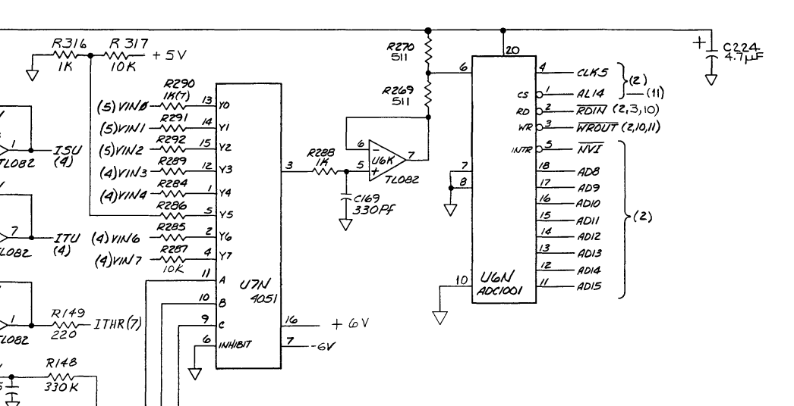

The service manual for the F880 is a lot better; it has annotations in the schematic that tell us the above circuit is indeed what we're looking for. The theory of operation for the 980 describes the operation of this circuit:
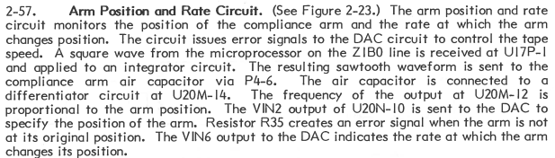

## Drive error messages
The drive shows error messages on the keys in binary. It The digits are reversed though: the lsb is LOAD, the MSB is HI-DEN, sigh.

We have the following list of error codes from the manual:

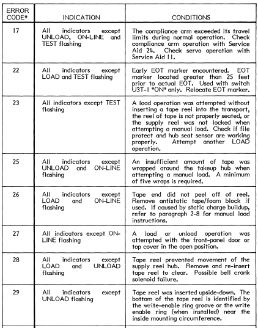
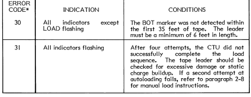

We also have another list which is less precise but with more codes:
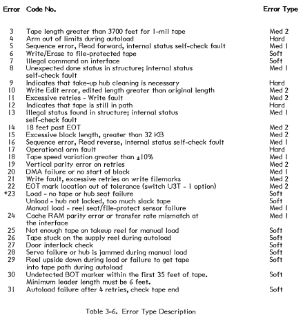

## Links

- [Youtube repair video](https://www.youtube.com/watch?v=9-UWP-Op278)
