# Investigating and testing the PSU (H7140)

The PDP-11 comes with a H7140 power supply. In my machine there was something wrong with it. The +5V rail measured fine but the -15V and +15V measured -20V and +9V. In the configuration I had these voltages are not used, but despite that the voltages *are* checked by the M7090 CIM module (the module that also provides the console and TU58 interfaces), and when they are wrong they lead to an error in the CPU error register (bit 0, called CIM power fail). This, in turn, caused a lot of XXDP tests to fail immediately with the same error.

So, despite the fact that the machine seemed to work OK I need to fix that power supply… Which is a very scary thing..

The H7140 power supply delivers +5V at 120A (that is NOT a typo! A hundred and twenty amperes!), +15V at max 3A and -15V at max 3A too, and some other voltages.

## Different voltages

There are two models:

- One model is for 110V
- The other is for 230V.

This is marked on the label of the device:

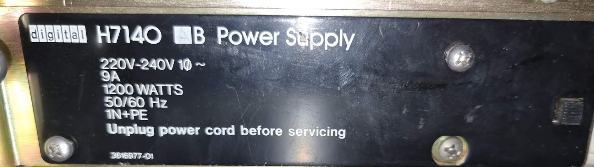

Geert got me another power supply as a spare, and the idea was to first check that supply and see whether it provides the correct voltages; if it does we could swap supplies before repairing the other one.

The second supply however had a different marking:

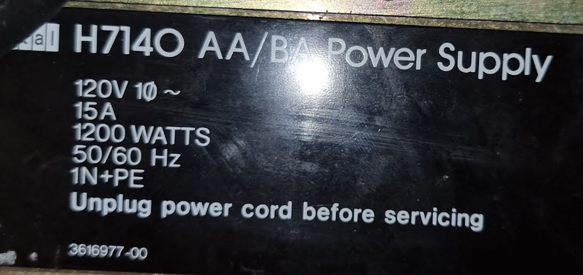

Luckily enough there is a small detail that helps:

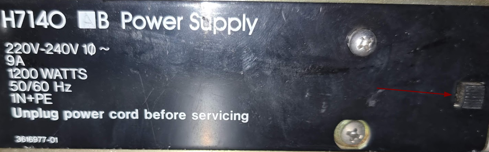

That little thing is a switch, and if you remove the cover there (it is glued) it switches between 120V and 230V. This means that as long as you keep the cover bent you can switch to 230V. I spend a bit of time confirming this on the schematic diagram of the thing.

## Investigating the PSU’s schematics

I used two documents to investigate how the PSU works:

- The Field Maintenance Print set MP00897\_11x44 of december '79. This contains the schematic diagrams and the layout and construction diagrams. This contains hardly any information and a lot of things are not very clear, so I added annotations to that PDF document so that things become more clear. I will link this document later.
- The BA11-A Mounting box and psu tech manual - EK-BA11A-TM-003\_Aug83. This contains block schemas and short explanations on the PSU’s innards. I ran this document through the excellent [*ocrmypdf* software](https://thucnc.medium.com/convert-a-scanned-pdf-to-text-with-linux-command-line-using-ocrmypdf-1a2e8d50277f) which OCR’s all text in the document and makes it fully searchable. Many thanks to the authors of that!

The first goal was to gain an understanding on how the +15 and -15V signals were generated, and after that the +5V. I will try to write down what I learned from that later on.

## Creating a test bed for the PSU

The second goal was to make it possible to run this PSU outside a PDP-11, so that I can check whether it works (and later use the same setup to find out what is wrong with the original one).

### Creating a load on the +5V

The first step was to make sure I could create a load on the PSU; the +5V must have a load of at least 6A according to Internet Lore :wink:

. To provide that I bought a cheap Chinese electronic load which could sink 150W. This should manage with the 30W that the 6A requirement will produce and is way more useful than a resistor.

To connect this I dismantled a PC power supply Molex connector and removed the pins; these are the same size as the MATE-N-LOK connectors used on the H7140. With this I connected the electronic load:

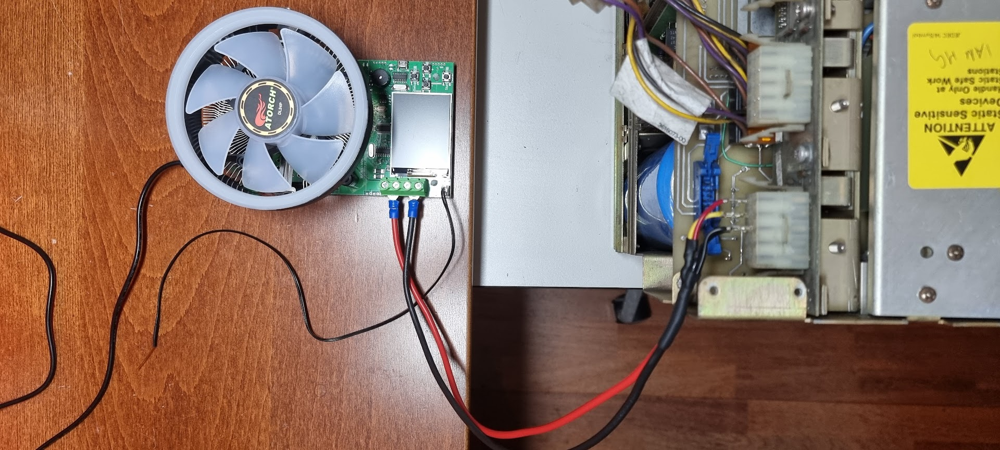

The pins were inserted in the connector as follows:

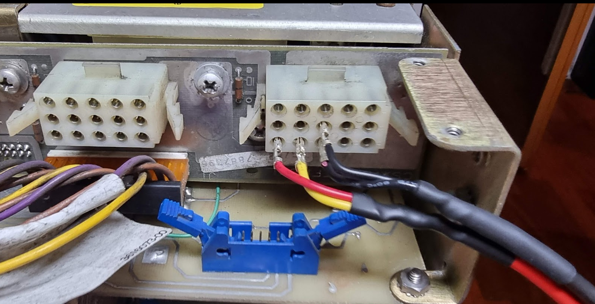

The red+yellow are connected together and are the +5V, both blacks are ground. This is according to the following part of the schematic:

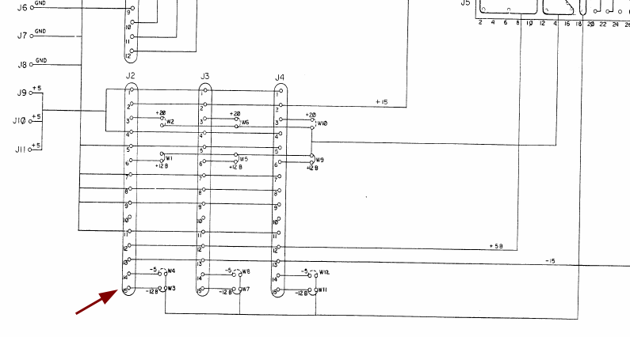

J2, J3 and J4 are the 15 pin MATE-N-LOK connectors that accept the connectors from the backplane, and as can be seen 1+4 are +5v and 7+8 are ground.

Pin 2 is +15V, and pin 13 is -15V, useful to measure those voltages.

### The main circuit breaker on the PSU

The H7140 has a large switch at the back. This is the main circuit breaker which sits immediately after the netfilter and switches both wires. Switching this one ON does not really switch on a PDP-11 though; the PDP switches on using the console’s key (by moving it to LOCAL or LOCAL DSBL.

Switching the main breaker DOES however switch on part of the PSU. A small switching PSU on the BIAS board switches on, and this one provides two voltages:

- +12V BIAS
- \-15V (not the main output, and I did not yet find out what for).

The +12V BIAS voltage is (among other things) used for a trick to prevent power surges. The H7140 rectifies the input net voltage (so the 230V here) to more than 300V DC, and uses that to fill some pretty large capacitors. If nothing is done then switching on the PSU would trip the circuit breakers of the house because of the large current requires to fill those capacitors.

The trick is that initially the net power goes through a resistor. This resistor limits the inrush current needed to charge the capacitors. While this is happening the +12V BIAS voltage also ramps up, and on the BIAS board there is a little circuit that monitors the rectified net voltage. When that voltage reaches close to 300V (indicating that the capacitors are loaded) then this circuit switches on a relay over that limiting resistor, taking it out of the circuit. That relay is powered by the +12V BIAS voltage. This is the source of the “click” about one second after you switch the main circuit breaker.

### Creating something to switch on the PSU

To be able to test the CPU we need to act as if the key is moved to the LOCAL setting. This comes in on the PSU on connector J1 on the PSU’s motherboard: the blue Berg connector that can be seen in the picture above. Following the schematic and the signals it looks to me like the signal we need is called DC ON (L), which comes in from pin 5 of that connector. To be able to play with that we need something to do that:

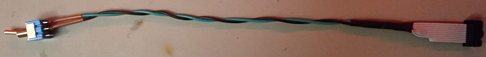

# Testing the PSU

With all of this in place it is now time to start testing.. Add test leads in the +15V and -15V sockets:

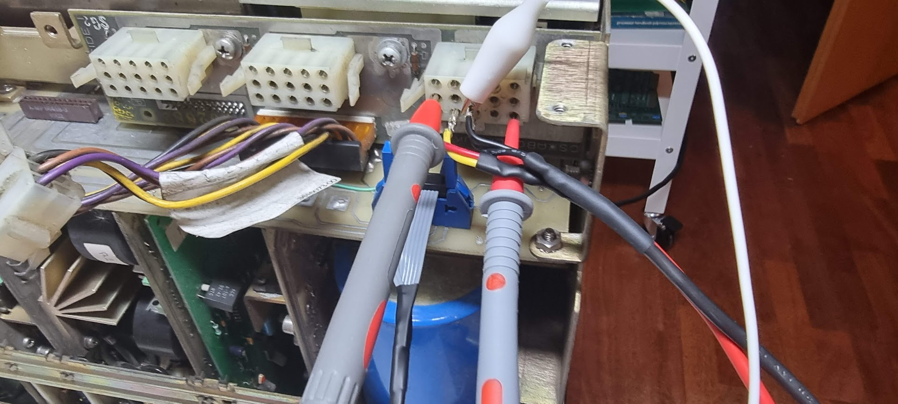

Switch on the electronic load to 6A constant current:

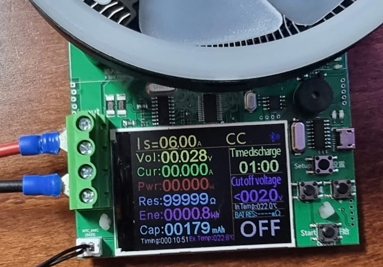

And then switch on the power and switch the “DC ON (L)” switch.. We need to be quickish because there is no cooling of the PSU…

The PSU switches on (Yippee) and the electronic load shows:

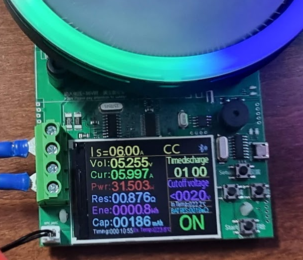

The voltages of the +15V and -15V rails are:

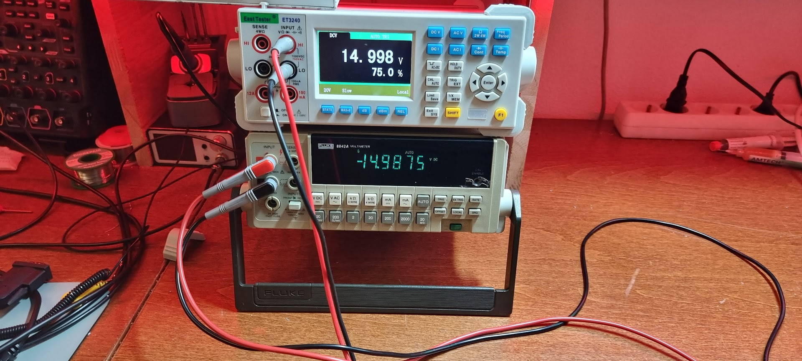

These seem to be fine, but the +5V rails seems to be slightly high. It should be 5.1V +/- 0.1V, but I will assume this to be fine considering we will have loss on the internal wiring and we’re only pulling 6A of load (which is the minimum for this PSU).

It appears that this PSU is OK, so next task is to replace the PSU in my 11/44..