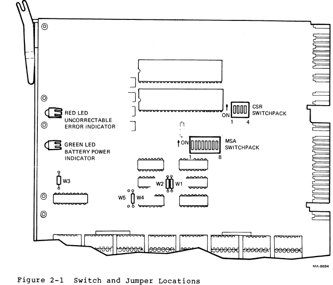
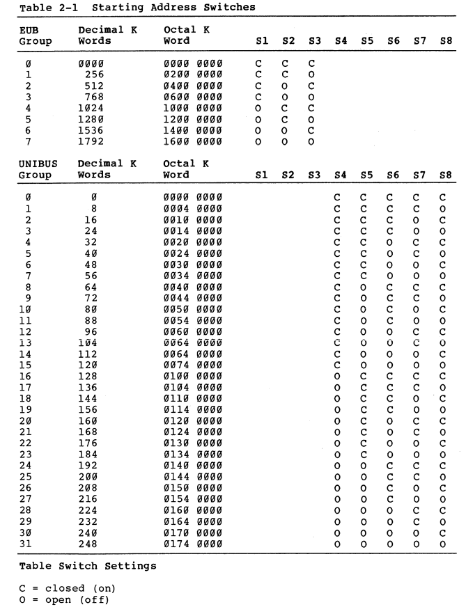
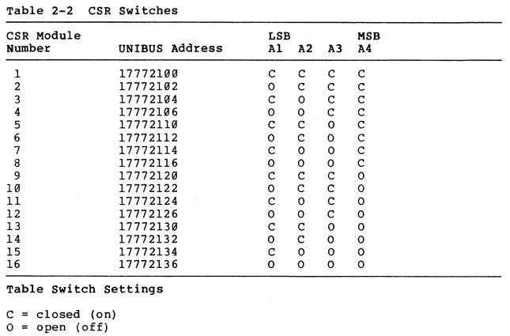

# M8743 MS11-P MOS memory

Pictures:

From [gunkies](https://gunkies.org/wiki/MS11-P_MOS_memory):

The MS11-P is a Extended UNIBUS MOS DRAM main memory card. As an EUB card, it can therefore only be plugged into the EUB slots on the PDP-11/24 or PDP-11/44 backplane.

It has ECC which automagically corrects single-bit errors, and detects double-bit errors. On power-on, the system is frozen (via negation of the ACLO UNIBUS signal) while the entire memory is cleared, to prevent spurious ECC errors. For diagnostic purposes, the ECC can be disabled, and there are also means for the CPU to read/write the ECC bits directly.

The access time is 490-535 nsec (read, typical/max; 215-230 nsec extra on error), 100-125 nsec (write); the cycle time is 680-750 nsec (read cycle) or 580-620 (write cycle). Memory refresh time is 675 nsec (typical; 725 nsec maximum), every 11.25-13.75 μsec.

It is a hex-height card, the M8743, and holds 1 Mbyte when fully populated with 64Kx1 DRAM chips. The memory is arranged as 8 banks, each 16 data bits wide, with 6 additional bits for the ECC.

**It uses +5V only**, unlike the earlier MS11-L and MS11-M MOS memories. The board has provision to use battery backup power to retain data during a power outage. Power requirements are 3.4-4.8A of +5V, and 2.0-2.8A of +5VBB.

# Switches and jumpers

The MSA switchpack selects the start address for the memory.

- S2-1 to S2-3 corresponds to A21..A19 (256K increments)
- S2-4 to S2-8 correspond to A18..A14, in 8K increments

Warning: “ON” represents a logical 0.

The CSR switches control the address of the “control registers” for the memory board:

- [Technical manual](https://bitsavers.org/pdf/dec/pdp11/memory/EK-MS11P-TM-001_Tech_Oct82.pdf)