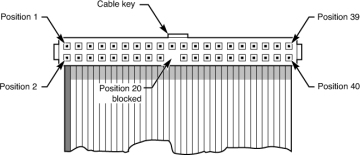
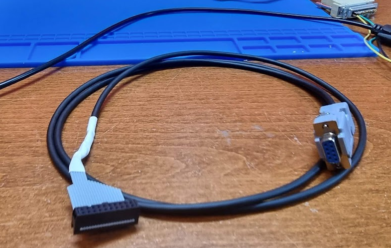

# PDP11 M7090 Console Cable / tu58 cable

The PDP-11/44 uses a M7090 board which contains three serial interfaces:

- One system console interface
- One tu58 interface (to the tu58 tape unit(s))
- One serial interface that used to connect to a modem to get Dec remote maintenance (which for some reason is no longer available).

We need to have cables so that we can connect a PC or terminal to the PDP-11, and for that you need a console cable. This cable is the same for both the console serial port and the tu58 serial port if you want to connect these to a PC.

The connectors used on the M7090 are called “Berg connectors”. We need to make a cable using a Berg connector on one end and a DB9 male connector on the other. The latter is meant to be connected to the USB to serial converter cables that we need to use nowadays as a serial port. If you want to connect to a real terminal you will need to use a DB25 instead (and make sure that you do not cross the RX and TX lines.

The pinout for the serial console cable (J2) to DB25 is as follows. Take the following image as an indication of the numbering scheme on the 20 pin connector:

We’re looking at the FRONT and number from left to right.

We have the following connections:

| **Pin** | **To DB25** | **Pin** | **To DB25** |
| --- | --- | --- | --- |
| 1   | NC  | 11  | NC  |
| 2   | CLOSED HOLE | 12  | NC  |
| 3   | NC  | 13  | NC  |
| 4   | pin 3 | 14  | NC  |
| 5   | pin 2 | 15  | NC  |
| 6   | NC  | 16  | NC  |
| 7   | NC  | 17  | NC  |
| 8   | PIN 20 | 18  | NC  |
| 9   | GND | 19  | NC  |
| 10  | NC  | 20  | NC  |

A cable can be made easily by taking a bit of ribbon cable and a ribbon connector.

My cable uses a DB9 connector that removes the need for a cross cable:

Pin 4: (green wire) to pin 2 of a DB9  
Pin 5: (yellow) to pin 3  
Pin 8 (brown) to pin  
Pin 9 (mantle) to pin 5

> [!WARNING]
> WATCH OUT: The original connector LOOKS like a 24 pin connector, but the FIRST and LAST columns are empty, and the receiving connector has no pins there!!

