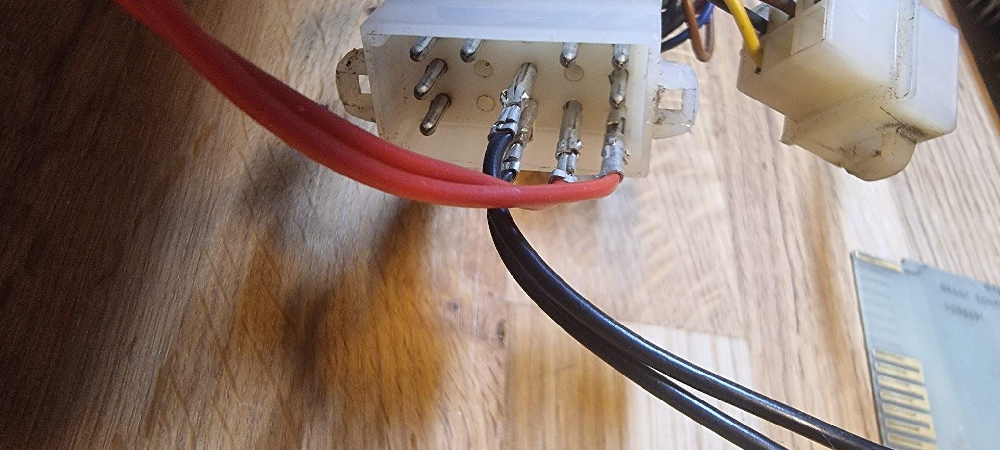
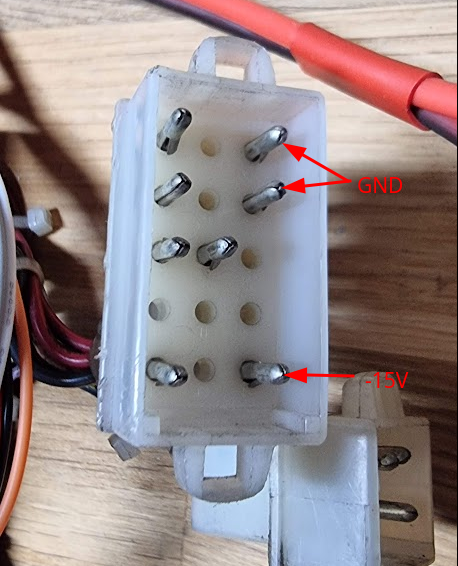
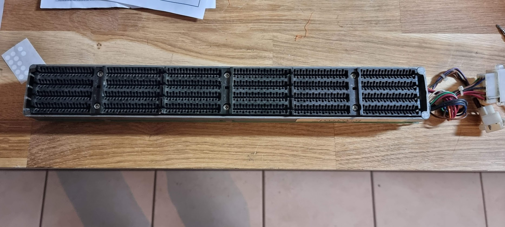
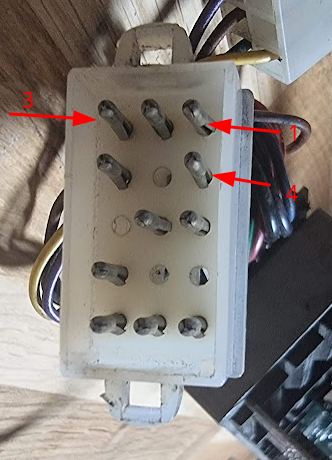
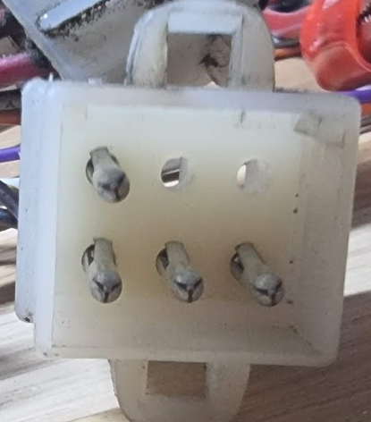

# The DD11-DK backplane

# The DD11-DK backplane

This DD11-DK backplane is a generic 9 slot Unibus backplane:

It has the following configuration:

|     |     |     |     |     |     |     |
| --- | --- | --- | --- | --- | --- | --- |
|     | A   | B   | C   | D   | E   | F   |
| 9   | UNIBUS |     | SPC |     |     |     |
| 8   | Modified UNIBUS |     | SPC |     |     |     |
| 7   | Modified UNIBUS |     | SPC |     |     |     |
| 6   | Modified UNIBUS |     | SPC |     |     |     |
| 5   | Modified UNIBUS |     | SPC |     |     |     |
| 4   | Modified UNIBUS |     | SPC |     |     |     |
| 3   | Modified UNIBUS |     | SPC |     |     |     |
| 2   | Modified UNIBUS |     | SPC |     |     |     |
| 1   | UNIBUS |     | SPC |     |     |     |

The power connectors are configured as follows:

P2 Connector: Amp 15 pin MATE-N-LOC

|     |     |     |     |     |
| --- | --- | --- | --- | --- |
| Pin | AWG | Color | Function | **Slot Pins** |
| 1   | 14  | red | +5V | AA2, BA2, CA2, DA2, EA2, FA2 |
| 2   | 18  | grey | +15V | CU1 |
| 3   | 14  | orange | +20V core | AU1, AV1, AV2 |
| 4   | 14  | red | +5V | AA2, BA2 |
| 5   |     |     |     |     |
| 6   |     |     |     |     |
| 7   |     |     |     |     |
| 8   | 14  | black | GND |     |
| 9   | 14  | black | GND |     |
| 10  |     |     |     |     |
| 11  |     |     |     |     |
| 12  | 14  | red | +5VB | BD1 |
| 13  |     |     |     |     |
| 14  | 18  | brown | \-5V core | BV2 |
| 15  |     |     |     |     |

P3 Connector: Amp 6 pin MATE-N-LOC

|     |     |     |     |     |
| --- | --- | --- | --- | --- |
| Pin | AWG | Color | Function | **Slot Pins** |
| 1   | 14  | black | GND |     |
| 2   | 18  | brown | LTC | CD1 |
| 3   | 18  | violet | DCLO | BF2, CN1 |
| 4   | 18  | yellow | ACLO | BF1 |
| 5   |     |     |     |     |
| 6   |     |     |     |     |

P4 Connector: Amp 15 pin MATE-N-LOC

|     |     |     |     |     |
| --- | --- | --- | --- | --- |
| Pin | AWG | Color | Function | Slot Pins |
| 1   | 14  | red | +5V | AA2, BA2, CA2, DA2, EA2, FA2 |
| 2   |     |     |     |     |
| 3   | 14  | orange | +20V core | AU1, AV1, AV2 |
| 4   | 14  | red | +5V | AA2, BA2, CA2, DA2, EA2, FA2 |
| 5   |     |     |     |     |
| 6   | 18  | white | +15VB | AR1 |
| 7   |     |     |     |     |
| 8   | 14  | black | GND |     |
| 9   | 14  | black | GND |     |
| 10  |     |     |     |     |
| 11  |     |     |     |     |
| 12  |     |     |     |     |
| 13  | 18  | blue | \-15V | CB2, CC2, CD2, CE2, CF2 |
| 14  |     |     |     |     |
| 15  | 18  | green | \-15VB | AS1 |

Connecting +5V to this backplane can be done as follows, on P2:

Make sure this is P2; it should be written on the plug itself, if not take good note of the pin layout.

Connecting -15V (for the Delua controller) must be done on P4, as follows:

# The DD11-CK backplane

This backplane is a generic 4 slot backplane:

The slots are numbered 1 to 4, starting the closest to the edge of the table. Connectors A are to the right; F is to the left. It has the following configuration:

|     |     |     |     |     |     |     |
| --- | --- | --- | --- | --- | --- | --- |
|     | A   | B   | C   | D   | E   | F   |
| 4   | UNIBUS |     | SPC |     |     |     |
| 3   | Modified UNIBUS |     | SPC |     |     |     |
| 2   | Modified UNIBUS |     | SPC |     |     |     |
| 1   | UNIBUS |     | SPC |     |     |     |

This backplane has two connectors for power:

and

Power connector pinout:

|     |     |     |     |     |
| --- | --- | --- | --- | --- |
| Pin | AWG | Color | Function | **Slot Pins** |
| 1   | 14  | red | +5V | AA2, BA2, CA2, DA2, EA2, FA2 |
| 2   |     | grey |     |     |
| 3   |     | orange |     |     |
| 4   | 14  | red | +5V | AA2, BA2 |
| 5   |     | white |     |     |
| 6   |     |     |     |     |
| 7   | 14  | black | GND |     |
| 8   | 14  | black | GND |     |
| 9   |     |     |     |     |
| 10  |     |     |     |     |
| 11  |     |     |     |     |
| 12  |     | red |     |     |
| 13  | ?   | blue | \-15V |     |
| 14  |     | brown |     |     |
| 15  |     | green |     |     |