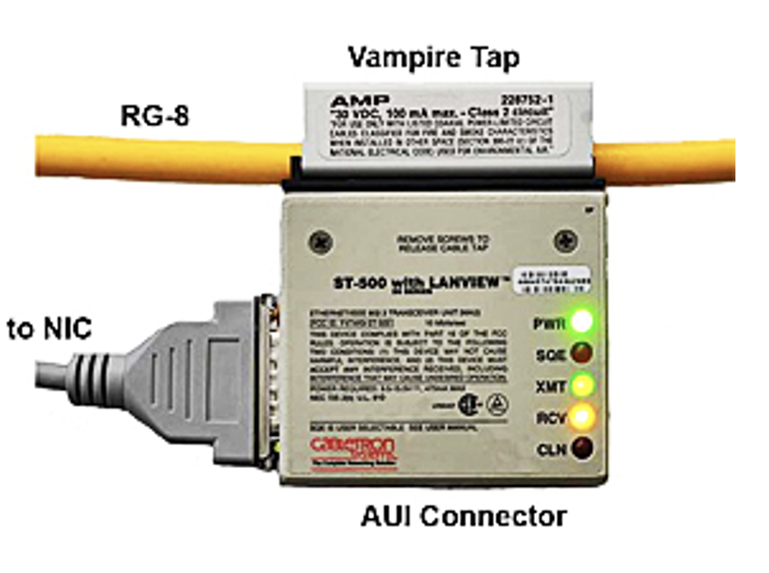
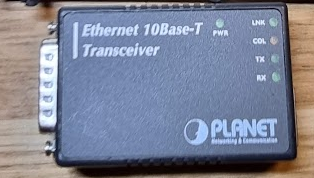
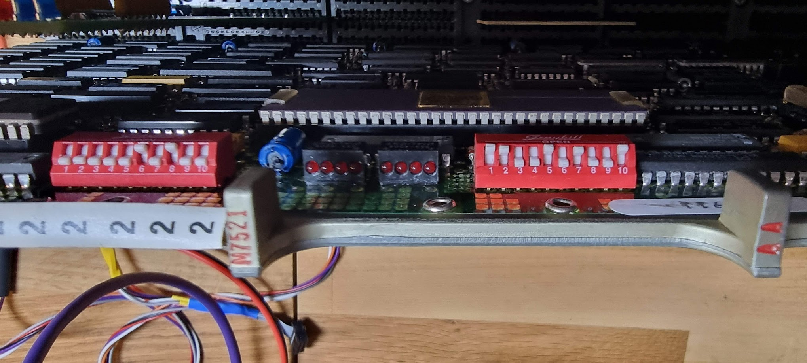
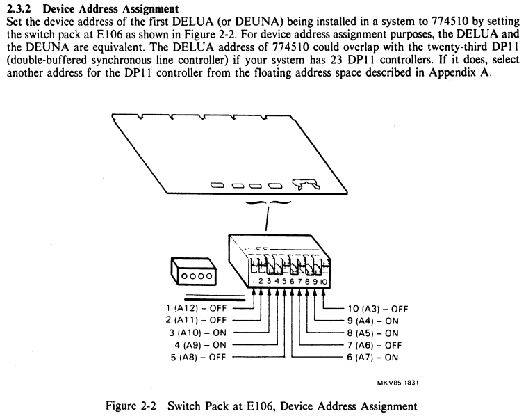
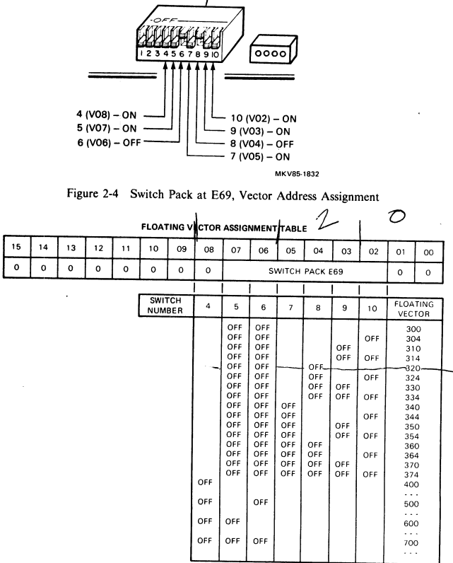
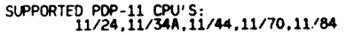
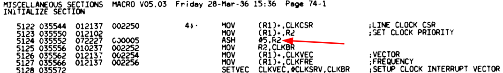
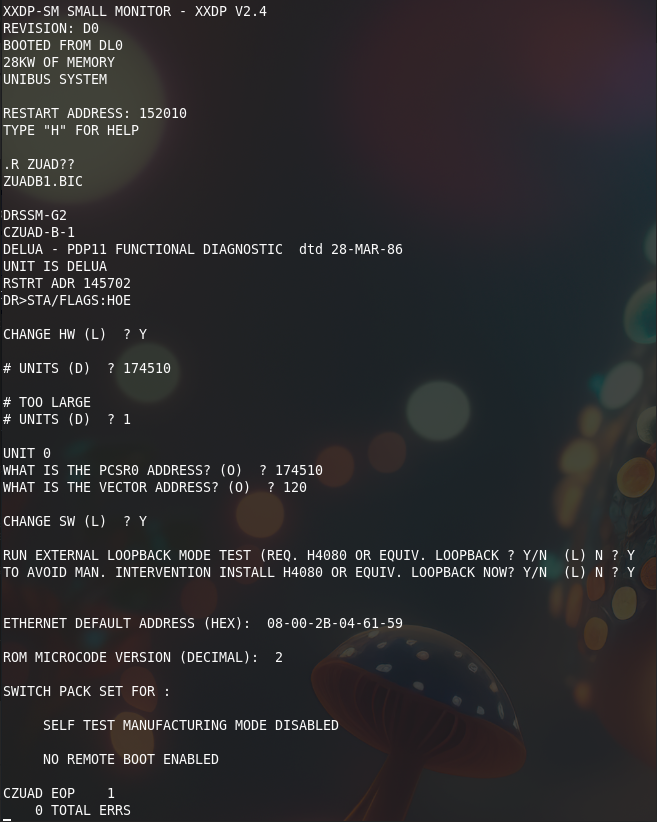
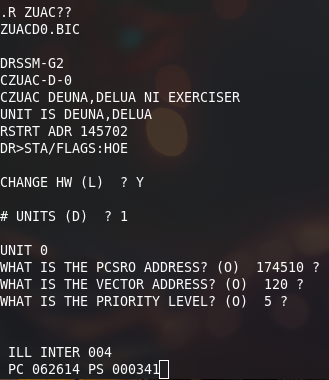

# The DELUA Ethernet controller (M7521)

This is an Unibus ethernet card.


It needs a few extra’s to work: the UNA bulkhead cable assembly:


and the cable to connect the card and the bulkhead assembly:


The bulkhead assembly ends in a AUI connector. These were, at that time, meant to be connected to a “Vampire Tap” type of Ethernet connection through an AUI cable:



The top line is the actual Ethernet COAX line which, at that time, was 10 10Mbit/s bus structure where multiple devices would attach to that same COAX.

To connect the DELUA to a modern network we need an AUI to 10Base-2 adapter:



This can be plugged into the AUI connector and provides a RJ45 10Base-2 connector. You will need to connect this to a switch that still understands 10MBit connections!

# Testing the DELUA controller in an Unibone rig

Like the RX02 before it, I want to test the controller in a standalone Unibone setup.

## Providing power

The DELUA card has some rather hefty power requirements:

- 5V 8A
- \-15V 1A

This will require some setup with lab PSUs; an empty Unibone setup already takes about 3.2A.. Luckily enough the real power use (at least at startup) is less: putting my KA3305 in parallel mode, with 5A per channel provides enough power (about 4.8A per channel).

> [!WARNING]
> Make sure your power cords are thick enough! You will have substantial losses in voltage with this amount of current! And they will get pretty warm! Do not use your typical Chinesium wires!

Example: assuming 12A at 5V through 1M of cable (effectively 2M for power and ground):

| **AWG** | **mm2** | **Loss** | **Result** |
| --- | --- | --- | --- |
| 15  | 1.65 | 0.516V | 4.48V |
| 13  | 2.63 | 0.324V | 4.67V |
| 10  | 5.26 | 0.162V | 4.83V |
| 9   | 6.6 | 0.128V | 4.87V |
| \-  | 16  | 0.053V | 4.95V |

We now also need -15V. This is found on pin FB2 of the backplane. See the [power connector diagram for details](../pdp-1144/the-dd11-dk-backplane.md).

## Card configuration: DIP switches

Dip switches on the DELUA card at arrival:



The rightmost dipswitch defines the device address, and it is set to 774510 as per the manual:



The leftmost dipswitch defines the vector address, and should be set to 120 for the 1st controller:



which is correct too.

## XXDP tests for the DELUA controller

The absolutely awesome [XXDP database by Joerg Hoppe](https://retrocmp.com/tools/pdp-11-diagnostic-database/202-pdp-11-diagnostics-database) can be searched by device: click the “Device Index” link, then search for DELUA. This returns the tests available for the device. Another route is to download the [“PDP11 Diagnostics Handbook” from Bitsavers](http://www.bitsavers.org/pdf/dec/pdp11/xxdp/PDP11_DiagnosticHandbook_1988.pdf). In there we find the following tests:

- ZUAC??: NIE Exerciser Diagnostic. This is a tool which allows discovering nodes on the network. Does not seem to be very useful.
- ZUAD??: Functional Diagnostic. This test needs a loopback connector on the AIU connector, and consists of 27 subtests.

Running the test, however, does not go well:

```
BOOTING UP XXDP-SM SMALL MONITOR


XXDP-SM SMALL MONITOR - XXDP V2.4
REVISION: D0
BOOTED FROM DL0
28KW OF MEMORY
UNIBUS SYSTEM

RESTART ADDRESS: 152010
TYPE "H" FOR HELP 

.R ZUAD??
ZUADB1.BIC

DRSSM-G2
CZUAD-B-1
DELUA - PDP11 FUNCTIONAL DIAGNOSTIC  dtd 28-MAR-86
UNIT IS DELUA
RSTRT ADR 145702
DR>STA/FLAGS:HOE

CHANGE HW (L)  ? Y

# UNITS (D)  ? 1

UNIT 0
WHAT IS THE PCSR0 ADDRESS? (O)  ? 174510
WHAT IS THE VECTOR ADDRESS? (O)  ? 120

CHANGE SW (L)  ? Y

RUN EXTERNAL LOOPBACK MODE TEST (REQ. H4080 OR EQUIV. LOOPBACK ? Y/N  (L) N ? Y
TO AVOID MAN. INTERVENTION INSTALL H4080 OR EQUIV. LOOPBACK NOW? Y/N  (L) N ? Y


 ILL INTER 010
 PC 035554 PS 000341
```

It seems to hit a trap 010 which is an “Illegal Instruction” trap. Looking at Joerg Hoppe’s diagnostics database fiches the test documentation states:



The Unibone emulates a 11/20 CPU, which is one of the earliest CPUs. I checked. That same fiche, for ZUADB0 (we are using ZUADB1, so there will be differences to be aware of) shows this code at the address around 035554:



This is an instruction from the “Extended Instruction Set”, and so it is logical that we die on it on the Unibone. Trick is going to be [to extend the emulator to support the extended instruction set](../pdp-1144/extending-the-unibone-cpu-emulation.md) too.

## After extending the instruction set

Running the test again:



Next round is to try ZUACD0, but that is again bad luck:

