# The RX02 floppy drive and the M8256 RV211 controller

Another amazing gift from Geert, this is my first real DEC peripheral for the PDP 11/44!! Yay!

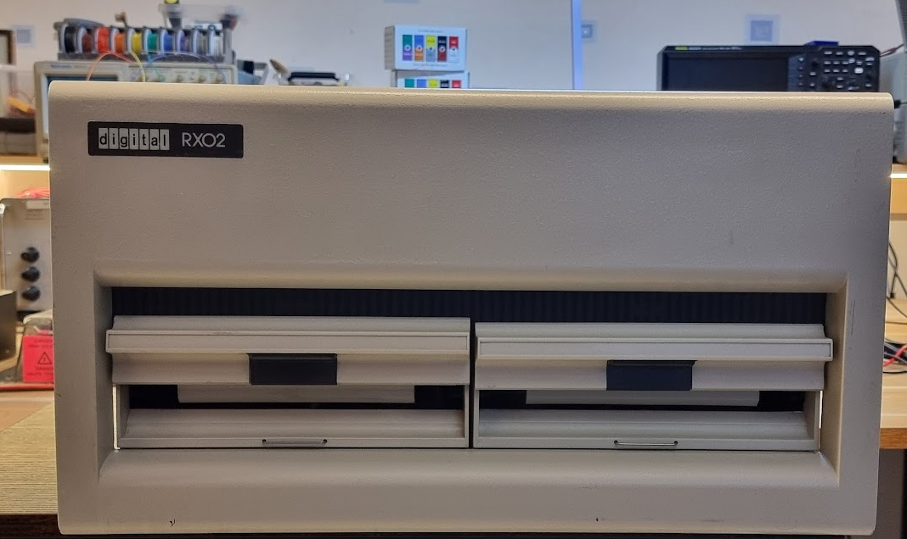

The controller for this is the M8256:

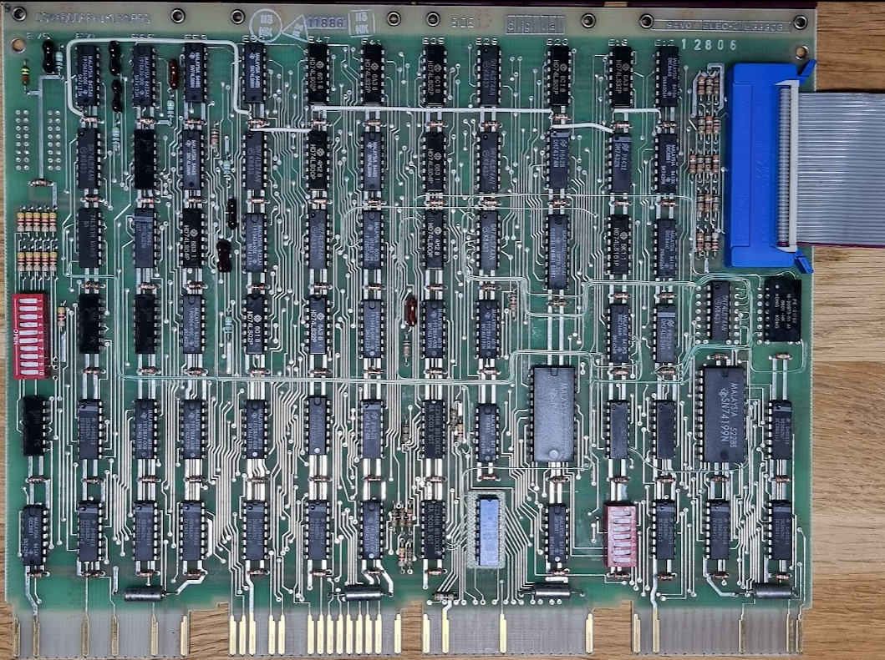

The band cable at the left is the cable going to the RX02. The red wire at the top needs to go to the A pin of the connector (written on it).

The RX02 has a nice construction which should make it more easy to repair. There are two main circuit boards. The top board, for which you see the back when you look inside the machine, is called the M7744:

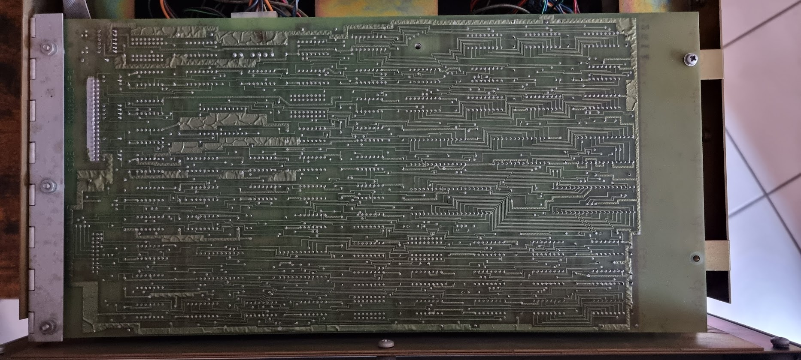

This is a rather complex board which actually implements a processor in discrete hardware! It uses two AM2901 bit slice processors and three AM2909 sequence generators. The CPU is a microcode based CPU with the microcode in PROMs. These PROMs are Harris 7643 PROMs:

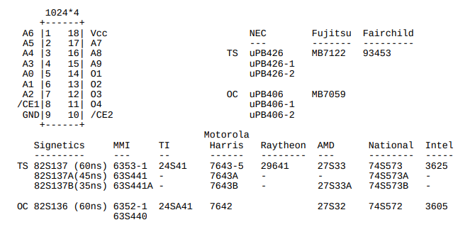

Anyway, by just releasing two screws you can flip that entire board up, so that you can access both its component side and the components on the analog board:

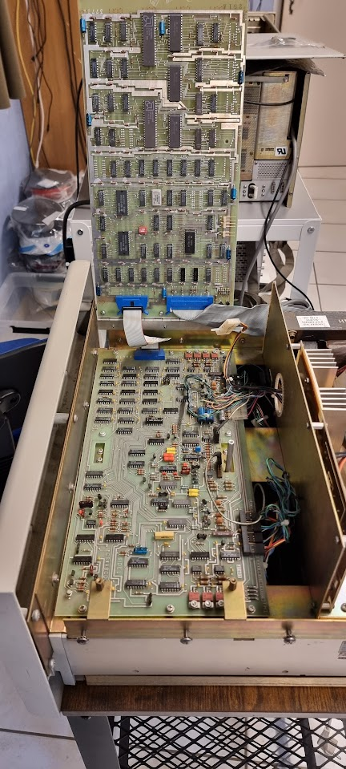

Very nicely done, it reminds me of early HP equipment like the HP 9825A which also used something similar. If only machines nowadays would pay similar attention on how to be repaired…

## Initial mini repairs

The machine was cleaned as much as possible, and the large capacitors were reformed during about 4 hours. The power cord of the device was broken, so it was replaced with a new cord and a new grommet:

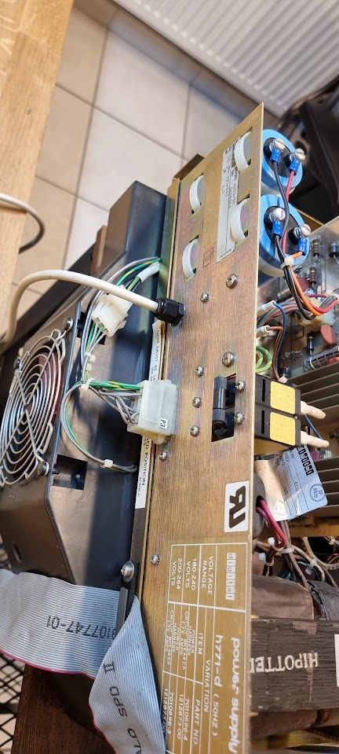

The main circuit breaker also had a problem: it would not make contact properly when switched on. This could have become a bit of a problem as the thing seemed to be riveted close, but luckily applying some Deoxit in different nooks and crannies of the switch made it work properly again,

## Running tests for the controller

I inserted the M8256 controller in an Unibone testbed ([see here how to set that up](../pdp-1144/using-the-unibone-as-a-stand-alone-machine.md)):

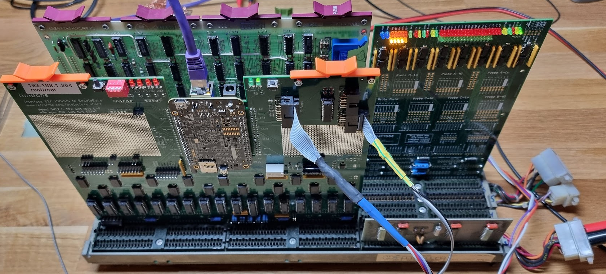

The controller must be put in an SPC slot, i.e. connectors C-F. It needs the NPG line to be cut as it uses DMA. A way to see that this is probably the case is by looking at the edge connector for slot C of the card (component side):

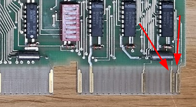

These fingers are actually connected, and these are the NPR signals they connect to - indicating that they need them.

I then started the cpu20\_xxdp\_rl0\_dl11.sh script to get the Unibone to emulate a CPU and a DL11 serial port. This now boots xxdp. I then start ZRXFB0.BIC which should test the controller:

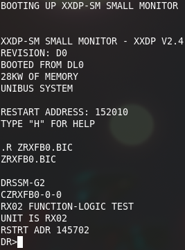

This test starts by calling the Supervisor. This prompt takes [a set of possible answers explained here](https://www.pdp-11.nl/peripherals/xxdp-supervisor.html). After answering STA/FLAGS:HOE (start test, halt on error) the test reports the following:

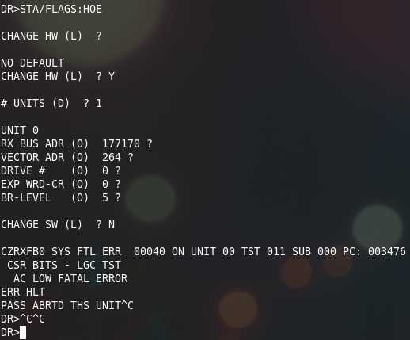

This error complains about AC LOW. The M8256 (RX211) actually has a bit in its status register that gets set when it detects that the RX02 does not have power:

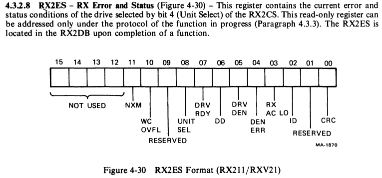

Not so surprising we get this error considering that the RX02 is not connected to the controller at this point…

If you ever get a “real” error: look in Jörg Hoppe’s [fantastic diagnostics database here](https://www.retrocmp.com/tools/pdp-11-diagnostic-database/202-pdp-11-diagnostics-database) and find the test in question to get the assembly listing for the thing.

## Testing with the RX02 connected

Inserting the cable in the controller, and switching on the RX02, after that we run the same test. Initially without a floppy inserted, which does not make it happy:

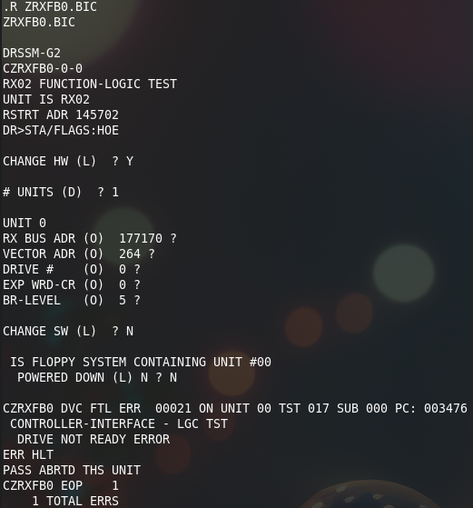

After that I inserted a floppy, and got:

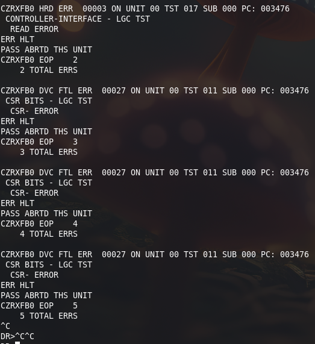

This was accompanied by a lot of “clacking” sounds, probably the heads being lowered on the disk?

## Second test

The second test was even less successful: the drive kept repeating there was an AC LOW FATAL ERROR. Apparently something broke… This seems to be done by this part of the circuit on the M7744 board:

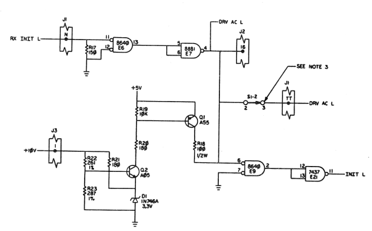

The 8881 is an equivalent of the 7439, and is open collector. I measured the signal on pin 4 of E7, and that remained at 0V, i.e. this circuit registered the AC failure, indeed. I also checked the 10V input, and that was fine.

This circuit should work as follows:

If the 10V is missing then Q2 will not conduct; its emitter is at 0v through the zener, and the base is near 0v because the 10V is missing. Because of that Q1 will also not conduct and thus not pull the exit of E7 high, i.e. the signal will remain low.

If the 10V is present (at least high enough) the emitter of Q2 will be around 3.3V through the zener. The base of Q2 should be slightly higher than 5V through the resistor ladder R22,R23 causing Q2 to conduct. This pulls the base of Q1 to below 5V, causing it to conduct, thereby pulling the DRV AC L line high.

Next step is to measure the voltages around Q2:

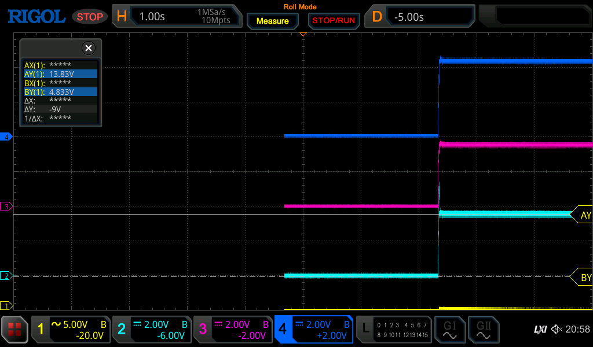

Yellow = E7 Pin 4 (DRV AC L), light blue=collector Q2, purple=emitter, dark blue=base Q2

We see that the base is indeed > 5V, but collector and emitter of Q2 are both way above 3.3V. This indicates that the 3.3V zener has given up. After replacing the zener we have a proper signal when the test runs:

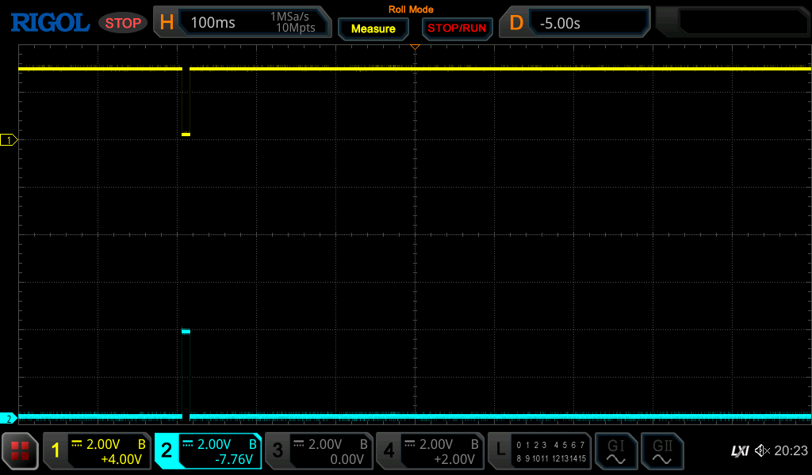

Light blue is the signal on pin 6 E7, yellow is the signal on pin 4.

After this, and after messing with some floppies I got this:

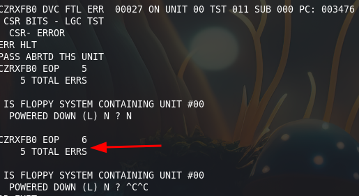

It looks like an entire pass tested OK :wink:

 During the test I could see the head moving; first track by track, after that reading random tracks… This part seems to be OK :wink:

Running the test with both drives filled with a properly filled floppy shows:

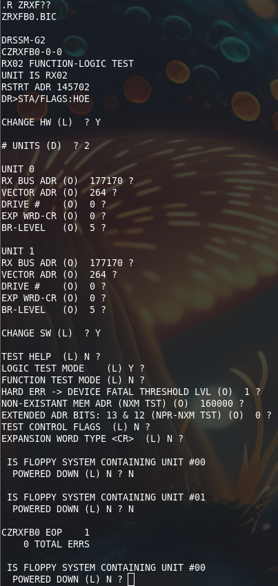

## Making a bootable RX11 disk and booting from the RX02

Next thing to do is to try to boot off the RX02 :wink:

. For that I want to use RT11, as it is small and easy to use.

### Creating a RT11 RL disk image

First thing is to create a Unibone image containing an RX11 version that has the DY.SYS driver, because the original image does not 8-/. This can be done using simh. I downloaded the installation image for RT11 V5.3 and installed in an RL image in Simh. I then copied that image to the Unibone, under 10.03\_app\_demo/5\_applications/cpu as the file [rt11-53-j.dsk](./attachments/rt11-53-j.dsk)
 .

We first need a set of files to boot off the RL disk image. These are the following:

cpu20\_rt11-53\_rl0\_dl11-j.cmd:

```
dc			# device menu

# first, make a serial port. Default ist
sd dl11
en dl11			# use emulated serial console
p p ttyS2		# use "UART2 connector, see FAQ
en kw11			# enable KW11 on DL11-W

pwr			# reboot PDP-11
.wait 3000		# wait for PDP-11 to reset
m i			# install max UNIBUS memory

# Deposit bootloader into memory
m ll dl.lst

en rl			# enable RL11 controller

# mount RT11 v5.5 in RL02 #0 and start
en rl0			# enable drive #0
sd rl0			# select
p emulation_speed 10	# 10x speed. Load disk in 5 seconds
# set type to "rl02"
p runstopbutton 0	# released: "LOAD"
p powerswitch 1		# power on, now in "load" state
p image rt11-53-j.dsk	# mount image file with test pattern
#p image rt11v5.5_games_34.rl02	# mount image file with test pattern
p runstopbutton 1	# press RUN/STOP, will start

.print Disk drive now on track after 5 secs
.wait	6000		# wait until drive spins up
p                       # show all params of RL1

en cpu20
sd cpu20

.print RL drives ready.
.print RL11 boot loader installed.
.print Emulated PDP-11/20 CPU will now boot RT11.
.print Serial I/O on simulated DL11 at 177650, RS232 port is UART2.
.print Start 10000 to boot from drive 0, 10010 for drive 1, ...
.print Reload with "m ll"
.print Start CPU20 by toggeling CONT switch with "p c 1"
```

And the shell file:

cpu20\_rt11-53\_rl0\_dl11-j.sh:

```
# start RT11 5.5 with "demo" application
cd ~/10.03_app_demo/5_applications/cpu
~/10.03_app_demo/4_deploy/demo --verbose --cmdfile cpu20_rt11-53_rl0_dl11-j.cmd $*
```

### Create the boot floppy on the RX02

Now start the script we’ve just created. It should start the emulated CPU, and after the “p c 1” command it should boot into RX11 from the RL0 disk image:

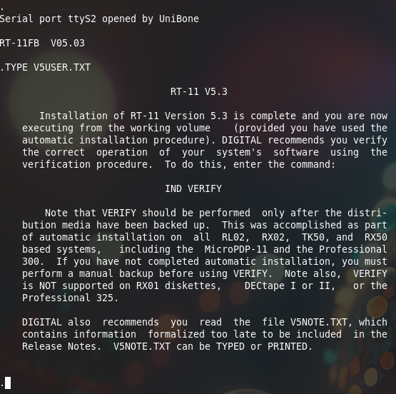

We now create a RX02 boot disk, as follows:

```
.init dy0:
DY0:/Initialize; Are you sure? Y

.dir dy0:

 0 Files, 0 Blocks
 974 Free blocks
```

Then start copying files (commands [stolen from here](https://avitech.com.au/?page_id=914), with thanks!):

```
.COPY RT11SJ.SYS DY0: ⤶
 Files copied:
DK:RT11SJ.SYS  to DY0:RT11SJ.SYS

.COPY SWAP.SYS DY0: ⤶
 Files copied:
DK:SWAP.SYS    to DY0:SWAP.SYS
(rest of the output skipped)
.COPY TT.SYS DY0: ⤶
.COPY DU.SYS DY0: ⤶
.COPY DD.SYS DY0: ⤶
.COPY DX.SYS DY0: ⤶
.COPY DY.SYS DY0: ⤶
.COPY LS.SYS DY0: ⤶
.COPY PIP.SAV DY0: ⤶
.COPY DUP.SAV DY0: ⤶
.COPY DIR.SAV DY0: ⤶
.COPY KED.SAV DY0: ⤶
.COPY RESORC.SAV DY0: ⤶
.COPY STARTS.COM DY0: ⤶
.COPY SL.SYS DY0: ⤶
.COPY IND.SAV DY0: ⤶
```

Next thing is to install a boot sector:

```
.COPY/BOOT:DY DY0:RT11SJ.SYS DY0:
```

After this the floppy should be bootable.

### Booting off the floppy

The next step is to create a file containing the boot PROM for the RX02. This can be found here:

[https://ak6dn.github.io/PDP-11/M9312/](https://ak6dn.github.io/PDP-11/M9312/)

You need the LST file for the 23-811A9 PROM. Copy that as dx02.lst to the same directory on the unibone ([rx02.lst](./attachments/rx02.lst)
 ).

Then we’ll create a set of files on the Unibone that will allow us to boot:

cpu20\_m9312\_dl11.cmd:

```
dc			# "device + cpu" test menu

# first, make a serial port.
sd dl11
p p ttyS2		# use "UART2 connector, see FAQ
en dl11			# use emulated serial console
en kw11			# enable KW11 on DL11-W

sd m9312		# further commands form M9312
p bl DIAG		# set start label to console emulator entry 765020
p cer 23-248F1.lst	# plug console emulator ROM into socket
p br1 23-756A9.lst	# plug RK BOOT ROM into socket1
p br2 23-751A9.lst	# plug RL BOOT ROM into socket2
p br3 rx02.lst		# plug rx02 boot prom
p
en m9312		# online

m i			# install max UNIBUS memory

# Deposit "serial echo" program into memory
m ll serial.lst

#en rl			# enable RL11 controller

# mount XXDP disk in RL02 #0 and start
#en rl0			# enable drive #0
#sd rl0			# select
#p emulation_speed 10	# 10x speed. Load disk in 5 seconds
# set type to "rl02"
#p runstopbutton 0	# released: "LOAD"
#p powerswitch 1		# power on, now in "load" state
#p image xxdp25.rl02  	# mount image file with test pattern
#p runstopbutton 1	# press RUN/STOP, will start

#.print Disk drive now on track after 5 secs
#.wait	5000		# wait until drive spins up
#p                       # show all params of RL1

en cpu20
sd cpu20
p h 0			# release HALT switch

pwr
# Do not issue DMA-like accesses for 300ms, M9312 manipulates ADDR lines after ACLO


.print M9312 boot rom installed.
.print "Serial echo" program loaded at memory 1000.
.print Serial I/O on simulated DL11 at 177650, RS232 port is UART2.
.print Emulated PDP-11/20 CPU will booted into M9312 console emulator.
.print Make sure physical CPU is disabled.
.print Start "Serial echo" with "@L 1000", "@S"
.print Boot from real rx02 with "@dy0"
```

This emulates the CPU and a m9312 terminator, and we add the rx02.lst file as one of its emulated boot proms.

We also need the shell file cpu20\_m9312\_dl11.sh:

```
#!/bin/bash
cd ~/10.03_app_demo/5_applications/cpu
~/10.03_app_demo/4_deploy/demo --verbose --cmdfile cpu20_m9312_dl11.cmd $*
```

Starting this will start the CPU and will use the emulated m9312 to boot. On the console (the 2nd Unibone serial port) the system prompts:

```
Serial port ttyS2 opened by UniBone

000000 000000 000000 000000 
@
```

Enter DY0 (uppercase) after the @ to use the DY boot rom and boot off the RX02:

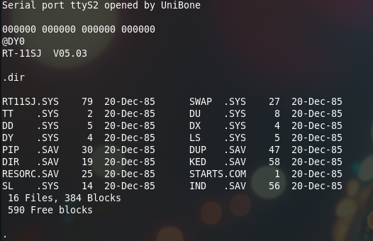

It works :wink: