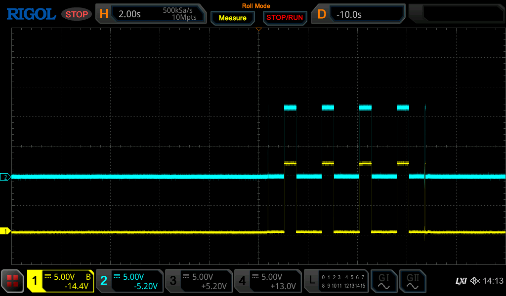
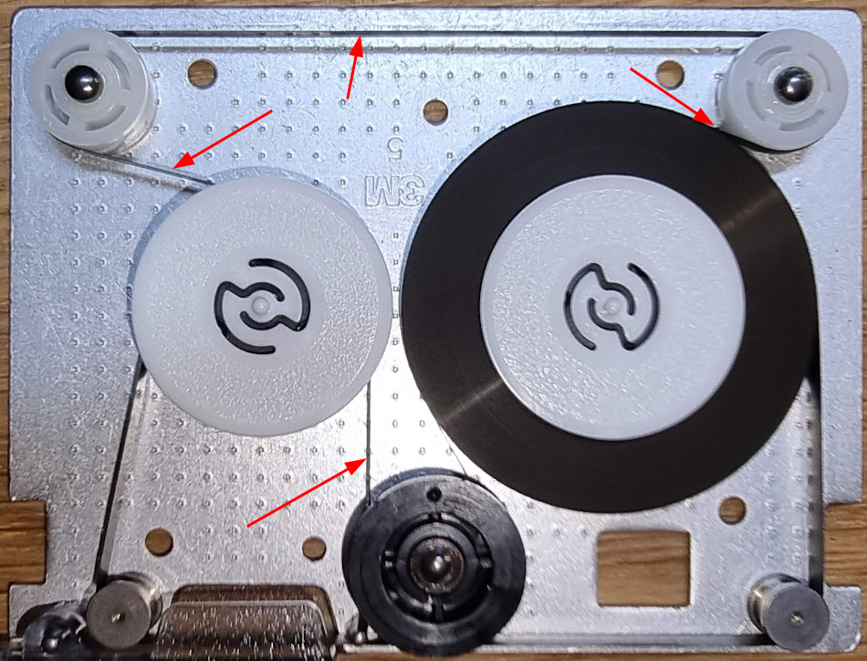

# The TU58 tape unit

Another gift from Geert (thanks)!

This uses DC100 tapes that must be preformatted. I have a set of “new old stock” tapes still in cellophane, but it is more than likely that these tapes have completely perished by now. Despite that I would like to get the drive at least in technical good state again :wink:

- [Cleaning and repairing the cassette drives](#cleaning-and-repairing-the-cassette-drives)
- [Testing the unit](#testing-the-unit)
- [Getting the motor to run..](#getting-the-motor-to-run)
-   [Oscilloscope measurements](#oscilloscope-measurements)
- [Looking into the seek error](#looking-into-the-seek-error)
- [TU85 Tape problems](#tu85-tape-problems)

- [Formatting TU58 tapes](#TheTU58tapeunit-FormattingTU58tapes)

## Cleaning and repairing the cassette drives

First thing to attack is the drives themselves. Their capstan will have turned to very sticky and almost fluid goo. We need to remove the drives and scrape off the old rubber, and clean the metal part. The latter can be done with a bit of acetone, and you can use the motor of the drive as a small “lathe” by connecting it to a power supply. After that the capstan looks at least clean:


Next part is to replace the rubber. For this I 3D printed a ring in TPU with the inner diameter smaller than the capstan as to have a tight fit on it, making the drives look quite hip:


## Testing the unit

The power supply was disconnected from the main PCB and switched on. Voltages were all fine :wink:

Next round was to test the device. For that we would need a PDP-11 or so, and that’s a bit of a lot of work to get running just to test these… The tu58 uses RS232 to connect to the computer, so I used and USB-to-RS232 cable and made a cable to connect that to the TU58. This uses a BERG connector which can be replaced by a 2x5 ribbon connector. Just press in a bit of ribbon cable and split that out to make the prerequisite connections to the 9-pin D connector of the USB cable, as follows:

| **BERG pin** | **RS232 pin** |     |
| --- | --- | --- |
| 8   | 3   |     |
| 2   | 5   | GND |
|     | 2   |     |

(fix connection schema, I forgot to write down the pinout)

To test the device I wrote some Java code to talk with the serial port using the protocol described in the TU58 user guide. This worked fine, see the initial parts of the initialization here:


You can see the initial stream of INIT characters (the Et’s above) sent by the TU58. My program then sends a BREAK (represented as Nu) and two INIT characters to initialize the TU58 to which it responds with a CONT (the Dl). I then send a GET STATUS command packet which responds with SUCCESS, unit 0.

Next phase was to actually try to read a block. To do that I wrote the code to send the READ command. That, however, always failed:

```
Read tape 1 block 40 for 8192 bytes
ERROR: Unexpected end packet: [motorStopped], unit 1
```

While it answers this nothing happens: the motor is not running at all. So, something’s wrong. The wrongness is on both drives (0 and 1), they react the same.

## Getting the motor to run..

For this we need part of the schematic which can be found in the field maintenance print set for the device:


Click the image for a large presentation.

Putting an oscilloscope on drive 1’s motor shows the following when we run the program:



This looks like one side of the motor is not being driven: both pulses are at about 12V; we would expect one to be at a higher voltage than the other.

One simple step is to test the drive transistors. I desoldered the D44C8 ones (NPN) and tested them with my Chinese tester; they tested OK.

Next step is to follow the signals. To help with this I run the “read” command in a loop, with a second of wait in between.

### Oscilloscope measurements


Yellow: Base of Q15.

Light blue: Pin 11 E8, called F H. This indicates we’re not moving forward

Purple: Pin 3 E10. This is the exit of a NAND of RUN H and R H. It drives Q15 which is a PNP power transistor whose emitter is at 12V and its collector is at pin 6 of the motor (which is the BLACK connector of the motor. We see it going DOWN when the read command is issued, which should mean that it drives the black line to +12V. This also indicates that the tu58 wants to go REVERSE.

Dark blue: Pin 3 E8. This is the R H signal, again an indication that the drive wants to REVERSE.

This seems to indicate that the pin 6 part of the drive motor is driven to +12V properly, and that the Pin 5 part of the motor is not driven (considering the motor image above).

Considering the schematic the opposite side should drive Q13 through Q14. These are driven by a 7406 OC inverter (pin 11 = F H, pin 10 drives base Q14. This should work as follows:

- F H is low (as we’re reversing). So Pin 10 should be open, and driven to a + voltage, causing Q14 to start conducting, causing Q13 to do the same.

Next image:


Yellow: base of Q13, stays at 0 → this means the - side of the reverse action is not driven as we saw.

Blue: Pin 11 of E8 the 7406 (F H, input). This is a noisy LOW,

Purple: Pin 10 of E8, driving the transistors.

For some reason we do not get pin 10 of E8 high. Looking at the schematic there is a single circuit that controls the voltage on all outputs of E8 which is related to the speed control. The output of E15 pin 7 (called “Servo Amp”) is connected to a 2.4/2.4K network to all outputs. If this remains low it might cause this problem, so let’s take a look at its in- and outputs.


Yellow: E15 pin 5 :heavy_plus_sign:

, Blue pin 6 :no_entry:

, purple pin 7 (output).

It looks like the + line here is at quite a higher voltage than the - line - so why is the output so low?

Let’s try to cut R64 to remove the feedback loop and see if this makes the motor run.. This resistor is not numbered correctly (apparently) on the component overview; it can be found immediately under C46 between the two resistor arrays.


Dark blue is now the basis of Q13. Cutting the resistor had no effect, sigh.

Checking E8 pin 10 again at least shows something (purple trace):


Still a very low voltage,

Putting the yellow trace on the collector of E14. This should show the +12V voltage from the “other” side switching on, and it does:


Next part is to find out why the output of pin 10 stays so low. What I tried:

- Remove Q14. No effect.
- Replace 7406 with a new one. No effect.

Then the cluestick hit me. I cut R64, because I saw that the LM324 tacho amplifier always output a low value. Duh, should have seen that immediately. This signal is motor speed control, and cutting it made the signal a bit higher but not enough. But if that amplifier would start to output 5V this should definitely increase the signal, a lot- and it should get to that level because the motor is idle, i.e. at start the voltage of that comparator should be high, and it should decrease as soon as the motor gets up to speed. Clearly that part does not work!

To test I disconnected R64 from the LM324 side, and put a constant 5V on it. That shows this:


Yellow: P10 of E8, blue: base of Q13. This made the motor run like mad :wink:

, I switched off as soon as I heard the sound which explains the odd end of the signal.

Now we know that the tacho part is not working, it is always-low while it should be high initially. Redoing an earlier image that already showed a problem by putting probes on all ports of the LM324 (pin 5, 6, 7):


It seems very clear that the chip is dead here; pin 6 :heavy_plus_sign:

 is higher than 2V, Pin 5 :no_entry:

 is around 1.9V.. This should cause the output to swing to +5V. Replacing the LM324.

With the resistor still cut this shows a lot more promise:


The output swings high immediately, as it show considering the inputs :wink:

 Let’s try with R64 connected..


That fixed it :wink:

 The image shows the motor being controlled, and indeed the motor runs up and down with every “read block” command 

 . The test program now shows another error though:

```
End packet received: [success], unit 0
Read tape 1 block 40 for 8192 bytes
ERROR: Unexpected end packet: [seekError], unit 1
```

That will be the next round of debugging…

## Looking into the seek error

Both drives share the read and write logic, so we can continue with just drive 1.

Looking at the following oscilloscope image:


Yellow: pin 6 of E28 “AMP”, the 1st exit of the amplified head signal.

Light Blue: pin 13 of E29, part of the clock detection?

Purple: pin 14 of E29, almost at the end of the RD strobe signal

Dark Blue: pin 2 of E4, RD Data H

This is the start of the run, i.e. after the motor just started reverseing.

Another run:


This looks like it is rewinding, then reversing and trying a forward read and then giving up.

Many retries show all kinds of different errors:

- ERROR: Read timeout: read 1 of 2 bytes
- ERROR: Unexpected end packet: \[seekError\], unit 1
- motorStopped

These can easily have to do with the quality of the tapes…

## TU85 Tape problems

I have found a set of new old-stock tapes:


These tapes, however, were produced in the 80’s, so they are more than 40 years old.. The tape contains a rubber band which moves the tape when the capstan wheel moves:



This rubber band has gone bad an damaged the tape surface as can be seen here:


This means the magnetic layer will have trouble there. It does not end there though; the magnetic layer itself has not really survived well either so it’s not that likely that we can actually read data off the tape. This is made worse by the fact that DEC TU58 tapes cannot be formatted: they came preformatted from the factory, and the TU58 firmware does not have any code in it that can format a tape. There is supposed to be firmware called tu58-i which can format- but the Internets do not seem to have it.

Let’s finish with some more images. This is a read that did several retries but ended with a seek error:


The device does things, and there seems to be some “data”..

I’m going to assume it has been repaired, but the tapes are unreadable..

# Formatting TU58 tapes

There has been some discussion about whether a TU58 can be “updated” with new firmware to format tapes. Some discussions exist where people say that there was a “tu58-i” ROM for the machine which exposed a format command.

This, however, seems unlikely to me. The tape units in the tu58 do not have any optical sensors for the BOT and EOT tape holes, i.e. these:


In other tape drives, like the HP drives used in the 9825A/B/T and the HP-85A, there is an optical sensor which can detect these holes. The TU58 cannot. And when the tape is rewound too far it will come loose from the wheel, as the tape is not glued or hard fixed on it: the tape gets stuck to the wheel solely by being wound on it.

For me this proves that formatting tapes is impossible on a TU58.

It should, however, be possible to format them using one of the HP drives…..