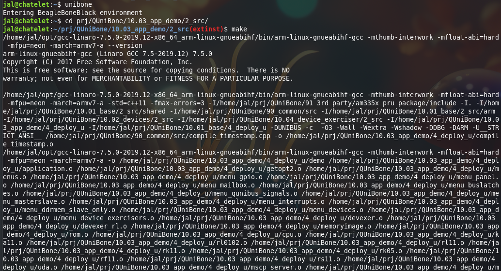

# Cross-compiling Unibone software on Linux

When working on the Unibone software it is a lot more comfortable to be able to do that from your own workstation. Setting that up is not trivial so here is a description on how to get that to work. This description has been made for a Linux workstation running Ubuntu 24.04.

I used the following documents, many thanks to the authors:
* [https://github.com/robamu-org/beaglebone-crosscompiling](https://github.com/robamu-org/beaglebone-crosscompiling), this describes how to get the ARM toolchain.

The software needed from external sources will be installed in ~/opt. The Unibone root directory (the checked out git repo) is under ~/prj/QUniBone .

## Getting and installing the ARM compiler

Download the appropriate compiler from Linaro: [https://releases.linaro.org/components/toolchain/binaries/latest-7/arm-linux-gnueabihf/](https://releases.linaro.org/components/toolchain/binaries/latest-7/arm-linux-gnueabihf/) . Use gcc-linaro-7.5.0-2019.12-x86_64_arm-linux-gnueabihf.tar.xz and extract with the xz tool, then untar:

```
cd ~/opt
xz -d < gcc-linaro-7.5.0-2019.12-x86_64_arm-linux-gnueabihf.tar | tar x
```
This will create the directory gcc-linaro-7.5.0-2019.12-x86_64_arm-linux-gnueabihf/ under opt.

## Getting and installing the PRU compiler and software

You can download the PRU compiler tools from here: [https://www.ti.com/tool/download/PRU-CGT/2.3.3](https://www.ti.com/tool/download/PRU-CGT/2.3.3)
Download the "Linux Installer for PRU CGT". This will be a .bin file. After the download install the software as follows:
```
cd (your download path)
chmod a+x
./ti_cgt_pru_2.3.3_linux_installer_x86.bin
```
This will start the installer. Install the software under ~/opt. This should result in a directory ~/opt/ti-cgt-pru_2.3.3/ there.

## Get the Unibone source tree

Now get the source tree from git. I store my sources under ~/prj, but you can pick wherever as long as you fix any paths in the shell file shown at the end.
```
mkdir -p ~/prj
cd prj
git clone https://github.com/j-hoppe/QUniBone
```

## Fixing the Unibone makefiles
The original Unibone code used make 3.81. Modern Linux has make 4.x, and there are changes in how those modern make versions interpret makefiles.

You need to edit the following make files:
* 10.03_app_demo/2_src/makefile
* 10.03_app_demo/2_src/makefile_u
* 10.03_app_demo/2_src/makefile_q

These files contain conditional statements like:
```
ifeq ($(QUNIBONE_PLATFORM),UNIBUS)
        include makefile_u
else ifeq  ($(QUNIBONE_PLATFORM),QBUS)
        include makefile_q
else
        $(error Set QUNIBONE_PLATFORM to UNIBUS or QBUS!)
endif
```
The problem is that modern make does not allow the indent, so you need to change these conditional blocks like this:
```
ifeq ($(QUNIBONE_PLATFORM),UNIBUS)
include makefile_u
else ifeq  ($(QUNIBONE_PLATFORM),QBUS)
include makefile_q
else
$(error Set QUNIBONE_PLATFORM to UNIBUS or QBUS!)
endif
```
The same needs to be done for the other makefiles, for all conditionals.

## Fixing the missing PRU tools

The directory 91_3rd_party in the Github project does not contain all that is needed to get the build to work. I fixed it by copying the same directory from the real Unibone root directory into the repository one. This should not be committed, but I do not know how this was originally meant to be handled.


## Create a helper shell file to set up a build environment

I use the following bash script to set up everything needed to do Unibone compiles from the command line. I store the thing under ~/bin with the x flags set so that I can just use it from a shell.
```
#!/bin/bash -i
# See https://github.com/robamu-org/beaglebone-crosscompiling
echo "Entering BeagleBoneBlack environment"

# Set-up the ARM compiler
export GCC_ROOT="$HOME/opt/gcc-linaro-7.5.0-2019.12-x86_64_arm-linux-gnueabihf"
export PATH=$GCC_ROOT/bin:$PATH
#export LINUX_ROOTFS="/home/jal/prj/uniboneFS/"
export CROSS_COMPILE="arm-cortex_a8-linux-gnueabihf"
export CONSOLE_PREFIX="[BBB]"

# Things to set for the make build to work
# The root of the github repository
export QUNIBONE_DIR=~/prj/QUniBone

# The platform we're compiling for
export QUNIBONE_PLATFORM=UNIBUS
export QUNIBONE_PLATFORM_SUFFIX=_u

# Whether it is a RELEASE or a DBG build
export MAKE_CONFIGURATION=RELEASE

# Set the PRU compiler
export PRU_CGT="$HOME/opt/ti-cgt-pru_2.3.3"

export BBB_CC="$GCC_ROOT/bin/arm-linux-gnueabihf-gcc -mthumb-interwork -mfloat-abi=hard -mfpu=neon -march=armv7-a"
export MAKE_TARGET_ARCH="BBB"

exec /bin/bash
```

To use this just execute "unibone" from a shell. It will then have all settings ready for a build, which needs to be done like this:


Next thing to investigate is why make -j64 does not work ;)

