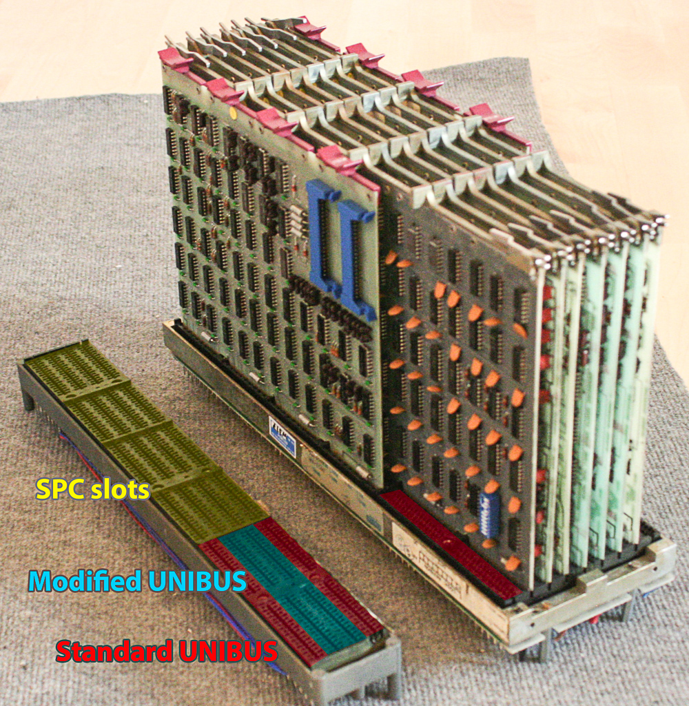
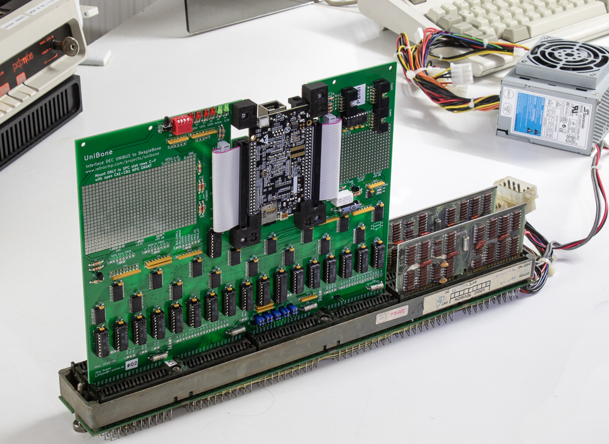
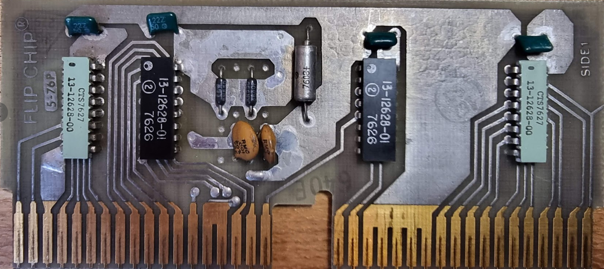
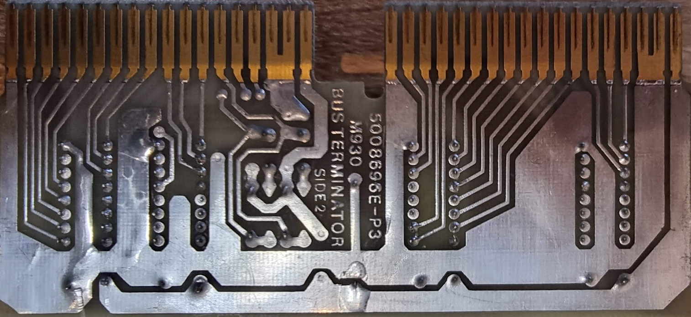

# Unibus, Uniprobe and Unibone tales

As my PDP-11 came without peripherals I need something to make it come alive..

## Unibus information

There are multiple parts inside an Unibus:

- UNIBUS Slots are the real Unibus
- SPC are slots usually reserved for peripheral cards?

In addition, there are two versions of Unibus. Normal Unibus and modified Unibus. **These are not compatible!** In “newer” PDP-11’s both of these are present on the backplane, and it is a bad idea to use boards meant for the one in the other.

Picture [from here, where there is also way more information](http://retrocmp.com/tools/uniprobe/292-uniprobe-standard-unibus-modified-unibus).

To test the Unibone we need it in a terminated backplane like the DD11-CK:

We need two passive terminators (M930, donated by Geert):

Login to the Unibone with:

ssh root@ip

password: root

Follow the test instructions [from here](http://retrocmp.com/projects/unibone/287-unibone-acceptance-test)

More information:

- [Unibus - pinout](./unibus-uniprobe-and-unibone-tales/unibus-pinout.md)
- [SPC Slots pinout](./unibus-uniprobe-and-unibone-tales/spc-pinout.md)
- [Backplane types - overview](./unibus-uniprobe-and-unibone-tales/backplane-types-overview.md)
- [Unibone DD11 backplanes - detailed slot descriptions](./unibus-uniprobe-and-unibone-tales/backplanes-detailed-slot-descriptions.md)